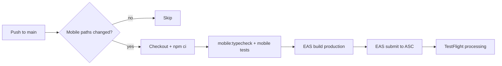

# Tailo Mobile — Development Tasks

Task plan for the mobile app. Work top-to-bottom within each phase; later phases depend on earlier ones.

**References:** [Architecture](./ARCHITECTURE.md) · [Phase 0 design](./architecture/phase-0-local-spike.md) · [Developer guide](./DEVELOPER.md) · [Agent guidelines](../AGENTS.md)

**How to use:** Check off tasks as completed (`[x]`). Add notes or PR links inline when useful. Pick the next unchecked task in the current phase.

**GitHub tracking:** Each task has a matching issue in [asymfermion/tailo-monolith](https://github.com/asymfermion/tailo-monolith/issues?q=label%3Amobile-tasks), organized on the [Tailo mobile project board](https://github.com/users/asymfermion/projects/2). Filter issues by phase label (`setup`, `phase-0`, `phase-1`, `phase-2`, `phase-3`, `cross-cutting`). Closed issues = completed tasks; use the board for status and prioritization.

---

## Status snapshot

| Phase   | Focus                                       | Status      |
| ------- | ------------------------------------------- | ----------- |
| Setup   | Dev environment, monorepo, modules scaffold | Done        |
| Phase 0 | Local technical spike (no backend)          | Done        |
| Phase 1 | Local MVP foundation                        | Done        |
| Phase 2 | Mobile + backend integration                | In progress |
| Phase 3 | Polish & first-session UX                   | In progress |

---

## Setup (complete)

- [x] Monorepo with `apps/mobile` and `packages/shared`
- [x] Expo SDK 54 + core modules (`media-library`, `camera`, `image`, `file-system`, `secure-store`, `sqlite`)
- [x] `src/modules/` scaffold and path aliases
- [x] Developer guide and project README

---

## Phase 0 — Local technical spike

**Goal:** Generate a believable local pet timeline from real photos. No network, no account.

**Success condition:** User grants photo access → app shows grouped pet moments on a timeline within ~60s of useful partial results.

### 0.1 Foundation

- [x] **0.1.1** Define local TypeScript types in `apps/mobile/src/types/` (mirror processing pipeline: `LocalAsset`, `LocalEventCandidate`, `TimelineEvent`)
- [x] **0.1.2** Add SQLite schema + migration helper in `src/db/` for `local_assets`, `local_event_candidates`, `local_media_scores`
- [x] **0.1.3** Wire `getDatabase()` to run migrations on app launch
- [x] **0.1.4** Add minimal app shell: safe area, navigation container (or single-stack) ready for multiple screens

### 0.2 Photo access (`mediaScanner`)

- [x] **0.2.1** Implement permission check + request flow (full / limited / denied)
- [x] **0.2.2** Build permission UI states with calm copy (no technical jargon)
- [x] **0.2.3** Paginate camera roll — **newest first**, initial window last 2–4 weeks
- [x] **0.2.4** Persist scanned assets to `local_assets` (uri, dimensions, `created_at`, `media_type`)
- [x] **0.2.5** Expose scan progress (batch count, “Finding moments…”) without blocking UI
- [x] **0.2.6** Handle denied permission: explain + allow app to continue (manual capture path stub OK)

### 0.3 Pet detection (`eventBuilder`)

- [x] **0.3.1** Spike on-device pet detection approach for iOS (Vision / Core ML bridge or interim heuristic)
- [x] **0.3.2** Mark assets `is_pet_candidate` + `pet_confidence` in `local_assets`
- [x] **0.3.3** Process in background batches; never block main thread
- [x] **0.3.4** Skip or degrade gracefully when no pet candidates found (empty state copy)

> **Note:** First pass can use a simple heuristic (e.g. confidence stub or sample classifier) to unblock clustering UI. Replace with real on-device ML in a follow-up task.

#### Model hardening

- [x] **0.3.5** Add `detected_pet_type` (`dog | cat | null`) to local schema and asset types
- [x] **0.3.6** Add `PetDetector` abstraction with native detector + heuristic fallback
- [x] **0.3.7** Scaffold iOS local Expo module for Vision/Core ML image classification
- [x] **0.3.8** Wire detection pipeline to prefer native detector when available
- [x] **0.3.9** Add on-device Vision dog/cat classifier path (uses bundled `TailoPetClassifier.mlmodel` when present, otherwise Apple Vision built-in classification) and document dev-client requirement
- [x] **0.3.10** Validate dog/cat/other accuracy on real iPhone photo libraries

### 0.4 Event clustering (`eventBuilder`)

- [x] **0.4.1** Implement deterministic clustering: same day + within 10–30 min + pet candidate → one `local_event_candidate`
- [x] **0.4.2** Persist candidates with `timestamp`, `source: camera_roll`, `candidate_status`, `selected_asset_ids`
- [x] **0.4.3** Continue scanning older photos in background after first partial timeline render
- [x] **0.4.4** Deduplicate near-identical assets before clustering (basic hash / time+size heuristic)
- [x] **0.4.5** Limit passive auto-detection to one promoted moment per UTC day per detected pet type for onboarding and incremental scans

### 0.5 Best image selection (`eventBuilder`)

- [x] **0.5.1** Score assets: sharpness, brightness, subject visibility, uniqueness (start simple)
- [x] **0.5.2** Store scores in `local_media_scores`
- [x] **0.5.3** Select **2–5 images per event** only; never show every similar photo
- [x] **0.5.4** Mark primary image per event for timeline thumbnail

### 0.6 Timeline UI (`timeline`)

- [x] **0.6.1** Home screen = timeline (not a photo grid)
- [x] **0.6.2** Timeline list: caption placeholder, image grid (2–5), timestamp, event type
- [x] **0.6.3** Apply calm visual design (off-white bg, large rounded photos, generous spacing — see theme constants)
- [x] **0.6.4** Loading states: “Finding moments…”, “Building your timeline…”
- [x] **0.6.5** Incremental render: show events as batches complete (newest first)
- [x] **0.6.6** Empty states: no permission, no pet photos, scan in progress

### 0.7 Phase 0 wrap-up

- [x] **0.7.3** Document known limitations and detection accuracy — see [architecture/phase-0-local-spike.md](./architecture/phase-0-local-spike.md)

### Phase 0 — notes & decisions

<!-- Add dated notes, PR links, and spike findings here -->

- 2026-05-17: Pet detection uses a `PetDetector` abstraction. The iOS local Expo module (`TailoPetClassifier`) uses a bundled Core ML model when present, otherwise Apple Vision on-device animal detection, with heuristic fallback when native is unavailable. `detected_pet_type` is persisted for `dog | cat | null`.
- 2026-05-18: **0.3.10** — dog/cat detection validated on a real iPhone photo library with an Expo dev client build (native path + confidence threshold; timeline reflects pet photos only).
- 2026-05-17: Event clustering groups same-day pet candidates within a 20-minute window, dedupes near-identical time/dimension matches, persists stable local candidate IDs, and starts a bounded older-photo scan after the first local pipeline pass.
- 2026-05-24: Passive camera-roll detection now keeps at most one auto-detected moment per UTC day per detected pet type for both onboarding and incremental scans; in-app capture remains explicit and can still create additional moments.
- 2026-05-17: Best-image selection scores event media with deterministic local heuristics for sharpness/brightness/subject visibility/uniqueness, caps selected media at 5, and writes primary-image flags to `local_media_scores`.
- 2026-05-17: Timeline UI now loads scored local candidates newest-first and renders event rows with a primary image, secondary image strip, placeholder caption, timestamp, event type, and calm loading/empty states.

---

## Phase 1 — Local MVP foundation

**Goal:** User gets value without registering. One pet, full local experience.

### 1.1 Identity & pet profile (`auth`, `pets`)

- [x] **1.1.1** Generate `anonymous_user_id` on first launch; store in SecureStore
- [x] **1.1.2** Persist onboarding state (step, completed flags) in SecureStore
- [x] **1.1.3** Local pet model: name, type (dog | cat), optional gender
- [x] **1.1.4** Onboarding flow: welcome → photo permission → scan starts → partial timeline → pet name → type → gender → profile photo suggestion
- [x] **1.1.5** Suggest profile photo from highest-scoring pet image

### 1.2 Event model & processing state

- [x] **1.2.1** Promote `local_event_candidate` → local `Event` with stable IDs
- [x] **1.2.2** Track `processing_state` per asset/candidate (pending, processed, failed)
- [x] **1.2.3** Map local events to shared `@tailo/shared` types where appropriate
- [x] **1.2.4** Store `last_scan_timestamp` for incremental rescans

### 1.3 Timeline & event detail

- [x] **1.3.1** Event detail screen: larger gallery, timestamp, type, placeholder caption
- [x] **1.3.2** Basic event editing: caption, event type, favorite toggle (local only)
- [x] **1.3.3** Favorite filter or visual indicator on timeline
- [x] **1.3.4** Top area: pet profile summary + “Ask Tailo” entry (UI shell only — no AI yet)

### 1.4 Active capture (`capture`)

- [x] **1.4.1** In-app camera screen using `expo-camera`
- [x] **1.4.2** Save capture to local storage + create manual event (`source: in_app`)
- [x] **1.4.3** Preview / confirm before adding to timeline
- [x] **1.4.4** Works when photo library permission is denied

### 1.5 Local data hardening

- [x] **1.5.1** Add `upload_queue` + `sync_state` tables (schema only; no network yet)
- [x] **1.5.2** Offline: full local scan + timeline + manual capture queue
- [x] **1.5.3** App restart: resume incomplete scan/processing from DB state

### 1.6 Phase 1 wrap-up

- [x] **1.6.1** Test: first launch without account through onboarding to timeline
- [x] **1.6.2** Test: edit persistence across app restarts
- [x] **1.6.3** Externalize UI strings (prep for i18n)

### Phase 1 — notes & decisions

- 2026-05-17: First-session identity, onboarding progress, and the one-pet local profile are stored with Expo SecureStore. Onboarding now gates the app before the timeline and suggests a profile photo from the highest-scoring local media row.
- 2026-05-18: **1.2** — SQLite v4 adds `local_events` (promoted timeline rows with `pet_id`, `processing_state`, caption/type/favorite fields). Scored `local_event_candidates` promote via `promoteScoredCandidatesToLocalEvents` after image selection; timeline reads `local_events` (not candidates). `mapLocalEventToSharedEvent` maps to `@tailo/shared` `Event`. `last_scan_timestamp` stored in SecureStore after each successful scan batch.
- 2026-05-18: **1.3** — `EventDetail` route with gallery + local edits (caption, type, favorite). Timeline favorites filter + star indicator. Pet profile header and Ask Tailo shell on Home.
- 2026-05-18: **1.4** — In-app camera (`Capture` / `CapturePreview`), persist to app documents, `createInAppCaptureEvent` writes `local_assets` + `local_events` with `source: in_app`. Floating + on Home works without photo library permission.
- 2026-05-18: **1.5** — SQLite v5 adds `upload_queue` + `sync_state`. Promoted/captured events enqueue pending uploads (no network worker yet). Pipeline scan cursor + phase persisted; app restart resumes incomplete scan/processing instead of always re-scanning.
- 2026-05-18: **1.6.1–1.6.2** — Manual QA: welcome → scan → pet select → profile → timeline without account; event detail edits (caption, type, favorite) persist after force-quit and relaunch.
- 2026-05-18: **1.6.3** — User-facing copy moved to `apps/mobile/src/i18n/` (`locales/en.ts`, `t()`, dynamic helpers under `i18n/messages/`). Screens and timeline modules consume `t()` instead of inline strings.

---

## Phase 2 — Mobile + backend integration

This phase now tracks both the mobile client work and the backend work needed to ship sync, uploads, and AI enrichment. Specs: [phase-2-backend-mvp.md](./architecture/phase-2-backend-mvp.md).

### 2.1 Configuration & auth (anonymous-first)

- [x] **2.1.1** Env config: `EXPO_PUBLIC_SUPABASE_URL`, anon key; Supabase client + session in SecureStore
- [x] **2.1.2** On launch: `signInAnonymously()` if no session (no login UI)
- [x] **2.1.3** One-time legacy bridge: Phase 1 `anonymous_user_id` → `link-anonymous-user` after first session (upgrades only)
- [x] **2.1.4** Create/link pet record on server after local pet profile exists (`upsert-pet`)
- [x] **2.1.5** Account upgrade UI (settings): **email** via `updateUser` + OTP (`verifyOtp`); Apple / Google deferred
- [x] **2.1.6** After auth bootstrap, resolve the current Supabase session into a stable backend `app_user_id` (`ensure-current-user`) instead of treating Supabase `user.id` as the canonical owner id
- [x] **2.1.7** Update auth/session UX and dev diagnostics to distinguish Supabase auth subject from Tailo `app_user_id`

### 2.2 Upload pipeline (`storage`, `sync`)

- [x] **2.2.1** Compress per [upload spec](./architecture/phase-2-backend-mvp.md#compression--files-mvp-defaults): original 1280px JPEG, thumb 400px; HEIC→JPEG; strip GPS EXIF
- [x] **2.2.2** Upload **selected event media only** — never full camera roll
- [x] **2.2.3** Implement `upload_queue` worker: pending → uploading → done / failed
- [x] **2.2.4** Retry with backoff; persist `last_error`
- [x] **2.2.5** Deduplicate uploads by local asset / event id
- [x] **2.2.6** Signed URL or token flow for uploads (Supabase Storage via Edge Function; R2 optional later)

### 2.3 Sync & timeline merge

- [x] **2.3.1** `sync-event` payload: local ids, media paths, `user_edited` flags, `client_sync_version` (see [sync spec](./architecture/phase-2-backend-mvp.md#sync-specification))
- [x] **2.3.2** Poll `get-event-updates` (~30s when pending AI); merge per [field matrix](./architecture/phase-2-backend-mvp.md#field-merge-matrix) — do not overwrite user-edited caption/type
- [x] **2.3.3** Background sync when network returns
- [x] **2.3.4** UI: subtle sync status (no “Uploading assets…” technical copy)
- [ ] **2.3.5** Hydrate unknown remote events from other devices: when poll sees an event missing locally, fetch media/signed thumbnails and insert it into SQLite
- [x] **2.3.6** Add cross-device timeline backfill after first restore so later or paged cloud moments are not missed once any hydrated event exists
- [x] **2.3.7** Cache or refresh restored cloud thumbnails instead of relying indefinitely on expiring signed URLs
- [x] **2.3.8** Add media fingerprints/hashes to upload + sync contracts and server schema for cross-device duplicate-image detection
- [x] **2.3.9** Server-side merge for duplicate moments from multiple devices: match by account, media fingerprint, and timestamp window before creating a new cloud event
- [x] **2.3.10** Tests: Device A uploads, Device B restores, Device A uploads later, Device B polls/inserts; duplicate image uploads collapse to one cloud moment

### 2.4 AI presentation (`ai`)

- [x] **2.4.1** Poll or subscribe for `ai_jobs` completion per event
- [x] **2.4.2** Parse caption JSON contract; validate against shared schema
- [x] **2.4.3** Low-confidence fallback captions (safe, non-invented)
- [x] **2.4.4** Never surface “AI” in user-facing copy

### 2.5 Backend setup (`supabase`, `packages/backend-core`)

- [x] **2.5.1** Create Supabase **dev** project; record project ref + region in Setup notes (not secret)
- [x] **2.5.2** Enable **Anonymous** sign-ins
- [x] **2.5.3** Enable **Manual linking** (for future Apple/Google/email; no UI yet)
- [x] **2.5.4** Add `supabase/config.toml`, `migrations/`, `functions/`
- [x] **2.5.5** `apps/mobile/.env.example`: `EXPO_PUBLIC_SUPABASE_URL`, anon key
- [x] **2.5.6** Document local workflow in [DEVELOPER.md](./DEVELOPER.md) (`supabase start`, `db push`, `functions serve`)
- [x] **2.5.7** Scaffold `packages/backend-core/` (`contracts/`, `usecases/`, `repositories/`) — initial `linkAnonymousUser` use case
- [x] **2.5.8** `packages/shared`: zod schemas for `sync-event`, `get-event-updates`, AI result (match specs); `create-upload-urls` contract added
- [ ] **2.5.9** GitHub issues / labels for `backend-tasks` (optional; mirror mobile board)

### 2.6 Backend schema & RLS (`supabase/migrations`)

- [x] **2.6.1** `profiles` — legacy Supabase auth mirror, dropped after `app_users` / `user_identities` became canonical
- [x] **2.6.2** `anonymous_id_links` — unique `anonymous_user_id`, FK `user_id`; reject insert if legacy id maps to different user
- [x] **2.6.3** `pets` — include `source_local_pet_id` unique per `user_id`
- [x] **2.6.4** `events` — unique `(user_id, source_local_event_id)`; `user_edited_caption`, `user_edited_event_type`, `sync_version`, `updated_at`, `caption_source` (minimal migration for uploads)
- [x] **2.6.5** `event_media` — unique `(event_id, source_local_asset_id)`; storage paths
- [x] **2.6.6** `ai_jobs` — `next_attempt_at`, `leased_until`, `input_snapshot`, status enum per spec
- [x] **2.6.7** RLS: `auth.uid() = user_id` on all user-owned tables
- [x] **2.6.8** RLS: `event_media` via join to `events` ownership
- [x] **2.6.9** Indexes: `events(user_id, updated_at)`, unique `(user_id, source_local_event_id)`, `ai_jobs(status, next_attempt_at)`, `event_media(event_id)`
- [x] **2.6.10** SQL smoke: user A cannot read/write user B rows (`supabase/tests/rls_cross_user_smoke.sql`; `npm run test:supabase:rls -- --linked`)
- [x] **2.6.11** Identity portability refactor: add `app_users` as the canonical Tailo user table
- [x] **2.6.12** Add `user_identities` mapping table (`provider`, `provider_subject`, `app_user_id`) and uniqueness constraints
- [x] **2.6.13** Migrate ownership columns on `pets`, `events`, and related tables from Supabase `user_id` to canonical `app_user_id`
- [x] **2.6.14** Add SQL helper / RLS function to resolve `auth.uid()` → `app_user_id`, then update policies to use it
- [x] **2.6.15** Re-key storage path rules from `{user_id}/...` to `{app_user_id}/...`
- [x] **2.6.16** Update smoke tests and integration tests for the `app_user_id` ownership model
- [x] **2.6.17** Add account profile fields to the canonical app-user model (`display_name`, `preferred_locale`, provider summary hooks) — stub `account_profiles` table; profile editing API deferred

### 2.7 Backend auth & upload APIs (`functions`, `backend-core`)

- [x] **2.7.1** Private bucket `event-media`
- [x] **2.7.2** Path layout per [upload spec](./architecture/phase-2-backend-mvp.md#upload-specification)
- [x] **2.7.3** Storage policies: read/write only under `auth.uid()` prefix
- [x] **2.7.4** Enforce JPEG only, 15 min signed URL TTL, 1–5 assets per request
- [x] **2.7.5** Document max sizes: original <=3 MB post-compress, thumb <200 KB target
- [x] **2.7.6** Implement auth edge-case policy in `backend-core` + tests
- [x] **2.7.7** Edge Function `link-anonymous-user` + unit tests
- [x] **2.7.8** Edge Function `ensure-current-user` + `ensure_app_user_for_auth()` RPC + unit tests
- [x] **2.7.9** Edge Function `upsert-pet` + unit tests (idempotent `source_local_pet_id`)
- [x] **2.7.10** Add `upsert-account-profile` use case/API so connected users can create and update their Tailo account profile
- [x] **2.7.11** `validateUploadRequest()` — pet ownership, 1–5 assets, duplicate asset ids rejected
- [x] **2.7.12** Unit tests: over limit, wrong pet, expired retry
- [x] **2.7.13** `create-upload-urls` — returns paired URLs + paths + `expires_at`
- [x] **2.7.14** Integration test: signed PUT with wrong `Content-Type` fails (`event-media` bucket `allowed_mime_types`; `npm run test:supabase:upload`)

### 2.8 Backend sync & AI (`functions`, `packages/ai`)

- [x] **2.8.1** `syncEvent()` — idempotent upsert; full media replace; increment `sync_version`
- [x] **2.8.2** Merge matrix per [sync spec](./architecture/phase-2-backend-mvp.md#sync-specification) + unit tests
- [x] **2.8.3** `createAiJob()` — rules from the AI spec
- [x] **2.8.4** `applyAiResultToEvent()` — confidence threshold 0.5; respect `user_edited_*` flags
- [x] **2.8.5** `getEventUpdates()` — cursor pagination, max 50
- [x] **2.8.6** `sync-event` — enqueue AI; return `event_id`, `server_sync_version`, `ai_job`
- [x] **2.8.7** `get-event-updates` — cursor in/out; include AI status
- [x] **2.8.8** Shared handler: CORS, error codes (`401`, `409`, `422`), no tokens in logs
- [x] **2.8.9** `process-ai-job` — lease + `pending` → `processing` → `done`/`failed`
- [x] **2.8.10** Vertex/GCP secrets in Supabase; prompt in `packages/ai` — see [supabase/GCP_VERTEX_SETUP.md](../supabase/GCP_VERTEX_SETUP.md) + `./scripts/set-gcp-vertex-secrets.sh`
- [x] **2.8.11** Retry/backoff: 1m / 5m / 15m; max 3 attempts
- [x] **2.8.12** Post-parse: caption max 280 chars; safety filter (no medical / “AI” phrasing)
- [ ] **2.8.13** Preferred-language captions: pass the user’s preferred language into the caption prompt when available, persist `caption_language` from the AI result, and keep `caption_source = user` untouched when the user has edited the caption
- [x] **2.8.14** Trigger: invoke from `sync-event` on enqueue (happy path)
- [x] **2.8.15** Server AI sweep — mobile poll is UX only, not the only guarantee:
  - Scheduled `process-ai-job` (`pg_cron` every **3 min** via `npm run setup:ai-job-cron`; body `{"sweep":true,"max_jobs":5}`)
  - Lease recovery on each invoke: `processing` with expired/null `leased_until` → `pending`
  - Migration `20260520010000_enable_pg_cron_pg_net.sql`; deploy `process-ai-job` after pull
- [x] **2.8.16** Unit tests: low confidence → placeholder; user_edited → no overwrite
- [x] **2.8.17** Deploy all functions to dev; document base URLs for mobile

### 2.9 Backend hardening & QA

- [x] **2.9.1** All functions reject missing/invalid JWT (`backendHardening.integration.test.ts`)
- [x] **2.9.2** Upload URLs scoped to event paths; invalid/tampered token rejected (`npm run test:supabase:qa`)
- [x] **2.9.3** `npm run audit:supabase` (root workspace deps used by Edge Functions)
- [x] **2.9.4** Auth: fresh anonymous user; legacy link; duplicate legacy link → 409 (integration + `linkAnonymousUser.test.ts`)
- [x] **2.9.5** Upload: 1 asset; 5 assets; 6 assets → 422 (integration)
- [x] **2.9.6** Sync: double `sync-event` idempotent; user caption survives (integration + `syncEventMerge.test.ts`)
- [x] **2.9.7** Sync: user_edited blocks AI overwrite on poll merge (`mergeRemoteEventUpdate.test.ts` + server merge tests)
- [x] **2.9.8** AI: failed job after 3 attempts (`aiJobFailure.test.ts`); `next_attempt_at` respected (integration when `SUPABASE_SERVICE_ROLE_KEY` set)
- [x] **2.9.9** Document session loss → new anonymous user (`supabase/SETUP.md`, phase-2 auth policy)
- [x] **2.9.10** Staging checklist (`supabase/STAGING_CHECKLIST.md`)

### 2.10 Timeline sync ownership (implemented)

- [x] **2.10.1** Redetect pets = user timeline wipe: tombstone all `source_local_event_id`s, bump `sync.timeline_generation`, clear upload queue + poll cursor + local pipeline
- [x] **2.10.2** Poll merge skips tombstoned events and events with `sync_lock_owner = user`
- [x] **2.10.3** User edits acquire `sync_lock_owner = user`; promote clears tombstone + lock for new moments
- [x] **2.10.4** `sync-event` accepts `client_timeline_generation`; server resets `pet_validation_status` and re-enqueues AI when generation advances

### 2.11 Future — image-level pet validation (not MVP)

- [ ] **2.11.1** Per-asset validation in `process-ai-job` (not only primary); drop failed `event_media` rows only
- [ ] **2.11.2** Event stays on timeline when ≥1 asset passes; reassign `is_primary`
- [ ] **2.11.3** Mobile merge: prune `selected_asset_ids` / scores per asset instead of `deletePromotedLocalEvent` on event-level `rejected`

**Current behavior (event-level):** Vertex sees the primary image only; if validation fails → server `rejected` + `deleted_at`, cloud media deleted; poll sets local `deleted_at` (hidden from timeline, media kept). See [FUTURE_FEATURES.md](./FUTURE_FEATURES.md#6-image-level-cloud-pet-validation).

### 2.12 User delete moment (local + cloud)

Soft-delete: `events.deleted_at` + poll sync to other devices; local `local_events.deleted_at` hides timeline row (media kept). See [FUTURE_FEATURES.md](./FUTURE_FEATURES.md#8-user-delete-moment).

- [x] **2.12.1** Timeline + detail UI: delete moment (confirm); `sync_lock_owner = user` before delete
- [x] **2.12.2** Local: `markLocalEventDeleted`, tombstone `source_local_event_id`, cancel `upload_queue` for event
- [x] **2.12.3** Cloud: Edge Function `delete-event` — soft-delete `events`, remove `event_media` + Storage; mobile `deleteMoment` → `delete-event`
- [x] **2.12.4** `local_assets.user_dismissed_at`; pipeline queries skip dismissed assets on scan/cluster/redetect
- [ ] **2.12.5** Re-inclusion only via **manual pick** (clear `user_dismissed_at` for chosen assets)
- [x] **2.12.6** Tests: `deleteMoment.test.ts`, `delete-event` contract tests

### 2.13 Future — pet identity validation (cloud, same individual)

Today: `profilePetValid` + `visiblePetType` only — **same breed, wrong pet** can pass. Later: reject unless the primary subject matches **this** pet profile.

**Design (prefer low token / no extra on-device detection):**

| Layer           | What                                                                                                   |
| --------------- | ------------------------------------------------------------------------------------------------------ |
| References      | Profile photo + up to ~5–8 **confirmed** primaries (`pet_validation_status = valid`, not user-deleted) |
| Stored features | Multimodal **embeddings** per reference; pet-level centroid in DB (`pgvector`)                         |
| New event       | Embed primary once → similarity vs centroid; reject if below threshold                                 |
| Borderline      | Optional tiny Gemini yes/no with **one** ref + candidate (not full gallery every time)                 |
| Caption         | Run only after identity pass (or skip caption tokens on reject)                                        |

- [ ] **2.13.1** Schema: `pet_reference_media` (pet_id, storage_path, source: profile \| event, event_id?, embedding vector); enable `pgvector` if needed
- [ ] **2.13.2** Build reference gallery: on profile save + on event `valid`; cap size; exclude deleted/dismissed assets
- [ ] **2.13.3** Worker: compute/update embeddings for new refs (async, not in hot scan path)
- [ ] **2.13.4** `process-ai-job`: identity gate before caption — embedding similarity + threshold; extend result JSON (`samePetIndividual`, `identityConfidence`, `identityMethod: embedding \| llm`)
- [ ] **2.13.5** Borderline band only → optional 2-image Gemini check (minimal tokens)
- [ ] **2.13.6** Cold start: `insufficient_refs` when only type check possible; tighten as gallery grows
- [ ] **2.13.7** Pass pet context in caption prompt (name, type) once identity passed — still one primary image for caption
- [ ] **2.13.8** Tests with fixture embeddings; document thresholds and gallery rules in phase-2 doc

**Out of scope:** Device-side re-identification; sending full timeline or all event_media to Vertex per job.

### 2.14 Future — user edit moment (capabilities & sync)

Today: caption, event type, and favorite can be edited locally; `user_edited_*` + `sync_lock_owner` partially protect against AI/poll overwrite. Rules are spread across merge code and lack a single **product matrix** for what a user may do to a moment and what happens on device vs cloud.

**Goal:** Define and harden **allowed actions per moment** and consistent sync/AI behavior for each.

| Area                     | Questions to decide                                                                         |
| ------------------------ | ------------------------------------------------------------------------------------------- |
| **Editable fields**      | Caption only? Event type? Favorite? Primary photo? Add/remove photos in an existing moment? |
| **Irreversible actions** | Delete (see 2.12); “not my pet” dismiss; hide from timeline without deleting assets         |
| **AI vs user**           | When can AI refresh caption/type after user edit? Explicit “reset to automatic” affordance? |
| **Sync**                 | `sync_lock_owner` lifetime; release on blur/save/timeout; multi-tab/device (deferred)       |
| **Poll merge**           | Full matrix: local `user_edited_*` × remote `caption_source` × `ai_job_status`              |
| **Rejected / pending**   | Can user edit a moment while `pet_validation_status = pending`? After `rejected`?           |

- [x] **2.14.1** Reorder photos in a moment (event detail): `selected_asset_ids` + cover/`is_primary`; sync via `pending_cloud_sync`
- [ ] **2.14.2** Product spec: **moment actions matrix** (view, edit caption, edit type, favorite, delete, change photos, dismiss from auto-detect) — allowed / hidden / disabled per moment state
- [ ] **2.14.3** Document merge rules in [phase-2-backend-mvp.md](./architecture/phase-2-backend-mvp.md#sync-specification) and implement any gaps in `syncEventMerge` + `mergeRemoteEventUpdate`
- [ ] **2.14.4** `sync_lock_owner`: acquire on edit start, release on save/cancel; prevent stuck locks blocking AI forever
- [ ] **2.14.5** UI: event detail reflects matrix (what is tappable); calm copy for “your edit is saved” vs automatic caption
- [ ] **2.14.6** When a user edits an AI-generated caption, set `caption_source = user` locally + server, keep `user_edited_caption = true`, and stop later AI/translation flows from treating that caption as automatic
- [ ] **2.14.7** Optional “use automatic caption again” — clears `user_edited_caption` locally + server and allows next AI job
- [ ] **2.14.8** Tests: matrix cases for server merge + mobile poll merge; integration smoke for edit → sync → poll → AI

See [FUTURE_FEATURES.md](./FUTURE_FEATURES.md#10-user-edit-moment-capabilities).

### Phase 2 — notes & decisions

- 2026-05-18: **2.3 / 2.4** — After upload batch completes, `runEventSyncForLocalEvent` posts `sync-event`; `useEventUpdatesPoll` + `useBackgroundSync` poll `get-event-updates` and merge without overwriting user-edited fields. Timeline captions use `resolveDisplayCaption` from `@tailo/ai`. Edge AI defaults to `AI_PROVIDER=stub` until GCP Vertex secrets are set.
- 2026-05-18: **2.1.3** — `linkLegacyAnonymousUserIfNeeded()` after auth bootstrap; Edge Function `link-anonymous-user`; migration `profiles` + `anonymous_id_links`; `resolveLinkAnonymousUser` in `@tailo/backend-core`. Deploy: `npx supabase db push` + `npx supabase functions deploy link-anonymous-user`. `profiles` was later dropped once `app_users` / `user_identities` became canonical.
- 2026-05-18: **Auth decouple** — `AuthProvider` + `authService` (`modules/auth/`); Supabase isolated in `providers/supabaseAuthProvider.ts`. Portability rules in [AGENTS.md](../AGENTS.md#backend-portability-phase-2).
- 2026-05-18: **2.1.2** — `bootstrapAuthSession()` on app launch (reuse persisted session or `signInAnonymously()`); skips when env unset; does not block local SQLite if auth fails.
- 2026-05-18: **2.5 / 2.1.1** — Dev project `sgxtyxvithlmuuofkzlk`; `supabase/` scaffold + [SETUP.md](../supabase/SETUP.md); mobile `getSupabaseClient()` with SecureStore session (`apps/mobile/src/lib/supabase.ts`). Postgres URI is CLI-only; mobile uses API URL + anon key.
- 2026-05-19: `app_user_id` ownership migration — `pets`/`events` use `app_user_id`, RLS + storage paths keyed by `current_app_user_id()`, `upsert-account-profile` Edge Function, Account settings profile editing.
- 2026-05-18: Upload/sync/AI numbers and merge rules live in phase-2 spec; backend tasks are tracked inline in this Phase 2 section with `B...` task IDs preserved.

---

## Phase 3 — Polish

**Goal:** First session feels simple, calm, and useful.

### 3.0 Navigation & app structure

- [x] **3.0.1** Define main app pages: `Timeline`, `Pet profile`, `Settings` — see [phase-3-navigation.md](./architecture/phase-3-navigation.md)
- [x] **3.0.3** Replace the lightweight temporary stack with the long-term app navigation shell (`MainTabShell` + `modalStack`)
- [x] **3.0.4** Keep capture, capture preview, event detail, and account upgrade as modal routes (`ModalShell`)
- [x] **3.0.5** Add anonymous-to-email upgrade IA per [authentication-and-account-flows.md](./architecture/authentication-and-account-flows.md): home reminder, settings entry, and linked state
- [x] **3.0.6** Tune reminder timing/cooldown so account prompts appear only after the user has seen timeline value and never feel blocking or repetitive
- [x] **3.0.8** Distinguish anonymous vs linked account capabilities in UI/UX: recent-only scan for anonymous users, deeper historical scan for linked users
- [x] **3.0.14** Align account UX with [authentication-and-account-flows.md](./architecture/authentication-and-account-flows.md): anonymous-first default, code-based email verification, direct sign-in support, and provider-based sign-in later

### 3.1 Authentication completion

- [x] **3.1.1** Direct email registration flow: email entry, 8-digit verification code, then continue into onboarding/app; password is optional and can be added later
- [x] **3.1.2** Direct email login flow: email + password
- [x] **3.1.3** Forgot-password flow for email accounts
- [x] **3.1.4** Configure and test hosted Supabase email templates for auth flows so app UX and email content match: `Confirm sign up`, `Change email address`, and `Reset password` should all use the intended OTP / recovery experience for mobile
- [x] **3.1.5** Add template-level QA for `dev` and `prod`: correct subject lines, `{{ .Token }}` where OTP is expected, correct copy for account creation vs email change vs password reset, and no accidental magic-link-only mismatch
- [x] **3.1.6** Link Apple from anonymous or connected account state
- [x] **3.1.7** Prepare native Apple sign-in app configuration: add `expo-apple-authentication`, enable `ios.usesAppleSignIn`, add the Expo config plugin, and rebuild the iOS dev client / EAS build with the Sign in with Apple entitlement
- [x] **3.1.8** Configure Apple provider credentials for `dev` and `prod`: Apple Developer capability for `com.mtxforge.tailo`, Services ID / Team ID / Key ID / private key as needed by Supabase, and validated callback / redirect settings
- [x] **3.1.9** Add Apple auth provider contract support: `signInWithApple` in `authProvider`, `authService`, Supabase provider, provider result types, and shared blocking auth flow
- [x] **3.1.10** Implement anonymous Apple link behavior: preserve the same Tailo `app_user_id`, capture Apple profile name/email on first authorization when available, and treat private relay email as a normal provider email
- [x] **3.1.11** Handle Apple identity conflict fallback: if Apple identity is already linked elsewhere, sign in to the existing linked account, clear local anonymous device data, and bootstrap the existing account like Google
- [x] **3.1.12** Link Google from anonymous or connected account state
- [x] **3.1.13** Direct sign-in / sign-up with Apple
- [x] **3.1.14** Wire Apple direct entry points from onboarding and login while keeping `Start on this device` as the default anonymous-first path
- [x] **3.1.15** Update social sign-in UI/copy and account method status so Apple is enabled only where native Apple auth is available; keep non-iOS or unavailable states disabled without dead controls
- [x] **3.1.16** Add focused tests for Apple auth mode selection, native credential error handling, linked-account rejection, anonymous-link preservation, conflict fallback, and post-sign-in bootstrap
- [x] **3.1.17** Verify Apple auth on a real iOS dev/TestFlight build: direct sign-up, direct sign-in, anonymous link, cancel/error path, reinstall return, and first-authorization name/email capture — QA matrix in [DEVELOPER.md § Apple Sign in QA](./DEVELOPER.md#apple-sign-in-qa); verified on TestFlight (physical iPhone)
- [x] **3.1.18** Direct sign-in / sign-up with Google

### 3.2 Onboarding & permissions

- [ ] **3.2.1** Refine onboarding animations and pacing
- [ ] **3.2.2** Limited-access flow: process available photos + prompt to grant more later
- [x] **3.2.3** Privacy copy: what is scanned, what is uploaded, what stays on device
- [ ] **3.2.4** Keep onboarding anonymous-first: no email prompt before first meaningful timeline value; align copy and flow with [authentication-and-account-flows.md](./architecture/authentication-and-account-flows.md)

### 3.3 Timeline & event UX

- [ ] **3.3.1** Timeline visual polish (typography, spacing, image aspect ratios)
- [ ] **3.3.2** Event detail polish (transitions, edit affordances)
- [ ] **3.3.3** Floating `+` for capture (per layout guidelines)
- [x] **3.3.4** Incremental rescan on app open/foreground (delta scan after newest moment); pull-to-refresh still reloads DB only
- [ ] **3.3.5** Polish `Save your memories` home reminder and linked-success confirmation states
- [ ] **3.3.6** Add historical-scan upsell UX when anonymous users hit the recent-image cap (calm framing: fuller story, older memories)
- [ ] **3.3.7** AI caption localisation: translate AI-generated captions for the current app language on device, but never translate user-authored or user-edited captions; if a user edits an AI caption, flip the source to `user` and stop automatic translation for that caption
- [ ] **3.3.8** Cache translated AI captions per event + locale locally, and invalidate them when the source caption changes
- [ ] **3.3.9** Fallback rules for caption localisation: show the original AI caption when on-device translation is unavailable, model download is pending, or translation fails
- [ ] **3.3.10** Paid tier: support multiple passive auto-detected moments per day per pet, with product limits and sync/dedupe rules that preserve the free one-per-day behavior
- [ ] **3.3.11** Registered free full-history build: after account link/sign-in, run resumable historical photo backfill to build a complete single-pet story (progress persists across launches)
- [ ] **3.3.12** Paid multi-pet profiles: support multiple pets in product UI and sync, with per-pet selection and editing surfaces
- [ ] **3.3.13** Paid merged timeline: add “All pets” merged timeline mode with per-event pet identity labels and per-pet filters
- [ ] **3.3.14** Paid multi-moment/day controls: add account-level setting/flag to enable multiple passive auto-detected moments per day per pet, while preserving free-tier one-per-day behavior
- [x] **3.3.15** Onboarding scan bounds: stop at **10 promoted moments**, **300 images**, or **90-day window** — whichever comes first; timeline scans keep existing depth policy

### 3.4 Pet profile

- [ ] **3.4.1** Polish the pet profile tab as the primary home for the pet story: clearer summary hierarchy, recent-moment context, and calmer empty/loading states
- [ ] **3.4.2** Add pet profile edit affordances for name, type, gender, and profile photo with straightforward confirmation states
- [ ] **3.4.3** Keep the pet profile layout readable on compact phones and tablets without crowding the timeline shell

### 3.5 Settings

- [x] **3.5.1** Settings IA: user account settings, localisation, and app preferences (`SettingsScreen` sections)
- [x] **3.5.2** Turn connected account state into a full account profile surface: display name, email, connected methods, preferred language, and edit affordances
- [x] **3.5.3** Account profile editing: display name and preferred language

### 3.6 Notifications

- [x] **3.6.1** Define the shared notification contract and local storage schema: `notification_id`, `kind`, `title`, `body`, `source`, `target`, `priority`, `delivery`, `read_at`, `created_at`, and optional `expires_at`
- [x] **3.6.2** Add a notification repository/service in mobile that can create local notifications, list unread/read items, and persist read state
- [x] **3.6.3** Build the inbox UI with a badge/unread indicator in the shell or Settings, and open targets while marking the notification read
- [x] **3.6.4** Wire the first app-side producers for account reminders, sync completion, AI/job completion, and continuity-risk prompts
- [x] **3.6.5** Add backend notification creation for cloud jobs and other-device events, with a stable API contract that mirrors the local notification schema
- [ ] **3.6.6** Add push notification transport for `push` / `both` items, including device token registration, opt-in state, and a fallback to in-app inbox when push is unavailable
- [x] **3.6.7** Add read-state reconciliation so opening a notification on one device marks it read everywhere after sync
- [x] **3.6.8** Add tests for notification creation, unread count, open-and-mark-read behavior, push fallback, and cloud/local parity

### 3.7 Reliability & edge cases

- [ ] **3.7.1** Error states: scan failure, processing failure, upload failure
- [ ] **3.7.2** Retry actions without losing local data
- [ ] **3.7.3** Low storage / low memory graceful degradation
- [ ] **3.7.4** Document the intentional local SQLite ↔ cloud Postgres mapping for shared entities and fields; keep the mapping alongside the phase architecture docs
- [ ] **3.7.5** Add a schema-parity checklist for fields that exist on both device and cloud (`events`, caption metadata, identity ownership, sync cursors) so migrations update both sides intentionally
- [ ] **3.7.6** Add tests or verification helpers for local/cloud contract consistency: shared payload schemas, field-name alignment, and safe fallback behavior when one side lags behind the other

### 3.8 Observability (minimal)

- [ ] **3.8.1** Basic analytics events (scan started, timeline shown, permission result) — provider TBD
- [ ] **3.8.2** Dev-only debug panel gated behind `__DEV__`

### 3.9 Release readiness

- [ ] **3.9.1** App icons and splash aligned with brand
- [x] **3.9.2** iOS build via EAS (or dev client) with correct entitlements — `apps/mobile/eas.json` + `npm run eas:ios` script added; first TestFlight upload complete (Sign in with Apple verified)
- [ ] **3.9.3** TestFlight checklist from [Manual QA checklist](./DEVELOPER.md#manual-qa-checklist)
- [x] **3.9.4** Prepare auth-provider configuration checklist for `dev` and `prod`: Supabase redirect URLs, email templates, Apple capability, Google OAuth clients
- [ ] **3.9.5** Document the canonical hosted-email-template setup in `supabase/SETUP.md` and `docs/DEVELOPER.md`: which auth flow uses which template, expected mobile UX, and dashboard locations for `Confirm sign up`, `Change email address`, and `Reset password`
- [ ] **3.9.6** Defer phone auth until a regional launch requires it; when scheduled, scope SMS provider, abuse controls, and market-specific UX
- [ ] **3.9.7** Validate layout and interaction fit across recent iPhone sizes, iPads, and common Android phone sizes: safe areas, text wrapping, scroll behavior, and no clipped or overlapping UI
- [ ] **3.9.8** Add GitHub Actions release automation for iOS: on version tag / GitHub release, run Expo/EAS build and submit to App Store Connect using GitHub secrets for Expo and App Store Connect credentials, with a manual approval gate before production App Store submission
- [ ] **3.9.9** Manual test matrix: full / limited / denied photo access; many vs few pet photos; duplicates
- [ ] **3.9.10** Performance pass: first useful events visible within ~60s on real device
- [ ] **3.9.11** Continuous TestFlight from `main`: GitHub Actions workflow that builds and submits iOS on push to `main` (see plan below)

### 3.9.11 plan — Continuous TestFlight from `main`

**Goal:** Every merge to `main` that affects the mobile app produces a new TestFlight build automatically — no manual `npm run eas:ios -- release`.

**Scope split (keep separate from 3.9.8):**

| Workflow | Trigger | Destination | Gate |
| -------- | ------- | ----------- | ---- |
| **3.9.11** (this task) | Push to `main` | TestFlight (internal testing) | CI checks only |
| **3.9.8** (existing) | Version tag / GitHub Release | App Store production | Manual approval before store release |

**Recommended trigger (not literally every file on `main`):**

```yaml
on:
  push:
    branches: [main]
    paths:
      - 'apps/mobile/**'
      - 'packages/shared/**'
      - 'packages/ai/**'
      - 'package.json'
      - 'package-lock.json'
      - '.github/workflows/deploy-ios-testflight.yml'
  workflow_dispatch:   # manual re-run without a commit
```

Path filters avoid burning EAS minutes on landing-only or docs-only merges. Drop or widen filters if you truly want every `main` commit.

**Workflow shape (mirror `deploy-landing.yml` / `deploy-supabase.yml` patterns):**



**Implementation checklist:**

- [ ] **3.9.11.1** Create `.github/workflows/deploy-ios-testflight.yml` with `concurrency: deploy-ios-testflight-main` + `cancel-in-progress: true` so rapid merges only keep the latest build
- [ ] **3.9.11.2** Add pre-build gates: `npm run mobile:typecheck` and `npm run test:mobile` (fail fast before EAS billing)
- [ ] **3.9.11.3** Run EAS non-interactively from `apps/mobile`: `eas build --platform ios --profile production --non-interactive --auto-submit` (or `eas build` + `eas submit --latest` as two steps)
- [ ] **3.9.11.4** Configure GitHub repository secrets (see table below); document in workflow header + `docs/DEVELOPER.md`
- [ ] **3.9.11.5** Store App Store Connect API key in EAS (preferred) or pass via GitHub secrets for submit; Apple **build** signing already lives on EAS after `npm run eas:ios -- credentials`
- [ ] **3.9.11.6** Confirm `EXPO_PUBLIC_*` vars remain in EAS `production` environment (not GitHub) — CI should not need `.env.local`
- [ ] **3.9.11.7** Post workflow summary: EAS build URL, build id, submit status (use `eas build --json` or Expo GitHub Action)
- [ ] **3.9.11.8** First green run: verify build appears in App Store Connect → TestFlight → internal group

**GitHub secrets (repository settings):**

| Secret | Purpose |
| ------ | ------- |
| `EXPO_TOKEN` | Expo personal access token ([expo.dev/settings/access-tokens](https://expo.dev/settings/access-tokens)) |
| `ASC_API_KEY_ID` | App Store Connect API key id (submit) |
| `ASC_API_KEY_ISSUER_ID` | App Store Connect issuer id |
| `ASC_API_KEY` | Base64 `.p8` key contents (submit) |
| `ASC_APP_ID` | Optional — App Store Connect app Apple ID; skips lookup prompts |

**Prerequisites before enabling the workflow:**

1. First manual TestFlight upload succeeds (`npm run eas:ios -- release`) — **3.9.2**
2. EAS `production` env vars pushed — secrets step already done locally
3. Apple distribution cert + provisioning profile on EAS — credentials step already done
4. App Store Connect app exists for `com.mtxforge.tailo`
5. TestFlight internal testing group has at least one tester

**Operational notes:**

- **Cost / queue:** EAS cloud builds take ~15–25 min and count against Expo plan limits. Rapid `main` merges with `cancel-in-progress` help, but consider a nightly cadence later if volume grows.
- **Build numbers:** `eas.json` `production.autoIncrement: true` handles iOS build numbers remotely.
- **No Metro on device:** TestFlight builds are standalone; QA still follows [DEVELOPER.md § Before TestFlight](./DEVELOPER.md#before-testflight).
- **Failure alerts:** Enable GitHub Actions failure notifications (email or Slack) so a broken `main` does not silently stop TestFlight updates.

**Acceptance criteria:**

- Merge to `main` touching `apps/mobile/` produces a new TestFlight build without local CLI steps
- Workflow fails clearly when typecheck/tests/build/submit fail
- Docs list required secrets and how to re-run manually (`workflow_dispatch`)

### 3.10 Model readiness & Android path

- [ ] **3.10.1** Benchmark improved on-device pet detection models against the current Apple Vision fallback: collect a Tailo-like dog/cat/no-pet photo set, compare precision/recall, latency, binary size, battery impact, and false-positive behavior before replacing the bundled `TailoPetClassifier` path
- [ ] **3.10.2** Add Android on-device pet detection model/runtime plan and implementation path: decide TFLite vs ONNX Runtime Mobile vs train-once/export-twice, wire an Android native detector behind the existing `PetDetector` abstraction, and keep iOS/Android thresholds and output labels aligned

### Phase 3 — notes & decisions

- 2026-06-06: Phase 0 wrapped. Remaining detection model evaluation moved to Phase 3 model readiness; the final manual/performance wrap-up checks moved to release readiness.
- 2026-05-20: **3.0** — Tab shell (Timeline / Pet / Settings) + modal stack for EventDetail, Capture, CapturePreview, AccountSettings. `HomeScreen` renamed `TimelineScreen`; pet summary moved off timeline header to Pet tab.
- 2026-05-25: **3.0.6–3.0.8** — `SaveMemoriesLink` now uses a value-first reminder policy (first timeline value delay + snooze/repeat cooldown, non-blocking “not now” path), and scanning behavior distinguishes account state: anonymous stays recent/incremental while linked accounts trigger deeper historical backfill.
- 2026-05-25: **3.0.8 status correction** — reminder policy shipped, but anonymous-vs-linked scan-depth separation is not fully enforced yet; task remains open pending full linked historical-build behavior.
- 2026-05-25: **3.0.8 completion** — scan-depth policy is now shared and enforced in both onboarding and timeline (`shouldEnableHistoricalScan`): anonymous accounts run recent/incremental only; linked accounts enable deeper historical scan passes.
- 2026-05-25: Auth transition polish — login and sign-in handoff now use a blocking loading state plus forced loading gate on `auth_session_changed` to avoid transient screen flash before timeline.
- 2026-05-25: **3.2.3** — onboarding welcome now requires explicit privacy acknowledgment via checkbox before starting onboarding/account actions; copy clarifies on-device photo scan and that only selected moments sync after account connection.
- 2026-05-25: **3.1.18** — Google OAuth now works for direct sign-in/sign-up from onboarding and login, with in-app callback handling, account bootstrap, and login loading-state polish (hide form/options while auth is in flight).
- 2026-05-25: **3.1.12/3.1.18 hardening** — anonymous Google upgrade now uses link-first behavior to preserve the same `app_user_id`; if identity is already linked elsewhere, fallback signs into the existing account and clears local anonymous device data before bootstrap.
- 2026-05-25: **3.1 auth UX** — OAuth transitions now use shared blocking loading (`useBlockingAuthAction`) so account/create screens do not flash intermediate “sending” states during redirect return.
- 2026-06-06: **3.0.14** — account UX is aligned with the auth-flow doc: onboarding remains anonymous-first, email create/link/sign-in use 8-digit codes, direct sign-in supports password/code/Google, and Apple stays a later disabled provider path.
- 2026-06-06: Notification system split — the reminder/account prompt surface is now a dedicated Phase 3 feature area under `3.6`, separate from settings and timeline polish.
- 2026-06-06: **3.1.11** — Apple anonymous upgrade now shares the Google conflict fallback path: linked-elsewhere identities sign into the existing account, clear local anonymous device data, and run account bootstrap.
- 2026-06-06: **3.1.16** — Apple auth now has focused unit coverage for upgrade mode selection, native credential failures, linked-account rejection, anonymous link preservation, identity conflict fallback, and post-sign-in bootstrap ordering.
- 2026-06-10: **3.1.6–3.1.8, 3.1.13, 3.9.4** — Apple sign-in/link shipped in mobile (onboarding, login, account upgrade); dev Supabase Apple provider enabled via `config push`; runbooks and device QA checklist in `supabase/SETUP.md` and `docs/DEVELOPER.md`.
- 2026-06-10: **3.1.17** — Apple auth verified on physical iPhone via TestFlight (EAS production build). **3.9.2** — first TestFlight upload complete.
- 2026-06-10: **3.3.15** — onboarding scan now stops at 10 moments, 300 images, or a 90-day photo window (first limit wins); post-onboarding timeline scans unchanged.
- 2026-06-06: **3.6.1–3.6.4, 3.6.8 (first slice)** — added shared notifications contract + SQLite schema v13, mobile repository/service, Settings inbox entry + unread badge, inbox modal screen, initial producers (account reminder, continuity risk, sync completion, AI completion), push delivery fallback helper, read-state reconciliation helper, and unit tests.
- 2026-06-06: **3.6.5 + 3.6.7** — added cloud notification sync contract and unified API action (`sync-notifications` push+pull), Supabase `notification_items` + RLS migration, mobile notification sync metadata/schema v14, background sync pass with cursor, and cross-device read-state merge (`newest read_at` wins).
- 2026-06-06: Release automation direction — add GitHub Actions + EAS release workflow so a GitHub version release can build and submit iOS to App Store Connect once Apple credentials, Expo token, and approval gates are configured.
- 2026-06-10: **3.9.11** — planned continuous TestFlight workflow on `main` (path-filtered), separate from **3.9.8** tag-based App Store release with manual approval.
- 2026-05-25: Account profile seeding now treats blank cloud display names as missing and backfills from provider identity metadata (for example Google `full_name`).
- 2026-05-25: Supabase backend APIs are now consolidated under router functions (`api-auth`, `api-account`, `api-pet`, `api-events`); redundant legacy single-action Edge Functions were removed.

- 2026-05-20: Email account linking remains a **soft upgrade** after anonymous onboarding. Settings is the permanent home for account state; home/timeline can show a calm `Save your memories` reminder only after the user has seen timeline value. See [architecture/authentication-and-account-flows.md](./architecture/authentication-and-account-flows.md).
- 2026-05-23: Auth expansion direction — Tailo stays anonymous-first by default, but should also support direct email registration, direct email login, forgot password, Apple/Google sign-in, and a real connected account profile. See [architecture/authentication-and-account-flows.md](./architecture/authentication-and-account-flows.md).
- 2026-05-23: Local multi-user foundation — device storage now separates linked-account workspaces by `app_user_id` (workspace-scoped SQLite DB + onboarding/profile scan state). This supports testing multiple accounts on one device.
- 2026-05-23: First direct-entry slice shipped — onboarding welcome now exposes secondary `Create account` and `Log in` actions while keeping `Choose Photos` as the primary anonymous-first path.
- 2026-05-23: Email-account slice expanded — direct account creation now signs the user in immediately after OTP verification, with password setup available later from Account settings. Returning users can sign in with email + password, and OTP sign-in remains available as a fallback until password reset ships.
- 2026-05-20: Anonymous users can use Tailo normally but are capped at **500 recent images** plus ongoing new-photo detection. Linking email unlocks deeper historical scanning to build a fuller pet story. See [architecture/authentication-and-account-flows.md](./architecture/authentication-and-account-flows.md).
- 2026-05-20: Auth-provider rollout is `anonymous -> email OTP -> Apple -> Google`, with phone auth deferred unless a regional launch makes it worth the extra SMS and abuse-prevention work. See [architecture/authentication-and-account-flows.md](./architecture/authentication-and-account-flows.md).
- 2026-05-20: Screen-fit rule — the app should fit recent iPhones, iPads, and common Android phone sizes without clipped/overlapping UI; validate safe areas, wrapping, and scroll behavior before release.
- 2026-05-20: Caption localisation rule — only AI-generated captions should be translated for the current app language, on device where possible. Never auto-translate user-authored or user-edited captions; once a user edits an AI caption, treat it as `caption_source = user`.
- 2026-05-20: Backend caption-language direction — when the app has a preferred language, AI caption generation should request that language and persist `caption_language`; user-edited captions still win and should not be overwritten.
- 2026-05-20: Schema consistency rule — local SQLite and cloud Postgres are separate by design, but overlapping entities and fields must stay intentionally mapped through shared contracts, mapping docs, and parity checks rather than ad hoc drift.

---

## Cross-cutting (ongoing)

- [ ] Keep shared types in `packages/shared`; avoid duplicating event/AI contracts in mobile
- [ ] No feature that requires registration for free-tier value
- [ ] No upload of full camera roll; no LLM-per-image calls
- [ ] UI copy: moments, memories, timeline — not “AI assistant”
- [ ] One pet in UI; `pet_id` on all local records for multi-pet readiness

---

## Suggested next task

**Phase 3 → 3.6.1** — notification contract / inbox foundation ([authentication-and-account-flows.md](./architecture/authentication-and-account-flows.md)), or **3.4.1** pet profile polish.

When picking up work, reference the GitHub issue (e.g. _“Continue #25”_) or task ID in `docs/MOBILE_TASKS.md`.
