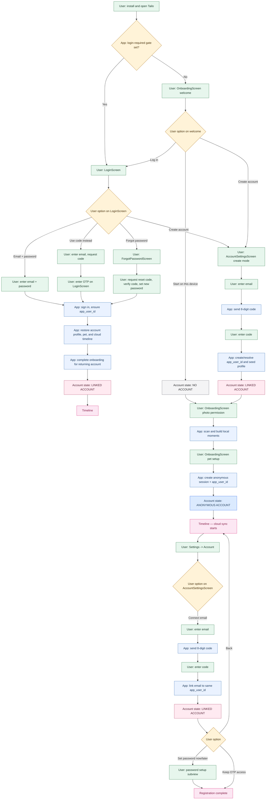
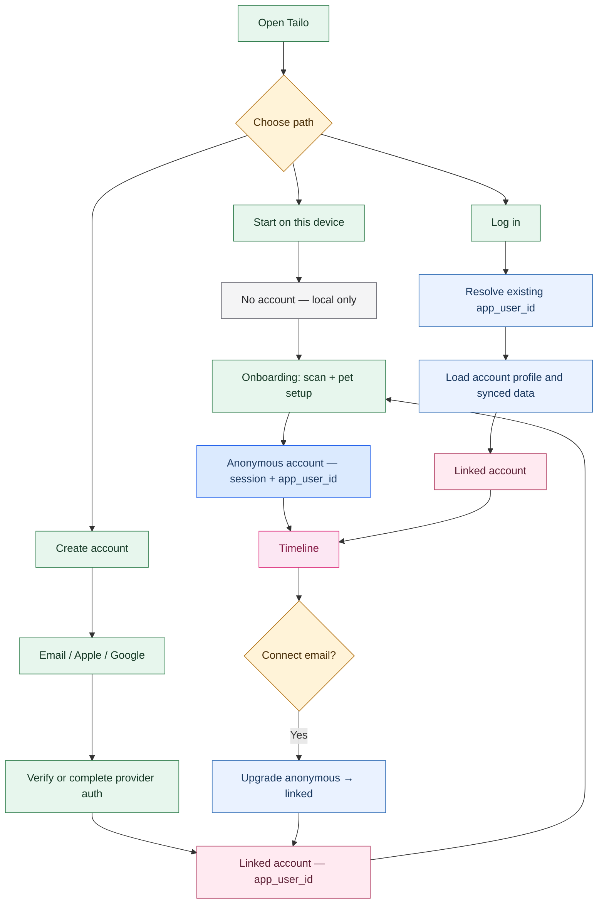
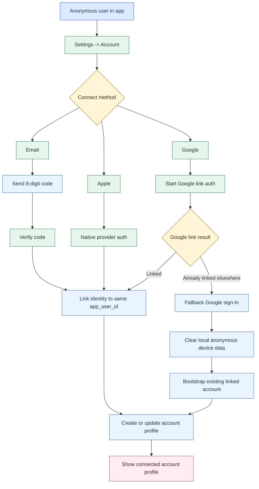
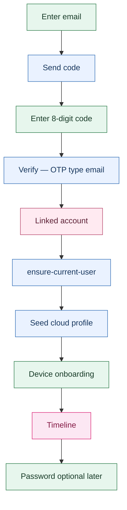
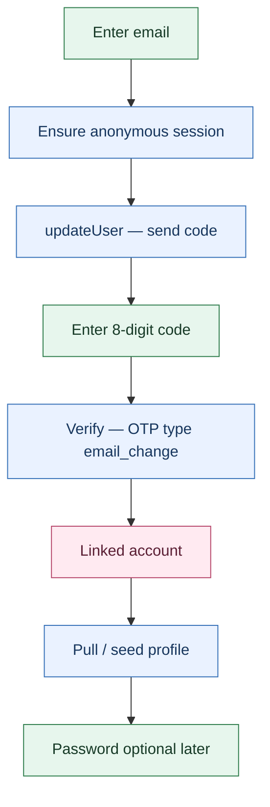
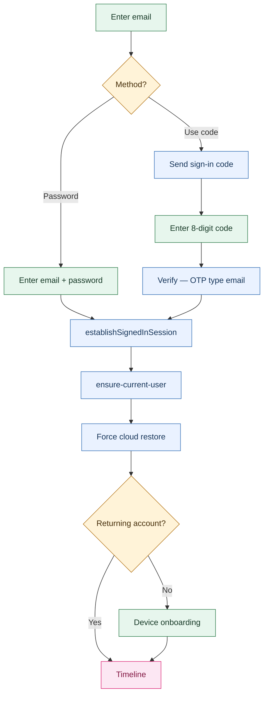
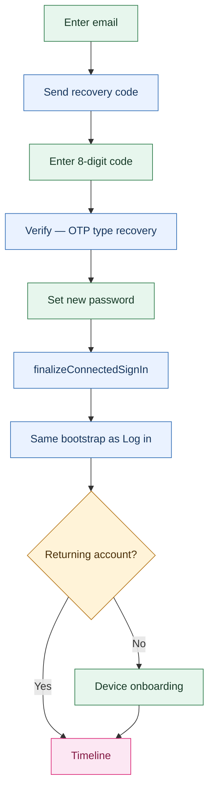

# Authentication And Account Flows

**Status:** In progress  
**Scope:** User authentication, account creation, account upgrade, login, recovery, and account profile  
**Goal:** Keep Tailo fast and low-friction for first use, while supporting durable accounts, easy sign-in, and account management across devices.

---

## Product principles

1. **Anonymous-first stays real**
   A new user can start with an anonymous account and get value immediately.

2. **Registration should feel light**
   Email registration and upgrade should be simple, mobile-friendly, and built around a short verification code instead of a fragile link-only flow.

3. **Account creation and sign-in are separate from profile setup**
   Auth answers “who is this user?” Account profile answers “how should Tailo present this user?”

4. **Connected users should feel connected**
   Once a user has a real account, Settings should show an account profile, not only an upgrade prompt.

5. **Auth must remain portable**
   Supabase can host auth today, but Tailo should keep a stable `app_user_id` and separate provider identity mappings.

---

## User states

### 1. Anonymous user

The user has:

- a local app install
- a Supabase anonymous session today
- later, a stable Tailo `app_user_id`

They can:

- complete onboarding
- build a timeline
- capture moments
- use local features
- sync allowed cloud features

They are not yet guaranteed:

- cross-device continuity
- easy recovery after reinstall
- account-based profile management

### 2. Connected user

The user has upgraded or registered with:

- email
- Apple
- Google

They should get:

- durable account identity
- clearer recovery path
- a visible account profile in Settings
- future multi-device / sharing eligibility

---

## Target auth model

Tailo should support two valid entry paths:

1. **Anonymous-first**
   Start immediately, then connect later.

2. **Direct account path**
   Create or sign in to an account immediately instead of starting anonymously.

Both paths should land on the same durable Tailo identity model:

- Tailo-owned `app_user_id` is the canonical user id
- `user_identities` stores provider mappings (`supabase_auth`, `email`, `apple`, `google`)
- account profile data belongs to the Tailo user, not to one auth provider

## Process diagrams

All flowcharts below use the same color legend as the install-to-registration tree:

- **Green:** the user must make a choice or enter data on a Tailo screen.
- **Blue:** Tailo performs the step automatically after the previous user action.
- **Amber:** a decision point or group of options.
- **Gray:** **no account** (local-only).
- **Light blue:** **anonymous account** (cloud, no email).
- **Pink:** **linked account** or stable timeline state.

### Install-to-registration decision tree

This tree describes the product behavior from first install through a completed account state. It is intentionally user-behavior oriented: the app should preserve the passive-first experience while still giving direct account paths to users who already know they want continuity.

**Account states** (three layers the user moves through):

| State                 | Meaning                                                          | Cloud identity                                                                           |
| --------------------- | ---------------------------------------------------------------- | ---------------------------------------------------------------------------------------- |
| **No account**        | First session before pet profile is saved; fully local-first.    | No Supabase session, no `app_user_id`. Device-local SQLite + `anon_*` device id only.    |
| **Anonymous account** | Pet profile exists; memories can sync to cloud without email.    | Supabase `signInAnonymously()` + Tailo `app_user_id`. Session persists on return visits. |
| **Linked account**    | Email (or future Apple/Google) connected to the same Tailo user. | Same `app_user_id`; provider identity in `user_identities`; not anonymous.               |

Screen names are implementation names where they exist today.

**Return visits (not shown as separate branches):**

- **No account → still onboarding:** same **NO ACCOUNT** state; no cloud bootstrap until pet profile is saved.
- **Anonymous account:** startup restores the existing Supabase anonymous session + `app_user_id`; user stays in **ANONYMOUS ACCOUNT** until they connect email.
- **Linked account:** session restore or sign-in; user stays in **LINKED ACCOUNT**.

Behavior rules:

- `Get started` / `Start on this device` remains the default path; it must not require registration.
- **Anonymous cloud identity is deferred** until the user saves a ready pet profile (name + type); until then the app uses local-only device identity.
- `Create account` creates durable identity first, but does not skip device setup for a new account.
- `Log in` is treated as a returning-account path; after auth, Tailo restores cloud profile, pet, and timeline data and can skip onboarding for an existing cloud account.
- `Connect email` from an anonymous session preserves the same `app_user_id`; it must not create a separate account or lose local memories.
- Password is useful for future password login, but email OTP remains a valid account access path when no password is set.

### Screen options and back behavior

| Screen / surface                            | User options                                                                                                                                                          | App-automatic actions after success                                                                                                          | Back / cancel behavior                                                                                                                       |
| ------------------------------------------- | --------------------------------------------------------------------------------------------------------------------------------------------------------------------- | -------------------------------------------------------------------------------------------------------------------------------------------- | -------------------------------------------------------------------------------------------------------------------------------------------- |
| `OnboardingScreen` welcome                  | `Start on this device` (primary when not linked), `Create account`, `Log in`; if **linked** account with existing local data, sign-in is emphasized over local start. | Local onboarding until pet profile; then anonymous cloud account + sync; sign-in restores cloud data for returning users.                    | No modal back on the welcome panel; account/login modals can be dismissed back to welcome when not login-gated.                              |
| `AccountSettingsScreen` create mode         | Enter email, send code, enter code; after connected, edit display name or add password.                                                                               | Direct email sign-up verifies OTP, establishes session, ensures `app_user_id`, seeds account profile, then returns to onboarding.            | Back returns to the previous onboarding/login screen. When opened from Login with `signInPresentation: pop`, sign-in is revealed underneath. |
| `AccountSettingsScreen` link mode           | Connect email for anonymous users; connected users can edit display name or set/change password.                                                                      | Email link verifies OTP, keeps the same `app_user_id`, runs account bootstrap, and refreshes account status.                                 | Back returns to Settings or the previous modal. Leaving before code verification keeps the user anonymous.                                   |
| `LoginScreen`                               | Email + password sign-in, `Use code instead`, `Forgot password`, `Create account`, social placeholders.                                                               | Password/OTP success signs in, ensures `app_user_id`, restores profile/pet/timeline, clears login gate, marks returning onboarding complete. | If shown as a modal, back returns to the previous screen. If shown by logout/login-required gate, cancel is not available.                   |
| `ForgotPasswordScreen`                      | Enter email, send recovery code, enter code, set new password.                                                                                                        | Recovery OTP activates the session; setting password finalizes connected sign-in and runs the same restore/bootstrap path as login.          | Back returns to `LoginScreen`; stepping back from code to email is available via `Use different email`.                                      |
| `OnboardingScreen` photo / scan / pet setup | Grant photo access, continue after scan, select pet type, enter pet details/profile photo.                                                                            | Local scan builds moments; saving pet profile completes device onboarding and opens Timeline.                                                | Step back follows onboarding step order; direct account creation does not skip these screens for a new account.                              |
| `Timeline` / `Settings` after onboarding    | Continue using Tailo, open `Settings -> Account`, connect email if still anonymous, add password if connected without one.                                            | Timeline refreshes from local SQLite; account actions sync profile/prefs/pet to cloud when connected.                                        | Normal tab navigation; account modal back returns to Settings.                                                                               |

### High-level auth map

### Anonymous-to-connected upgrade

Anonymous upgrade keeps the current Tailo identity whenever possible:

- Email connect (`updateUser` + `verifyOtp(email_change)`) keeps the same anonymous `app_user_id`.
- Google connect attempts provider **link** first on the anonymous session.
- If Google reports the identity is already linked to another account, Tailo falls back to provider **sign-in**, clears local anonymous device data, then bootstraps the existing linked account.
- OAuth transitions use a blocking loading state during redirect/callback handoff to avoid intermediate auth-screen flashes.

### Email registration, login, and recovery

All email flows use an **8-digit OTP** on mobile (no link-only verification in the core path). Password is **optional** for create/link; OTP sign-in works without a password once email is connected.

| Flow                      | Entry                             | Supabase OTP type                                   | After verify                                                                             | Password                           |
| ------------------------- | --------------------------------- | --------------------------------------------------- | ---------------------------------------------------------------------------------------- | ---------------------------------- |
| **Direct create account** | Welcome or Login → Create account | `email` (`signInWithOtp`, `shouldCreateUser: true`) | New linked user + `ensure-current-user`; seed empty cloud profile; **device onboarding** | Optional later in Account settings |
| **Connect email**         | Settings → Account (`mode: link`) | `email_change` (`updateUser` on anonymous session)  | Same `app_user_id`; pull/seed profile                                                    | Optional later                     |
| **Log in (password)**     | LoginScreen                       | — (`signInWithPassword`)                            | Force cloud restore; skip onboarding if returning account                                | Required for this path             |
| **Log in (OTP fallback)** | LoginScreen → Use code instead    | `email` (`shouldCreateUser: false`)                 | Same bootstrap as password sign-in                                                       | Not used on this path              |
| **Forgot password**       | ForgotPasswordScreen              | `recovery`                                          | Recovery session → set password → same bootstrap as sign-in                              | New password required              |

**Create vs connect:** direct **Create account** creates a **new** Supabase email user (and signs out any anonymous session first). **Connect email** upgrades the existing anonymous user in place — use this after the anonymous path.

#### 1. Direct create account

Welcome or Login → **Create account**. Ends **linked**; device onboarding still required.

#### 2. Connect email

Settings → Account while **anonymous**. Keeps the same `app_user_id`.

#### 3. Log in

LoginScreen. Password or **Use code instead** (existing accounts only).

#### 4. Forgot password

**Implementation notes:**

- `verifyEmailSignUp`, `verifyEmailLink`, `verifySignInOtp`, and password reset each call `establishSignedInSession` (except recovery, which sets password first then `finalizeConnectedSignIn`).
- `completeEmailAccountConnection` runs after linked sign-in/link: `ensure-current-user`, optional forced restore (`restoreRemoteAccountDataIfNeeded({ force: true })` on sign-in), pull/seed profile, pet sync.
- Direct create does **not** skip device onboarding; returning **log in** can skip when `created_app_user: false` or cloud restore fills a ready timeline.

## Capability rules

### Account tier matrix (target design)

| Capability                              | Anonymous user (no durable account) | Registered free user (linked account) | Paid user (future)                              |
| --------------------------------------- | ----------------------------------- | ------------------------------------- | ----------------------------------------------- |
| Onboarding                              | Yes                                 | Yes                                   | Yes                                             |
| Timeline, capture, basic edits          | Yes                                 | Yes                                   | Yes                                             |
| Cloud sync + AI captions                | Yes                                 | Yes                                   | Yes                                             |
| Recent photo scan                       | Recent window only, capped          | Yes                                   | Yes                                             |
| Historical full-story scan              | No                                  | Yes (single-pet full-history build)   | Yes (multi-pet full-history build)              |
| Passive auto-detected moments per day   | 1 per UTC day per pet type          | 1 per UTC day per pet type            | Optional multi-moment/day per pet               |
| Pet count in main product UI            | 1                                   | 1                                     | Multiple pets                                   |
| Timeline surface                        | Single-pet timeline                 | Single-pet timeline                   | Optional merged multi-pet timeline              |
| Reinstall/session-loss recovery promise | No                                  | Yes (best-effort continuity path)     | Yes (same as free, plus paid-tier features)     |
| Multi-device continuity                 | No guarantee                        | Yes (restore + ongoing sync path)     | Yes                                             |
| Premium privacy options                 | No                                  | No                                    | Future paid privacy tiers (see FUTURE_FEATURES) |

**Current status note (May 25, 2026):** anonymous vs linked scan-depth separation is not fully enforced yet in production behavior; this matrix is the intended target.

**Current product intent:** registration should improve continuity and history depth, not lock basic timeline value.

### Tier rollout design

1. **Registered free full-history build**
   - After account link/sign-in, run a resumable historical backfill pass over older library pages until complete.
   - Persist progress state and continue across app launches/foreground sessions.
   - Keep normal incremental recent scan running in parallel for new moments.
2. **Paid multi-pet model**
   - Add multiple pet profiles per account in UI and sync.
   - Keep per-pet passive limits configurable by tier.
3. **Paid multi-moment/day mode**
   - Add account feature flag for multiple passive auto-detected moments/day/pet.
   - Keep free default as one passive moment/day/pet.
4. **Paid merged timeline**
   - Add “All pets” merged timeline mode with per-event pet identity chips.
   - Keep per-pet filtered views available for focus and editing.

### Editing tiers

Basic editing should remain available to anonymous users:

- edit caption text
- change event type
- favorite or unfavorite
- hide or remove a moment
- choose the primary image for a moment

Advanced editing can stay in the upgrade or future-feature bucket:

- crop or filter photos
- styled share layouts
- richer moment curation
- synced edit history
- bulk editing
- AI-assisted rewrite variants

### Privacy and AI rule

- anonymous users can still use the standard cloud AI flow
- connected users get a stronger continuity and recovery story
- strongest privacy tiers are a separate product decision, not an automatic result of linking an account

---

## Desired user flows

### Flow A — New user onboarding with anonymous account

1. Open app
2. Tap `Start on this device`
3. **No cloud account yet** — local workspace only
4. User grants photo access
5. User completes pet setup
6. App creates anonymous Supabase session + `app_user_id`, then cloud sync
7. User lands in Timeline
8. Later, user can **connect email** (not Create account) from Settings or a soft reminder

This remains the default Tailo experience.

### Flow B — Anonymous user connects email account

1. User opens `Settings -> Account` (or timeline `SaveMemoriesLink`)
2. Enters email
3. App ensures anonymous session, then `updateUser({ email })` and sends an **8-digit verification code**
4. User enters the code (`verifyOtp` type `email_change`)
5. Email identity is linked to the **same** Tailo `app_user_id`
6. App pulls/seeds account profile from cloud
7. User can set a password **optionally** later from Account settings (OTP access remains valid without one)

### Flow C — User directly registers with email

1. User chooses `Create account`
2. Enters email
3. App sends an **8-digit verification code**
4. User enters the code
5. Tailo creates or resolves `app_user_id`
6. App creates initial account profile (cloud)
7. **Device onboarding runs** — photo permission, scan, pet setup (same steps as anonymous-first)
8. User lands on the timeline when onboarding completes
9. Password can be added later from Account settings (optional)

**Rule:** cloud account identity and local device setup are separate. New sign-ups and in-app email linking stay on onboarding until scan + pet setup finish. **Log-in** (`sign_in_with_password`, `verify_sign_in_otp`, password reset) auto-completes onboarding when `ensure-current-user` reports `created_app_user: false`, or when a **ready local pet profile** already exists on this device.

This path should be quick and should not feel heavier than anonymous-first.

### Flow D — User logs in with email

1. User chooses `Log in`
2. Enters email + password **or** uses **Use code instead** (OTP, existing accounts only)
3. App signs them in via `establishSignedInSession`
4. Backend resolves provider identity to `app_user_id`
5. Tailo runs forced cloud restore (`get-account-profile`, `get-pet`, `bootstrap-timeline` when needed)
6. Returning accounts skip device onboarding when `created_app_user: false`; otherwise device setup may still run

**Cross-device restore limits (MVP):** bootstrap can hydrate existing cloud moments; ongoing `get-event-updates` is metadata-only for events already known locally. Moments first uploaded from another device may need a future hydration pass before they appear here.

### Flow E — Forgot password

Recommended mobile-first shape:

1. User taps `Forgot password`
2. Enters email
3. App sends a verification code or reset flow email
4. User verifies identity
5. User sets a new password
6. Tailo finalizes the connected session and returns the user to the app/timeline

**Recommendation:** use a short code flow on mobile rather than relying only on email links.

### Flow F — Anonymous user connects Apple or Google

1. User opens `Settings -> Account`
2. Taps `Connect with Apple` or `Connect with Google`
3. Native provider auth completes
4. Provider identity is linked to the same Tailo user
5. Account profile screen shows connected state

**Google behavior (implemented):**

- If the user is anonymous and starts from create/link account, Tailo attempts `linkIdentity` first so the same `app_user_id` is preserved.
- If Google reports the identity is already linked to a different account, Tailo falls back to Google `sign_in`, then clears local anonymous device data and boots the existing linked account.
- During OAuth redirect + callback return, the upgrade screen switches to a full blocking loading state to prevent intermediate UI flashes.

### Flow G — User directly registers or logs in with Apple or Google

1. User taps `Continue with Apple` or `Continue with Google`
2. Native auth completes
3. Tailo resolves or creates `app_user_id`
4. If first time, create account profile
5. Continue to onboarding or app home

This should be the easiest path for many users.

**Google behavior (implemented):**

- Direct Google sign-in/sign-up uses OAuth `sign_in`.
- If an anonymous session exists before direct Google sign-in, Tailo signs out the anonymous session first to avoid invalid manual-link behavior on the provider handoff.

### Flow H — Account profile

Once a user has a connected account, Tailo should create and maintain a profile record.

Initial profile fields:

- `display_name`
- `email`
- `auth_methods` summary
- `preferred_locale`
- `created_at`
- optional `avatar_url` later

The user should be able to:

- view account profile
- update display name
- update preferred language
- see connected login methods
- later add/remove linked providers safely

---

## UX rules

### Onboarding

- default path stays anonymous-first
- direct `Create account` and `Log in` should exist, but not dominate the first session
- no long form wall before the user can understand the product
- **linked accounts still show onboarding** until `onboarding.completed` and a local pet profile exist — sign-in alone does not imply a timeline

### Verification

- email verification should use an **8-digit code**
- avoid link-only verification for the core mobile flow
- use the same mental model for email upgrade and direct email registration
- password should be optional at account creation, not a blocking extra step

### Connected account presentation

- anonymous user sees a soft upgrade prompt
- connected user sees an actual account profile surface
- do not keep showing “Save your memories” after the user is already connected

## Reminder strategy and placements

### Framing

The upgrade should be framed as:

- saving memories
- keeping the timeline safe
- recovering access later
- unlocking older historical scanning to build a fuller story

It should not be framed as unlocking the basic right to use Tailo.

### Timing

Show reminders only after the user has seen value.

**Definition of “seen value” (required):**

- User has at least one timeline moment where `caption_source = 'ai'` (AI caption visible in timeline or moment detail).
- Until this condition is true, account prompts stay non-blocking and low-priority.

Good triggers:

- after the user reaches a real timeline with at least one AI-captioned moment
- after first successful sync
- after several created or edited memories
- when the anonymous recent-scan cap is reached
- when the user opens Settings

Avoid:

- blocking the first session
- repeating the same reminder on every launch
- turning reminder copy into account bureaucracy

### Where and when we notify the user to create or connect an account

Tailo should use a tiered, calm notification plan for anonymous users.

| Surface                             | When it appears                                                                                  | What it says                                                                               | Behavior                                              |
| ----------------------------------- | ------------------------------------------------------------------------------------------------ | ------------------------------------------------------------------------------------------ | ----------------------------------------------------- |
| Welcome screen                      | Immediately, but secondary to `Get started`                                                      | `Create account` and `Log in` are available as alternate actions                           | Visible from day one, but not the default path        |
| Timeline home inline card           | After the user has completed onboarding and has at least one meaningful timeline session         | `Save your memories` / `Keep your timeline safe`                                           | Passive reminder only; dismissible                    |
| Timeline home after first sync      | After first successful cloud sync or after several created/edited moments                        | `Connect an account so your memories stay with you`                                        | Slightly stronger than the passive card, still inline |
| Timeline home at anonymous scan cap | When the anonymous user reaches the 500 recent-image cap                                         | `Create an account to scan more of your pet's history`                                     | Treated as a value upgrade, not an error              |
| Settings -> Account                 | Always for anonymous users                                                                       | `Create account`, `Connect email`, `Continue with Apple`, `Continue with Google`, `Log in` | Permanent account-management home                     |
| Before recovery-risk actions        | When the user is about to reinstall, restore, or do something where anonymous continuity is weak | `Create an account so your memories can come back later`                                   | Contextual warning, not a global nag                  |
| Future gated features               | Right before future family, sharing, or multi-device features that require identity continuity   | `Create an account to continue across devices`                                             | Just-in-time explanation                              |

### Notification timing rules

1. Do not interrupt onboarding with an account prompt.
2. Do not show a blocking popup on first timeline render.
3. Show the first home reminder only after the user has seen real value.
4. Keep `Settings -> Account` available at all times as the non-pushy place to act.
5. Use stronger reminders only when there is a clear user benefit or real continuity risk.

### Cooldown rules

- if the user dismisses the passive home reminder, do not show it again in the same session
- after dismissal, wait several days or a meaningful product event before showing it again
- if the user has already opened the account screen recently, reduce home reminder frequency
- once the user is connected, remove account-creation reminders and replace them with account profile UI

### Product distinction: create account vs connect account

- before a durable account exists, the UI can say `Create account`
- for an anonymous user upgrading the current session, the technical action is still `connect account`
- the user-facing copy should choose whichever wording is clearer in context, but the behavior must preserve the same `app_user_id`

### Placements

- `Timeline`: passive inline reminder only
- `Settings`: permanent home for account state and provider actions
- `Pet profile`: not a primary place for account upgrade

### Minimal notification system

Tailo should use one notification model for both in-app messages and push delivery.

Minimal v1 scope:

- one inbox in the app
- one unread count/badge
- one read state per notification
- a small set of notification kinds from app code and cloud jobs
- push only for actionable or time-sensitive items

Core rules:

- A notification is a durable record with `kind`, `title`, `body`, `source`, `target`, `priority`, `delivery`, and `read_at`.
- `source` can be local app logic, cloud logic, sync/AI jobs, or account actions.
- `delivery` can be `in_app`, `push`, or `both`.
- The in-app inbox is the source of truth for what the user has seen.
- Opening a notification marks it read and follows the attached target.
- Push is only a transport layer; it should never be the only place a message exists.
- Only actionable or time-sensitive items should use push. Passive prompts stay in-app.

Suggested notification kinds for the current app:

- account reminders
- sync completion or recovery issues
- AI/job completion
- continuity-risk prompts
- system status or release notes, if we later need them

First-pass product rules:

- do not add categories, threads, or reactions
- do not add archive/delete in v1 unless needed for inbox cleanup
- do not surface push for every notification; keep passive reminders in-app
- do not let cloud jobs overwrite local read state unless they own the same notification record

Minimal UI surfaces:

- a small unread indicator in Settings or the home shell
- an inbox screen with unread/read state
- tap-to-open behavior that marks the item read before navigation
- optional dismiss/archive later, but not required for the first pass

---

## Current implementation snapshot

Today the repo supports:

- anonymous session bootstrap with `signInAnonymously()`
- email upgrade from anonymous user via `updateUser({ email })` + `verifyOtp(..., type: 'email_change')`
- direct `Create account` and `Log in` entry points from onboarding welcome, both kept secondary to the anonymous-first path
- connected account profile screen (sections: account, sign-in methods, profile preferences)
- linked vs anonymous status in Account settings and Settings summary
- direct Google sign-in/sign-up from onboarding/login entry points
- anonymous Google link/upgrade path from Account settings
- Google identity conflict fallback: link-first, then sign-in existing account + clear local anonymous device data
- blocking auth loading state during OAuth redirect/callback handoff (Google and shared auth transitions)
- display name seeding from provider identity metadata when cloud/local display name is missing or blank
- sign-in methods list (email + Google currently available; Apple still pending)
- password setup after direct email account creation
- email + password sign-in for returning users
- email OTP sign-in screen as a fallback
- logout gate: after sign-out, app shows login-only until the same email signs in again
- forgot-password flow: email reset code → new password → sign in
- Phase 1 identity foundation: `app_users`, `user_identities`, `account_profiles`, `ensure-current-user` Edge Function; mobile caches `app_user_id` after bootstrap/sign-in
- `app_user_id` ownership on `pets`/`events`, RLS + storage paths, `upsert-account-profile` + Account settings display name / locale editing
- consolidated API Edge Functions (`api-auth`, `api-account`, `api-pet`, `api-events`) with shared handlers replacing redundant legacy single-action endpoints

Current architecture direction also says:

- move canonical identity to Tailo-owned `app_user_id`
- keep provider mappings in `user_identities`

Local device direction also now says:

- first-run onboarding and anonymous → cloud bootstrap stay on one device-local SQLite database; cloud identity is stored as metadata (`app_user_id`, `remote_pet_id`, `remote_event_id`) instead of switching database files
- local IDs remain device-scoped; cross-device merge and sync use remote IDs once they exist
- existing workspace-scoped installs keep their stored workspace key for backwards compatibility, but auth/bootstrap no longer changes the active workspace
- a first-class account switcher UX is still a separate feature; do not infer account switching from anonymous cloud bootstrap

---

## Current gaps

### Product / UX gaps

- no provider unlink/manage UI yet

### Configuration / operational gaps

- hosted Supabase email templates must match OTP UX, including `Reset password` OTP copy
- Apple provider on **prod/staging** still needs per-environment apply (dev configured; see `supabase/SETUP.md`)
- provider flows need environment-specific redirect and provider config validation across dev/staging/prod
- **3.1.17** Apple auth device QA matrix in `docs/DEVELOPER.md` — verified on physical iPhone via TestFlight (2026-06-10)

---

## Change log

| Date       | Change                                                                                                                                                                                                                                                                                                                     |
| ---------- | -------------------------------------------------------------------------------------------------------------------------------------------------------------------------------------------------------------------------------------------------------------------------------------------------------------------------- |
| 2026-06-10 | Native Apple sign-in/link: onboarding + login direct sign-in, Settings anonymous upgrade with link-first + conflict fallback, dev Supabase Apple provider (`com.mtxforge.tailo`), first-authorization name persisted to `user_metadata`. Device QA checklist in `DEVELOPER.md`; prod provider apply still per-environment. |
| 2026-06-10 | **3.1.17** device QA passed on physical iPhone via EAS TestFlight production build (Sign in with Apple).                                                                                                                                                                                                                   |
| 2026-06-06 | Notification inbox first slice shipped (`3.6.1`–`3.6.4`, `3.6.8`): shared contract + local inbox schema, Settings unread entry, account/sync/AI/continuity producers, and test coverage.                                                                                                                                   |
| 2026-05-25 | Google auth flow now documents link-first behavior for anonymous upgrades, plus fallback to existing-account sign-in when identity is already linked (with local anonymous data clear).                                                                                                                                    |
| 2026-05-25 | OAuth handoff UX now documents full-screen blocking loading during redirect/callback transitions to avoid intermediate auth screen flashes.                                                                                                                                                                                |
| 2026-05-25 | Account profile seeding now documents provider display-name fallback when cloud/local display name is blank.                                                                                                                                                                                                               |
| 2026-05-25 | Supabase Edge Function docs now reflect consolidated router endpoints (`api-auth`, `api-account`, `api-pet`, `api-events`) and removal of redundant legacy single-action functions.                                                                                                                                        |
| 2026-05-24 | Anonymous → cloud bootstrap no longer switches local SQLite workspaces; mobile persists cloud IDs onto existing local records and keeps local IDs device-scoped.                                                                                                                                                           |
| 2026-05-24 | Stale SecureStore reconciliation clears global identity/auth state for fresh local databases, including legacy workspace installs, so Keychain leftovers do not resurrect old accounts.                                                                                                                                    |
| 2026-05-24 | All auth flow diagrams share install-to-registration color legend (user/app/decision/account-state).                                                                                                                                                                                                                       |
| 2026-05-24 | Install-to-registration decision tree documents **no account**, **anonymous account**, and **linked account** states; deferred anonymous cloud until pet profile.                                                                                                                                                          |
| 2026-05-24 | Anonymous Supabase session + `app_user_id` are created **after first pet profile**, not at app launch; startup restores session only when pet profile or prior session exists.                                                                                                                                             |
| 2026-05-24 | Onboarding welcome: `Start on this device` stays primary for anonymous users (even with partial local data); sign-in is emphasized only when already linked.                                                                                                                                                               |
| 2026-05-24 | Returning-account sign-in forces cloud restore/backfill; cloud pet wins over partial local pet state and bootstrap pagination uses `(timestamp, event_id)` boundaries.                                                                                                                                                     |
| 2026-05-20 | Cross-device sign-in: `get-account-profile` + `get-pet` + `bootstrap-timeline` hydrate user profile, pet, and cloud moments; seed empty cloud prefs only after pull.                                                                                                                                                       |
| 2026-05-19 | Cross-device sign-in: `get-pet` + `bootstrap-timeline` hydrate local pet profile and cloud moments on devices without local timeline data.                                                                                                                                                                                 |
| 2026-05-19 | Per-user workspace DBs align install ids without wiping Keychain; workspace is always `app_<app_user_id>` (not Supabase auth id).                                                                                                                                                                                          |
| 2026-05-19 | Sign-in awaits workspace migration + legacy link before UI reload; per-user workspace DBs no longer wipe migrated SecureStore on first open.                                                                                                                                                                               |
| 2026-05-19 | Log-in (`password` / OTP) skips onboarding for existing cloud accounts (`created_app_user: false`); workspace selection prefers Tailo `app_user_id`.                                                                                                                                                                       |
| 2026-05-19 | Direct sign-up routes to **device onboarding** before timeline; returning linked sign-in skips onboarding only when a local pet profile exists.                                                                                                                                                                            |
| 2026-05-19 | **Create account** uses direct email OTP signup (`requestEmailSignUp`); **Save/link memories** keeps anonymous `updateUser` + `email_change` OTP.                                                                                                                                                                          |
| 2026-05-19 | `app_user_id` ownership migration: `pets`/`events`, RLS, storage paths, `upsert-account-profile`, Account settings profile fields.                                                                                                                                                                                         |
| 2026-05-19 | Phase 1 identity foundation: `app_users`, `user_identities`, `account_profiles`, `ensure-current-user`, mobile `app_user_id` cache + dev diagnostics.                                                                                                                                                                      |
| 2026-05-19 | Phase 4 account profile: connected vs anonymous surfaces, sign-in methods list, profile editing, Settings summary for linked accounts.                                                                                                                                                                                     |
| 2026-05-19 | Phase 2 email flows complete: `completeEmailAccountConnection` after link/sign-in; `authEdgeCasePolicy` in `@tailo/backend-core`; B2.4.0 done.                                                                                                                                                                             |
| 2026-05-20 | Mobile logout gate, password login, forgot-password reset flow, and auth loading hardening.                                                                                                                                                                                                                                |
| 2026-05-24 | Forgot-password documentation now matches the mobile code: successful reset finalizes sign-in and returns to the app/timeline.                                                                                                                                                                                             |
| 2026-05-24 | Documented cross-device sync gap: initial restore exists, but later remote-created moments need media hydration and cross-device dedupe work.                                                                                                                                                                              |
| 2026-05-25 | Cross-device sync completion: unknown remote moment hydration, persisted bootstrap backfill passes, signed-thumbnail refresh, and fingerprint-based server dedupe are now implemented.                                                                                                                                     |

## Recommended implementation plan

### Phase 1 — Identity foundation ✅ (2026-05-19)

1. ~~Finish `app_user_id` + `user_identities` backend model~~
2. ~~Define account profile schema (`display_name`, `preferred_locale`, provider summary)~~ — stub `account_profiles`
3. ~~Add `ensure-current-user` flow for every signed-in session~~
4. Keep anonymous-first flow working during the migration — **done**; `pets`/`events` ownership uses `app_user_id` (B2.1.13–16)

### Phase 2 — Complete email account flows ✅ (2026-05-19)

1. ~~Keep anonymous email upgrade with 8-digit code~~
2. ~~Add direct `Create account` with email verification code~~
3. ~~Add password creation after verification (optional step after create / link)~~
4. ~~Add direct `Log in with email`~~
5. ~~Add `Forgot password` / reset flow~~
6. ~~Persist and load account profile after connection~~ (`completeEmailAccountConnection`, `upsert-account-profile`)

### Phase 3 — Provider sign-in

1. Add `Continue with Apple`
2. Add `Continue with Google`
3. Support both:
   - direct registration/login
   - linking from an anonymous user
4. Show connected providers inside account profile

### Phase 4 — Account profile and management ✅ (2026-05-19)

1. ~~Replace upgrade-only views with real account profile screens~~
2. ~~Allow editing display name and preferred language~~
3. ~~Show connected methods and account status~~ (email connected; Apple/Google available for link/sign-in on iOS where native auth is supported)
4. Add safer provider-link / unlink rules later (Phase 3 providers)

### Phase 5 — Recovery and multi-device polish

1. Finalize cross-device sign-in and restore policy
2. Handle returning user on a new install
3. Resolve merge/recovery behavior between anonymous local data and connected cloud account

---

## Implementation checklist by area

### Mobile

- `AppShell` shows onboarding when `onboarding.completed` is false (anonymous **or** linked); timeline only after device setup
- `completeOnboardingForReturningLinkedUser` skips onboarding for explicit log-in when the cloud account already exists, or when `hasReadyLocalPetProfile()` is true
- `Create account` closes the account modal after verify and continues onboarding on the main shell
- onboarding entry points for `Get started`, `Create account`, `Log in`
- email verification-code screens
- password setup / password login screens
- forgot-password screens
- Apple / Google buttons and native auth flow
- connected account profile screen
- profile editing UI

### Backend / auth model

- `app_users`
- `user_identities`
- account profile data model
- provider resolution to `app_user_id`
- email/password auth support
- password reset support
- remove legacy `profiles` table writes after `app_users` / `user_identities` became canonical

### Shared contracts

- account profile payload
- auth state shape
- provider list shape
- verification / password reset contract docs

### Operations

- Supabase email templates aligned to OTP UX
- Apple capability and OAuth setup
- Google OAuth setup
- dev/prod provider configuration checklists

---

## Decision summary

Tailo should remain **anonymous-first by default**, but it should also support:

- direct account creation
- direct login
- quick email verification by **8-digit code**
- password login + forgot password
- Apple / Google sign-in
- a real connected account profile

That gives us a product that is easy to start, easy to recover, and much easier to scale beyond one-device anonymous use.
