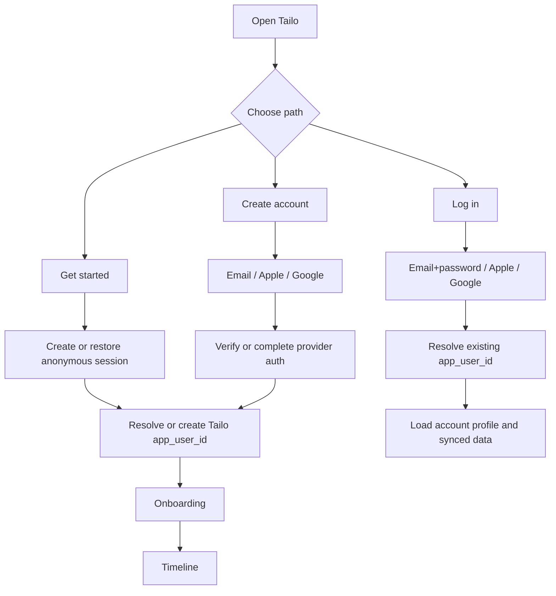
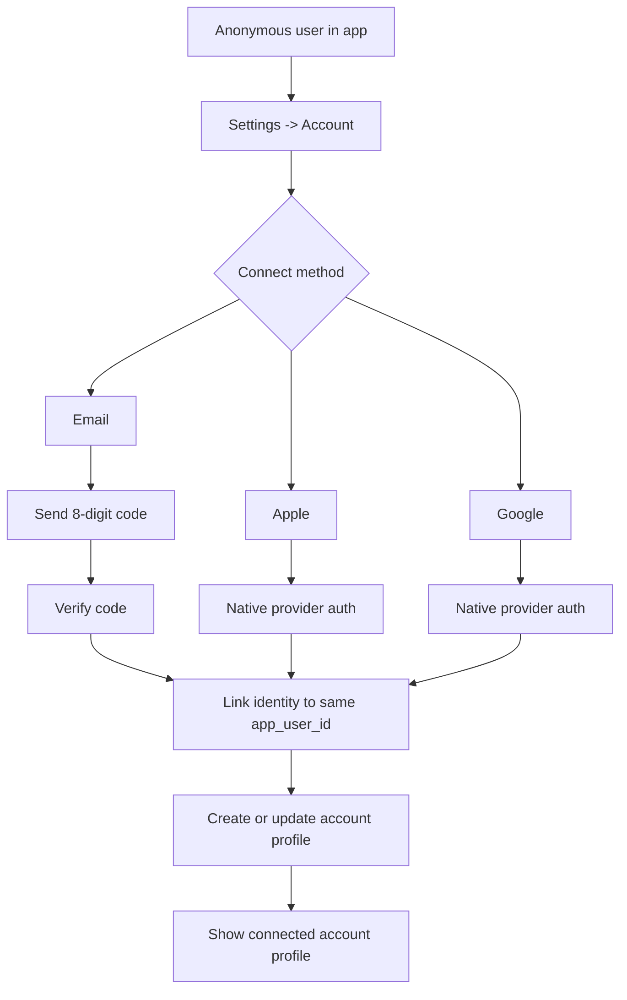
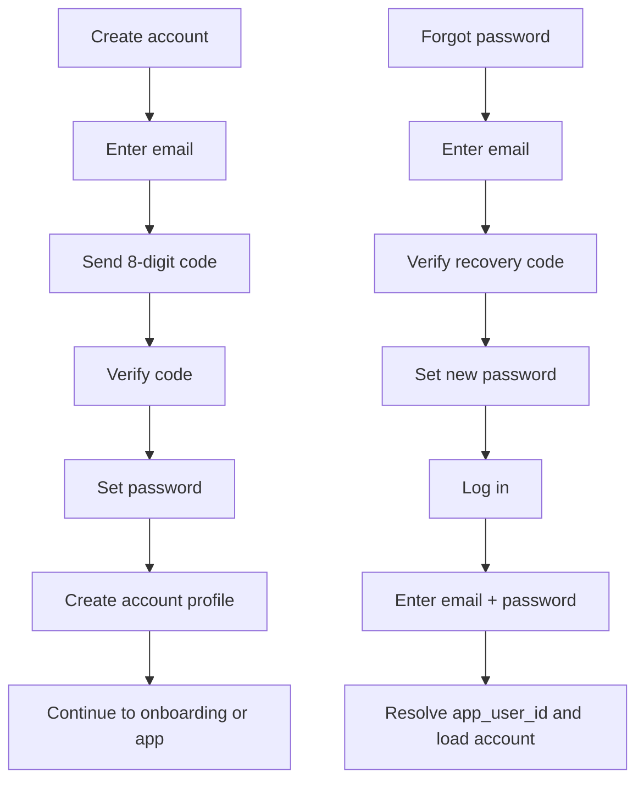

# Authentication And Account Flows

**Status:** In progress  
**Scope:** User authentication, account creation, account upgrade, login, recovery, and account profile  
**Goal:** Keep Tailo fast and low-friction for first use, while supporting durable accounts, easy sign-in, and account management across devices.

---

## Product principles

1. **Anonymous-first stays real**
   A new user can start with an anonymous account and get value immediately.

2. **Registration should feel light**
   Email registration and upgrade should be simple, mobile-friendly, and built around a short verification code instead of a fragile link-only flow.

3. **Account creation and sign-in are separate from profile setup**
   Auth answers “who is this user?” Account profile answers “how should Tailo present this user?”

4. **Connected users should feel connected**
   Once a user has a real account, Settings should show an account profile, not only an upgrade prompt.

5. **Auth must remain portable**
   Supabase can host auth today, but Tailo should keep a stable `app_user_id` and separate provider identity mappings.

---

## User states

### 1. Anonymous user

The user has:

- a local app install
- a Supabase anonymous session today
- later, a stable Tailo `app_user_id`

They can:

- complete onboarding
- build a timeline
- capture moments
- use local features
- sync allowed cloud features

They are not yet guaranteed:

- cross-device continuity
- easy recovery after reinstall
- account-based profile management

### 2. Connected user

The user has upgraded or registered with:

- email
- Apple
- Google

They should get:

- durable account identity
- clearer recovery path
- a visible account profile in Settings
- future multi-device / sharing eligibility

---

## Target auth model

Tailo should support two valid entry paths:

1. **Anonymous-first**
   Start immediately, then connect later.

2. **Direct account path**
   Create or sign in to an account immediately instead of starting anonymously.

Both paths should land on the same durable Tailo identity model:

- Tailo-owned `app_user_id` is the canonical user id
- `user_identities` stores provider mappings (`supabase_auth`, `email`, `apple`, `google`)
- account profile data belongs to the Tailo user, not to one auth provider

## Process diagrams

### High-level auth map

### Anonymous-to-connected upgrade

### Email registration, login, and recovery

## Capability rules

### Anonymous vs connected users

| Capability                              | Anonymous user          | Connected user          |
| --------------------------------------- | ----------------------- | ----------------------- |
| Onboarding                              | Yes                     | Yes                     |
| Timeline, capture, basic edits          | Yes                     | Yes                     |
| Cloud sync + AI captions                | Yes                     | Yes                     |
| Same-device normal use                  | Yes                     | Yes                     |
| Recent photo scan                       | Up to 500 recent images | Yes                     |
| New photo detection after setup         | Yes                     | Yes                     |
| Historical full-story scan              | No                      | Yes                     |
| Reinstall/session-loss recovery promise | No                      | Better future path      |
| Multi-device continuity                 | Not in MVP              | Future                  |
| Family / sharing features               | Future, likely gated    | Future, likely eligible |

### Editing tiers

Basic editing should remain available to anonymous users:

- edit caption text
- change event type
- favorite or unfavorite
- hide or remove a moment
- choose the primary image for a moment

Advanced editing can stay in the upgrade or future-feature bucket:

- crop or filter photos
- styled share layouts
- richer moment curation
- synced edit history
- bulk editing
- AI-assisted rewrite variants

### Privacy and AI rule

- anonymous users can still use the standard cloud AI flow
- connected users get a stronger continuity and recovery story
- strongest privacy tiers are a separate product decision, not an automatic result of linking an account

---

## Desired user flows

### Flow A — New user onboarding with anonymous account

1. Open app
2. Tap `Get started`
3. App creates or restores anonymous session
4. User grants photo access
5. User completes pet setup
6. User lands in Timeline
7. Later, user can connect email / Apple / Google from Settings or a soft reminder

This remains the default Tailo experience.

### Flow B — Anonymous user connects email account

1. User opens `Settings -> Account`
2. Enters email
3. App sends an **8-digit verification code**
4. User enters the code
5. Email identity is linked to the same Tailo user
6. User sets a password if we require password-based email login
7. App shows connected account profile

**Rule:** if the app supports email + password login later, password setup should happen during or immediately after successful email verification.

### Flow C — User directly registers with email

1. User chooses `Create account`
2. Enters email
3. App sends an **8-digit verification code**
4. User enters the code
5. Tailo creates or resolves `app_user_id`
6. App creates initial account profile (cloud)
7. **Device onboarding runs** — photo permission, scan, pet setup (same steps as anonymous-first)
8. User lands on the timeline when onboarding completes
9. Password can be added later from Account settings (optional)

**Rule:** a linked account does **not** skip device onboarding. Cloud account identity and a local timeline are separate. `completeOnboardingForReturningLinkedUser` only auto-completes onboarding when a **ready local pet profile** already exists (returning user on this device).

This path should be quick and should not feel heavier than anonymous-first.

### Flow D — User logs in with email

1. User chooses `Log in`
2. Enters email + password
3. App signs them in
4. Backend resolves provider identity to `app_user_id`
5. Tailo loads the connected account profile and synced data

### Flow E — Forgot password

Recommended mobile-first shape:

1. User taps `Forgot password`
2. Enters email
3. App sends a verification code or reset flow email
4. User verifies identity
5. User sets a new password
6. User returns to login

**Recommendation:** use a short code flow on mobile rather than relying only on email links.

### Flow F — Anonymous user connects Apple or Google

1. User opens `Settings -> Account`
2. Taps `Connect with Apple` or `Connect with Google`
3. Native provider auth completes
4. Provider identity is linked to the same Tailo user
5. Account profile screen shows connected state

### Flow G — User directly registers or logs in with Apple or Google

1. User taps `Continue with Apple` or `Continue with Google`
2. Native auth completes
3. Tailo resolves or creates `app_user_id`
4. If first time, create account profile
5. Continue to onboarding or app home

This should be the easiest path for many users.

### Flow H — Account profile

Once a user has a connected account, Tailo should create and maintain a profile record.

Initial profile fields:

- `display_name`
- `email`
- `auth_methods` summary
- `preferred_locale`
- `created_at`
- optional `avatar_url` later

The user should be able to:

- view account profile
- update display name
- update preferred language
- see connected login methods
- later add/remove linked providers safely

---

## UX rules

### Onboarding

- default path stays anonymous-first
- direct `Create account` and `Log in` should exist, but not dominate the first session
- no long form wall before the user can understand the product
- **linked accounts still show onboarding** until `onboarding.completed` and a local pet profile exist — sign-in alone does not imply a timeline

### Verification

- email verification should use an **8-digit code**
- avoid link-only verification for the core mobile flow
- use the same mental model for email upgrade and direct email registration
- password should be optional at account creation, not a blocking extra step

### Connected account presentation

- anonymous user sees a soft upgrade prompt
- connected user sees an actual account profile surface
- do not keep showing “Save your memories” after the user is already connected

## Reminder strategy and placements

### Framing

The upgrade should be framed as:

- saving memories
- keeping the timeline safe
- recovering access later
- unlocking older historical scanning to build a fuller story

It should not be framed as unlocking the basic right to use Tailo.

### Timing

Show reminders only after the user has seen value.

Good triggers:

- after the user reaches a real timeline
- after first successful sync
- after several created or edited memories
- when the anonymous recent-scan cap is reached
- when the user opens Settings

Avoid:

- blocking the first session
- repeating the same reminder on every launch
- turning reminder copy into account bureaucracy

### Where and when we notify the user to create or connect an account

Tailo should use a tiered, calm notification plan for anonymous users.

| Surface                             | When it appears                                                                                  | What it says                                                                               | Behavior                                              |
| ----------------------------------- | ------------------------------------------------------------------------------------------------ | ------------------------------------------------------------------------------------------ | ----------------------------------------------------- |
| Welcome screen                      | Immediately, but secondary to `Get started`                                                      | `Create account` and `Log in` are available as alternate actions                           | Visible from day one, but not the default path        |
| Timeline home inline card           | After the user has completed onboarding and has at least one meaningful timeline session         | `Save your memories` / `Keep your timeline safe`                                           | Passive reminder only; dismissible                    |
| Timeline home after first sync      | After first successful cloud sync or after several created/edited moments                        | `Connect an account so your memories stay with you`                                        | Slightly stronger than the passive card, still inline |
| Timeline home at anonymous scan cap | When the anonymous user reaches the 500 recent-image cap                                         | `Create an account to scan more of your pet's history`                                     | Treated as a value upgrade, not an error              |
| Settings -> Account                 | Always for anonymous users                                                                       | `Create account`, `Connect email`, `Continue with Apple`, `Continue with Google`, `Log in` | Permanent account-management home                     |
| Before recovery-risk actions        | When the user is about to reinstall, restore, or do something where anonymous continuity is weak | `Create an account so your memories can come back later`                                   | Contextual warning, not a global nag                  |
| Future gated features               | Right before future family, sharing, or multi-device features that require identity continuity   | `Create an account to continue across devices`                                             | Just-in-time explanation                              |

### Notification timing rules

1. Do not interrupt onboarding with an account prompt.
2. Do not show a blocking popup on first timeline render.
3. Show the first home reminder only after the user has seen real value.
4. Keep `Settings -> Account` available at all times as the non-pushy place to act.
5. Use stronger reminders only when there is a clear user benefit or real continuity risk.

### Cooldown rules

- if the user dismisses the passive home reminder, do not show it again in the same session
- after dismissal, wait several days or a meaningful product event before showing it again
- if the user has already opened the account screen recently, reduce home reminder frequency
- once the user is connected, remove account-creation reminders and replace them with account profile UI

### Product distinction: create account vs connect account

- before a durable account exists, the UI can say `Create account`
- for an anonymous user upgrading the current session, the technical action is still `connect account`
- the user-facing copy should choose whichever wording is clearer in context, but the behavior must preserve the same `app_user_id`

### Placements

- `Timeline`: passive inline reminder only
- `Settings`: permanent home for account state and provider actions
- `Pet profile`: not a primary place for account upgrade

---

## Current implementation snapshot

Today the repo supports:

- anonymous session bootstrap with `signInAnonymously()`
- email upgrade from anonymous user via `updateUser({ email })` + `verifyOtp(..., type: 'email_change')`
- direct `Create account` and `Log in` entry points from onboarding welcome, both kept secondary to the anonymous-first path
- connected account profile screen (sections: account, sign-in methods, profile preferences)
- linked vs anonymous status in Account settings and Settings summary
- sign-in methods list (email connected; Apple/Google shown as coming later)
- password setup after direct email account creation
- email + password sign-in for returning users
- email OTP sign-in screen as a fallback
- logout gate: after sign-out, app shows login-only until the same email signs in again
- forgot-password flow: email reset code → new password → sign in
- Phase 1 identity foundation: `app_users`, `user_identities`, `account_profiles`, `ensure-current-user` Edge Function; mobile caches `app_user_id` after bootstrap/sign-in
- `app_user_id` ownership on `pets`/`events`, RLS + storage paths, `upsert-account-profile` + Account settings display name / locale editing
- account-upgrade planning docs for Apple / Google later

Current architecture direction also says:

- move canonical identity to Tailo-owned `app_user_id`
- keep provider mappings in `user_identities`

Local device direction also now says:

- linked accounts should not share one device-local story by accident
- local SQLite and workspace-scoped SecureStore state may be partitioned by `app_user_id`
- multiple linked accounts on one device are supported at the storage layer for testing and future account switching
- a first-class account switcher UX is still a separate feature from the storage foundation

---

## Current gaps

### Product / UX gaps

- no Apple sign-in flow yet
- no Google sign-in flow yet
- no provider-management UI yet

### Configuration / operational gaps

- hosted Supabase email templates must match OTP UX, including `Reset password` OTP copy
- Apple/Google provider setup is not fully configured
- direct registration/login flows need environment-specific redirect and provider config

---

## Change log

| Date       | Change                                                                                                                                                |
| ---------- | ----------------------------------------------------------------------------------------------------------------------------------------------------- |
| 2026-05-19 | Direct sign-up routes to **device onboarding** before timeline; returning linked sign-in skips onboarding only when a local pet profile exists.      |
| 2026-05-19 | **Create account** uses direct email OTP signup (`requestEmailSignUp`); **Save/link memories** keeps anonymous `updateUser` + `email_change` OTP.     |
| 2026-05-19 | `app_user_id` ownership migration: `pets`/`events`, RLS, storage paths, `upsert-account-profile`, Account settings profile fields.                    |
| 2026-05-19 | Phase 1 identity foundation: `app_users`, `user_identities`, `account_profiles`, `ensure-current-user`, mobile `app_user_id` cache + dev diagnostics. |
| 2026-05-19 | Phase 4 account profile: connected vs anonymous surfaces, sign-in methods list, profile editing, Settings summary for linked accounts.                |
| 2026-05-19 | Phase 2 email flows complete: `completeEmailAccountConnection` after link/sign-in; `authEdgeCasePolicy` in `@tailo/backend-core`; B2.4.0 done.        |
| 2026-05-20 | Mobile logout gate, password login, forgot-password reset flow, and auth loading hardening.                                                           |

## Recommended implementation plan

### Phase 1 — Identity foundation ✅ (2026-05-19)

1. ~~Finish `app_user_id` + `user_identities` backend model~~
2. ~~Define account profile schema (`display_name`, `preferred_locale`, provider summary)~~ — stub `account_profiles`
3. ~~Add `ensure-current-user` flow for every signed-in session~~
4. Keep anonymous-first flow working during the migration — **done**; `pets`/`events` ownership uses `app_user_id` (B2.1.13–16)

### Phase 2 — Complete email account flows ✅ (2026-05-19)

1. ~~Keep anonymous email upgrade with 8-digit code~~
2. ~~Add direct `Create account` with email verification code~~
3. ~~Add password creation after verification (optional step after create / link)~~
4. ~~Add direct `Log in with email`~~
5. ~~Add `Forgot password` / reset flow~~
6. ~~Persist and load account profile after connection~~ (`completeEmailAccountConnection`, `upsert-account-profile`)

### Phase 3 — Provider sign-in

1. Add `Continue with Apple`
2. Add `Continue with Google`
3. Support both:
   - direct registration/login
   - linking from an anonymous user
4. Show connected providers inside account profile

### Phase 4 — Account profile and management ✅ (2026-05-19)

1. ~~Replace upgrade-only views with real account profile screens~~
2. ~~Allow editing display name and preferred language~~
3. ~~Show connected methods and account status~~ (email connected; Apple/Google “coming later”)
4. Add safer provider-link / unlink rules later (Phase 3 providers)

### Phase 5 — Recovery and multi-device polish

1. Finalize cross-device sign-in and restore policy
2. Handle returning user on a new install
3. Resolve merge/recovery behavior between anonymous local data and connected cloud account

---

## Implementation checklist by area

### Mobile

- `AppShell` shows onboarding when `onboarding.completed` is false (anonymous **or** linked); timeline only after device setup
- `completeOnboardingForReturningLinkedUser` skips onboarding only when `hasReadyLocalPetProfile()` is true
- `Create account` closes the account modal after verify and continues onboarding on the main shell
- onboarding entry points for `Get started`, `Create account`, `Log in`
- email verification-code screens
- password setup / password login screens
- forgot-password screens
- Apple / Google buttons and native auth flow
- connected account profile screen
- profile editing UI

### Backend / auth model

- `app_users`
- `user_identities`
- account profile data model
- provider resolution to `app_user_id`
- email/password auth support
- password reset support

### Shared contracts

- account profile payload
- auth state shape
- provider list shape
- verification / password reset contract docs

### Operations

- Supabase email templates aligned to OTP UX
- Apple capability and OAuth setup
- Google OAuth setup
- dev/prod provider configuration checklists

---

## Decision summary

Tailo should remain **anonymous-first by default**, but it should also support:

- direct account creation
- direct login
- quick email verification by **8-digit code**
- password login + forgot password
- Apple / Google sign-in
- a real connected account profile

That gives us a product that is easy to start, easy to recover, and much easier to scale beyond one-device anonymous use.
