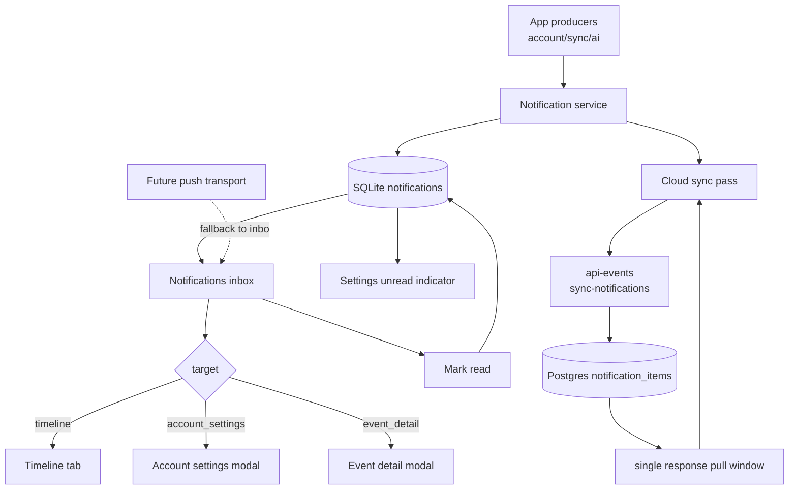
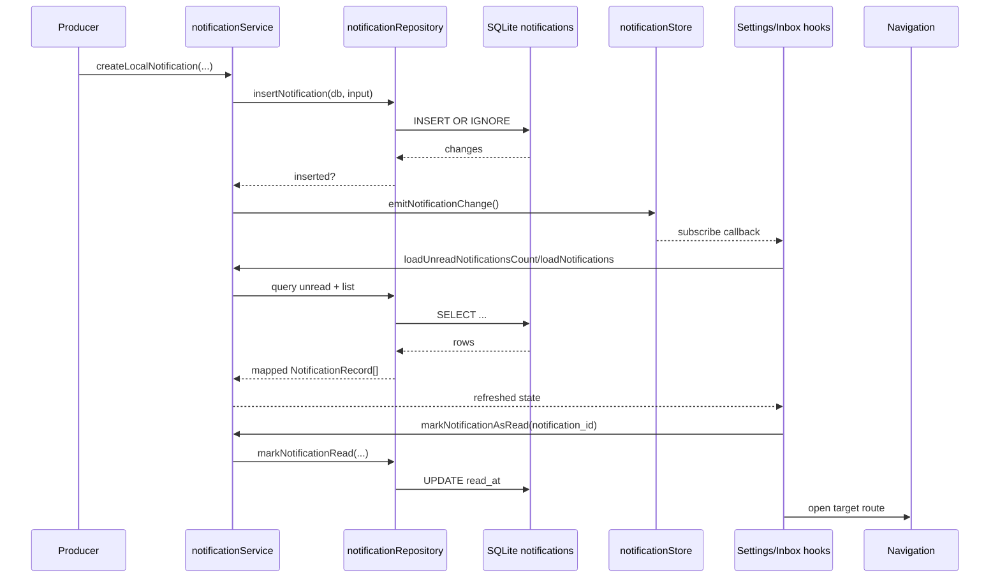
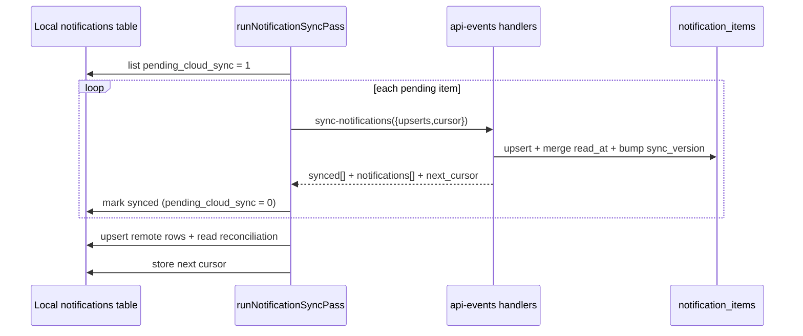

# Notifications And Inbox

**Status:** In progress  
**Scope:** Notification inbox + cloud storage/sync foundation (`3.6.1`–`3.6.5`, `3.6.7`, `3.6.8`; push transport remains partial)  
**Goal:** Keep one durable in-app inbox for account/sync/moment updates, with cross-device read/state sync.

---

## Design goals

1. **One durable model** for both in-app and future push notification delivery.
2. **Local inbox as source of truth** for read/unread state and what the user has seen.
3. **Calm placement** through Settings entry and inbox screen, without interruptive modal prompts.
4. **Producer-first architecture** so account, sync, and AI flows can emit notifications consistently.

---

## High-level design



---

## Low-level design



---

## DB schema (mobile SQLite)

Migration: `apps/mobile/src/db/migrations.ts` `version: 13`  
Table: `notifications`

```sql
CREATE TABLE IF NOT EXISTS notifications (
  notification_id TEXT PRIMARY KEY NOT NULL,
  kind TEXT NOT NULL,
  title TEXT NOT NULL,
  body TEXT NOT NULL,
  source TEXT NOT NULL,
  target TEXT NOT NULL,
  priority TEXT NOT NULL DEFAULT 'normal',
  delivery TEXT NOT NULL DEFAULT 'in_app',
  read_at TEXT,
  created_at TEXT NOT NULL DEFAULT CURRENT_TIMESTAMP,
  expires_at TEXT
);

CREATE INDEX IF NOT EXISTS notifications_read_created_idx
  ON notifications (read_at, created_at DESC);

CREATE INDEX IF NOT EXISTS notifications_created_idx
  ON notifications (created_at DESC);
```

Field meanings:

- `notification_id`: stable id for dedupe and read-state reconciliation
- `kind`: semantic category (`account_reminder`, `sync_complete`, `ai_job_complete`, `continuity_risk`, `system`)
- `source`: origin (`local_app`, `cloud_job`, `sync`, `account`, `system`)
- `target`: JSON payload for route intent (`timeline`, `event_detail`, `account_settings`)
- `priority`: delivery importance (`low`, `normal`, `high`)
- `delivery`: requested transport (`in_app`, `push`, `both`)
- `read_at`: null = unread; set timestamp = read
- `expires_at`: optional TTL for auto-expiring notifications

Indexes:

- `notifications_read_created_idx` for unread/read list queries
- `notifications_created_idx` for newest-first inbox loading
- `notifications_pending_cloud_sync_idx` for outbound sync queue

Shared contract source:

- `packages/shared/src/contracts/notifications.ts`

The shared contract validates:

- kinds, source, priority, delivery enums
- typed targets (`timeline`, `event_detail`, `account_settings`)
- record shape parity for local and future backend payloads

---

## DB schema (cloud Postgres)

Migration: `supabase/migrations/20260606114500_add_notification_items_sync.sql`  
Table: `public.notification_items`

```sql
create table if not exists public.notification_items (
  notification_item_id uuid primary key default gen_random_uuid(),
  app_user_id uuid not null references public.app_users (app_user_id) on delete cascade,
  source_notification_id text not null,
  kind text not null,
  title text not null,
  body text not null,
  source text not null,
  target jsonb not null default '{}'::jsonb,
  priority text not null default 'normal',
  delivery text not null default 'in_app',
  read_at timestamptz,
  created_at timestamptz not null default timezone('utc', now()),
  expires_at timestamptz,
  sync_version bigint not null default 1 check (sync_version >= 1),
  updated_at timestamptz not null default timezone('utc', now()),
  constraint notification_items_app_user_source_key
    unique (app_user_id, source_notification_id)
);
```

Cloud indexes:

- `notification_items_app_user_updated_idx` (`app_user_id`, `updated_at`, `notification_item_id`)
- `notification_items_app_user_unread_idx` (`app_user_id`, `read_at`, `created_at`)

Cloud security:

- RLS enabled on `public.notification_items`
- policies for `select/insert/update` scoped to `public.current_app_user_id()`

---

## Mobile architecture

### Repository + service

- `notificationRepository.ts` handles SQLite persistence and queries.
- `notificationService.ts` wraps DB access and publishes change events.
- `notificationStore.ts` provides a lightweight local subscribe/emit mechanism for unread and inbox refresh.
- `syncNotifications.ts` pushes local pending changes and pulls cloud updates during background sync.
- `api.ts` wraps the cloud action `sync-notifications` (push + pull in one request).

### UI surfaces

- **Settings entry** (`SettingsScreen`): adds `Notifications` row and unread badge text.
- **Inbox modal** (`NotificationsInboxScreen`): lists unread/read notifications and marks opened items as read.
- Navigation target handling:
  - `timeline` → switch to Timeline tab and close inbox
  - `account_settings` → open account modal
  - `event_detail` → open moment detail modal

### Producers wired now

- `account_reminder` and `continuity_risk` from `SaveMemoriesLink` visibility path.
- `sync_complete` from `runPendingCloudSync` completion summary.
- `ai_job_complete` when `applyRemoteEventUpdates` transitions a local event from `pending_ai` to done.

Deduping:

- producer-side recent unread checks avoid reminder spam for repeated triggers.

---

## Cloud API contract and sync flow

Action routed by `api-events`:

- `sync-notifications`
  - accepts local upserts (pending local notification rows)
  - upserts by `(app_user_id, source_notification_id)`
  - merges `read_at` using latest timestamp
  - increments `sync_version` for updated rows
  - returns ordered update window by cursor `(updated_at, notification_item_id)` + `next_cursor`



Read-state reconciliation:

- local and cloud `read_at` merge with **newest-read-wins**
- if local read is newer than remote during pull, local row remains `pending_cloud_sync = 1` for the next push

---

## Implementation plan (executed in this slice)

1. Add shared cloud notification sync contract (`packages/shared`) ✅
2. Add cloud table + RLS migration (`supabase/migrations`) ✅
3. Add cloud API handlers and route actions (`api-events`) ✅
4. Extend mobile notification schema for sync metadata (`migration v14`) ✅
5. Add mobile push/pull sync pass in background cloud sync loop ✅
6. Keep push transport fallback (`push` / `both` -> in-app when unavailable) ✅
7. Leave native/APNS/FCM token registration as follow-up (`3.6.6`) ⏳

---

## Push fallback and read reconciliation foundation

- `pushDelivery.ts` resolves requested delivery to in-app fallback when push is unavailable.
- `readStateReconciliation.ts` merges local/remote `read_at` values with newest-read-wins behavior.

This slice does **not** yet ship:

- real push transport/token registration (`3.6.6`)

Cloud storage + API sync (`3.6.5`, `3.6.7`) is now implemented in this slice.

---

## Test coverage in this slice (`3.6.8` first pass)

- shared contract validation (`packages/shared`):
  - record + target validation checks
- mobile notification repository:
  - create
  - unread count
  - open-and-mark-read
  - dedupe query behavior
- producer behavior:
  - push fallback to in-app
  - AI completion target payload
- read-state parity helper:
  - local vs remote newest-read-wins merge
- sync integrations:
  - pending-cloud-sync emits summary notification
  - remote AI completion emits event notification
  - cloud notification push/pull sync pass

---

## Change log

| Date       | Change                                                                                                                                                                                                                         |
| ---------- | ------------------------------------------------------------------------------------------------------------------------------------------------------------------------------------------------------------------------------ |
| 2026-06-06 | Added cloud notification storage and sync: Supabase `notification_items` table + RLS, unified `sync-notifications` API (push + pull), mobile sync cursor and pending queue wiring, and cross-device read-state reconciliation. |
| 2026-06-06 | Added mobile notification inbox foundation: SQLite schema v13, shared notification contract, Settings entry + inbox UI, initial app-side producers, push-fallback resolver, read-state reconciliation helper, and unit tests.  |
