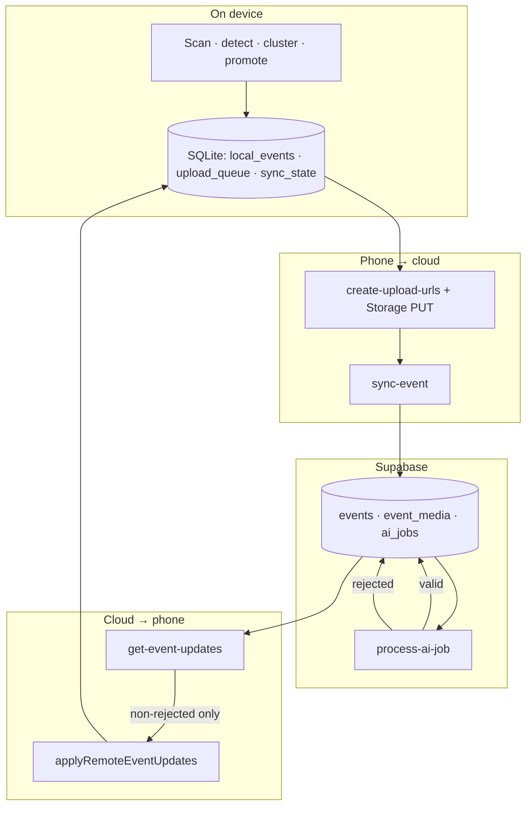
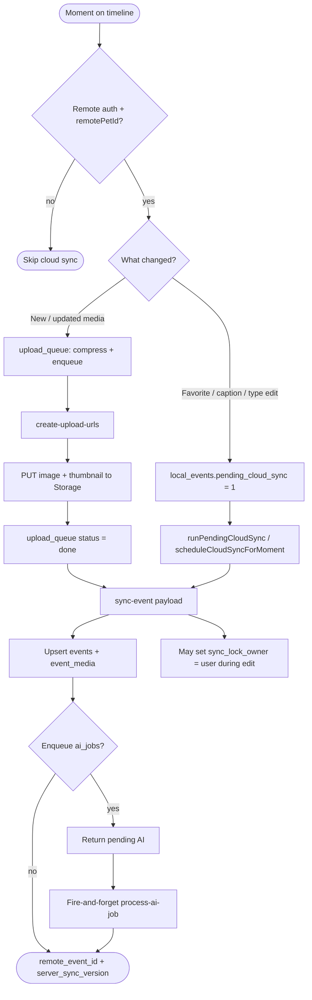
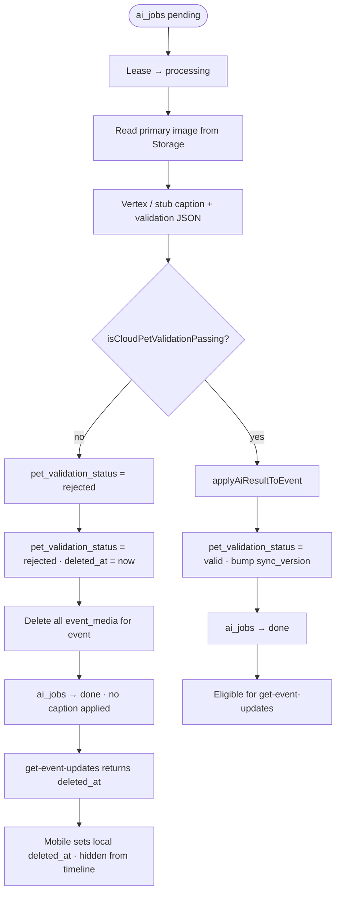
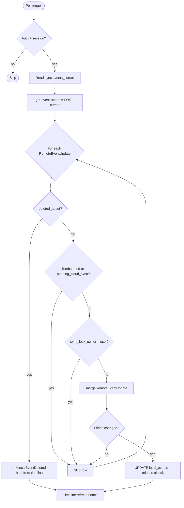
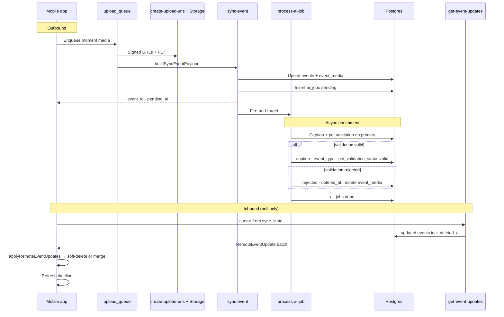
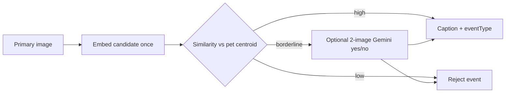

# Phase 2 — Backend MVP

**Status:** Planned  
**Goal:** Add sync, upload, and AI interpretation to the local-first app without coupling core business logic to Supabase.  
**Builds on:** [phase-1-local-mvp.md](./phase-1-local-mvp.md)

---

## Design principles

1. **Local-first remains true**
   The phone still scans, detects pets, clusters moments, scores images, and builds the first useful timeline locally.

2. **Cloud is selective**
   Only promoted events and selected event media are uploaded. Never upload the full camera roll.

3. **Core logic must be portable**
   Domain logic, sync rules, AI orchestration rules, and schema validation live in shared TypeScript modules, not inside Supabase function handlers.

4. **Supabase is an adapter layer**
   Supabase provides auth, Postgres, storage, realtime, and function hosting. It should not become the only place where business rules exist.

5. **Async AI**
   AI enrichment is a background workflow. Event creation should not block on caption generation.

---

## Recommended stack

| Layer              | Choice                                       | Why                                                     |
| ------------------ | -------------------------------------------- | ------------------------------------------------------- |
| Language           | `TypeScript`                                 | Matches mobile and shared package                       |
| Function runtime   | `Supabase Edge Functions` on `Deno`          | Small operational surface for MVP                       |
| Database           | `Supabase Postgres`                          | Relational model, RLS, migrations                       |
| Auth               | `Supabase Auth` + app-owned identity mapping | Silent sign-in first; optional Apple/Google/email later |
| Object storage     | `Supabase Storage`                           | Easiest first integration for selected event media      |
| AI invocation      | `OpenAI` via Edge Functions                  | Keeps secrets and prompt logic off the phone            |
| Shared contracts   | `packages/shared`                            | One schema source for mobile and backend                |
| Backend core logic | `packages/backend-core`                      | Portable domain layer, testable outside Supabase        |

**Optional later:** swap storage to R2, replace Supabase Auth, or move handlers to another platform without rewriting core logic.

---

## Monorepo shape

```txt
apps/mobile/             Expo app, local pipeline, upload queue
packages/shared/         Shared types, zod schemas, constants
packages/backend-core/   Portable domain logic and use cases
supabase/
  migrations/            Postgres schema
  functions/             Thin Supabase adapter handlers
```

### `packages/backend-core` responsibilities

This package should hold code that can run in tests, in Supabase functions, or later in another backend runtime:

- request/response schemas
- idempotency rules
- sync merge logic
- upload authorization rules
- AI job state machine
- event creation and update use cases
- prompt input shaping and AI result parsing

### `supabase/functions` responsibilities

These handlers should stay thin:

- parse HTTP request
- read auth context from Supabase
- call `backend-core` use case
- use Supabase adapters for DB/storage/realtime
- return validated response

If we later move to another platform, we replace handlers and adapters, not domain logic.

---

## Data syncing workflow

The phone remains usable if the cloud is unavailable. Sync catches up on **foreground resume**, **app launch**, and (while waiting for AI) a **30 s poll**. There is **no push/WebSocket** in MVP — inbound changes are **pull-only** via `get-event-updates`.

The mobile app **never** calls the AI provider directly. It uploads selected media, syncs metadata, then polls for server-enriched rows.

### Overview



| Direction    | Entry points (mobile)                                                                                               | Edge Functions / storage                                    |
| ------------ | ------------------------------------------------------------------------------------------------------------------- | ----------------------------------------------------------- |
| **Outbound** | `upload_queue` worker, `runPendingCloudSync`, `scheduleCloudSyncForMoment` (edits), `deleteMoment` → `delete-event` | `create-upload-urls`, Storage, `sync-event`, `delete-event` |
| **Inbound**  | `useEventUpdatesPoll`, `useBackgroundSync` (after upload + pending sync), timeline mount / app `active`             | `get-event-updates`                                         |
| **Async AI** | (server-only; phone observes via poll)                                                                              | `process-ai-job` (+ pg_cron sweep)                          |

Persistent cursor: `sync_state.events_cursor` (opaque `updated_at` + `event_id`).

---

### Device → cloud (outbound)

Only **promoted moments** and **selected assets** leave the device — never the full camera roll.



**`sync-event` prerequisites (mobile):** completed `upload_queue` rows for the moment (metadata payload includes storage paths). Edits without new media still need prior upload completion for that event.

**After successful `sync-event`:** clear `pending_cloud_sync`, release user sync lock, store `remote_event_id` and `server_sync_version`.

**Local/remote IDs:** mobile UI and the local pipeline keep using device-local IDs (`local_event_id`, local pet id, local asset id). Cloud-created IDs are stored as metadata (`app_user_id`, `remote_pet_id`, `remote_event_id`, remote media ids) and are the only IDs used for cross-device sync, merge, and delete semantics. Anonymous → cloud bootstrap does not switch SQLite database files.

**Foreground pass order** (`useBackgroundSync`): `runUploadQueueWorker` → `runPendingCloudSync` → `pollEventUpdates`.

---

### Cloud processing (AI + validation)

Caption enrichment is **async** after `sync-event`. Canonical caption/type live on **`events`**, not in `ai_jobs.result_json` alone.



---

### Cloud → device (inbound poll + merge)



**Poll triggers**

| When                          | Code                                                  |
| ----------------------------- | ----------------------------------------------------- |
| Timeline mount                | `useEventUpdatesPoll` → immediate `pollOnce`          |
| App → `active`                | `useEventUpdatesPoll` + `useBackgroundSync` full pass |
| Foreground + any `pending_ai` | `useEventUpdatesPoll` interval **30 s**               |
| After merge                   | `onApplied` → timeline `refreshKey` bump              |

Pull-to-refresh today reloads **SQLite only**; it does not call `get-event-updates` (resume/mount poll covers inbound sync).

**`get-event-updates`:** events for `auth.uid()` with `updated_at > cursor`, ordered ASC, max **50**; includes `deleted_at` and `ai_job_status`.

**Merge rules** (`mergeRemoteEventUpdate` / `applyRemoteEventUpdates`):

- Match on `source_local_event_id`.
- Current implementation only updates rows that already exist in SQLite. Remote events created on another device after initial bootstrap are skipped because `get-event-updates` does not include media rows or signed thumbnail URLs.
- Do not overwrite caption/type when local `user_edited_*` is set.
- Favorites: apply server value when `remote.sync_version >= local.server_sync_version`.
- Only `UPDATE` when merged fields differ (avoids poll ↔ refresh loops).
- **Soft-deleted (`deleted_at`):** applied even during user lock / `pending_cloud_sync`; sets local `deleted_at`, clears pending flags; moment hidden from timeline (local media kept for future user delete UX).
- **Tombstones:** skip rows after Redetect / wipe so stale cloud rows cannot return.
- **`pending_cloud_sync`:** skip inbound merge until outbound `sync-event` completes.
- **Lock:** `sync_lock_owner = user` blocks merge; AI merge uses `sync_lock_owner IS NULL OR 'ai'`.

**Display:** `getTimelineEvents` + `resolveDisplayCaption` (`@tailo/ai`) until AI caption arrives.

### Cross-device restore and dedupe status

Initial login on a new device is supported with MVP media limitations:

1. `completeEmailAccountConnection()` runs after password, OTP, or password-reset sign-in.
2. `restoreRemoteAccountDataIfNeeded({ force: true })` pulls account profile, pet profile, and `bootstrap-timeline`; this lets the cloud pet win over partial local onboarding state and backfills even when some cloud rows already exist locally.
3. `bootstrap-timeline` pages existing cloud moments with signed thumbnail URLs into local SQLite using a composite `(timestamp, event_id)` cursor so same-timestamp moments are not skipped at page boundaries.
4. `TimelineScreen` mounts `usePhotoAccess()`, so this device can continue local/incremental detection once photo permission is available.

Unfinished cross-device work:

- **Later remote-created moments:** polling currently returns metadata only, and `applyRemoteEventUpdates` skips unknown `source_local_event_id`s. Add event-with-media hydration for unknown remote events, either by extending `get-event-updates` or adding a targeted hydrate endpoint.
- **Signed thumbnail expiry:** restored assets use signed thumbnail URLs as `local_assets.uri`. Add local thumbnail caching or signed URL refresh.
- **Cross-device dedupe:** current dedupe is local-only (`created_at` + dimensions within a 2 s window). Add stable media fingerprints/hashes to upload/sync contracts and server schema so duplicate images uploaded from multiple devices merge into one account moment.
- **Event merge by content:** server idempotency is `(app_user_id, source_local_event_id)`, which is device-local. Add hash/time-window matching before inserting a new cloud event so duplicate moments from different devices merge without overwriting user edits.

---

### End-to-end sequence



#### Stage reference

| Stage         | Supabase                                                            | Mobile (`local_events`)                                                  |
| ------------- | ------------------------------------------------------------------- | ------------------------------------------------------------------------ |
| Upload + sync | `events`, `event_media`; optional `ai_jobs.pending`                 | `remote_event_id`, `server_sync_version`; `pending_ai = 1` if job queued |
| Edit sync     | Same `sync-event` upsert; respects `user_edited_*`                  | `pending_cloud_sync = 1` until sync succeeds                             |
| AI running    | `ai_jobs.processing` (leased)                                       | Poll every **30 s** while foreground + any `pending_ai`                  |
| AI valid      | Caption/type/`pet_validation_status = valid`; `sync_version` bumped | Next poll merges; card updates                                           |
| AI rejected   | `rejected` + `deleted_at`; cloud `event_media` deleted              | Poll sets local `deleted_at` — **hidden**, media kept on device          |
| AI failed     | `ai_jobs.failed`, `last_error`                                      | Placeholder caption; check Edge logs                                     |

#### Server: when `ai_jobs` is created

`sync-event` enqueues **`caption_event`** when **all** are true (see [AI job specification](#ai-job-specification)):

- At least one `event_media` row exists.
- Server `caption_source` is not `user`.
- No existing job in `pending` \| `processing`.
- MVP re-enqueue: skip if a `done` job exists for the same primary asset (see `input_snapshot.primary_asset_id`).

On success, `sync-event` returns `{ event_id, server_sync_version, ai_job?: { status: 'pending' } }` and **fire-and-forgets** `process-ai-job` (service role). Stuck jobs can be swept manually or on a schedule.

#### Server: `process-ai-job`

1. Claim a `pending` job (lease, max **3** attempts, backoff 1 → 5 → 15 min).
2. Read primary image from Storage (signed URL).
3. Run provider: **`AI_PROVIDER=stub`** (default) or **`vertex`** (GCP — [supabase/GCP_VERTEX_SETUP.md](../../supabase/GCP_VERTEX_SETUP.md); default **`GCP_VERTEX_MODEL=gemini-2.5-flash`**, see [model versions](https://docs.cloud.google.com/gemini-enterprise-agent-platform/models/model-versions) to change). Model returns caption JSON **and** cloud pet validation (`profilePetValid`, `visiblePetType`, `petValidationConfidence`).
4. If validation fails → **soft delete**: `pet_validation_status = rejected`, **`deleted_at = now()`**, delete **all** `event_media`, bump `sync_version` (no caption). Primary image only; image-level drop is [future](../FUTURE_FEATURES.md#6-image-level-cloud-pet-validation) (B2.10.x).
5. If valid → `applyAiResultToEvent`, `pet_validation_status = valid`, **`UPDATE events`** caption/type.
6. **`UPDATE ai_jobs`** → `done` (or `failed` / retry). Poll returns `deleted_at` so devices hide synced moments without hard-deleting local rows.

Canonical AI text lives on **`events`**, not in the job row.

#### Future: pet identity validation (cloud)

Planned in **B2.12** — distinguish **this pet** from another animal of the same type (e.g. neighbour’s dog).

**Problem with today’s gate:** `profilePetValid` + `visiblePetType` only check species and presence, not individual identity.

**Reference set (no full-library upload):**

| Source                  | When it enters the gallery                                   |
| ----------------------- | ------------------------------------------------------------ |
| `pets.profile_media_id` | User sets / updates profile photo                            |
| Event primary           | After `pet_validation_status = valid` (and not user-deleted) |
| Cap                     | ~5–8 images; drop oldest when full                           |

**Pipeline (cost-aware):**



1. **Embeddings (default)** — On gallery add/update, store a multimodal embedding per reference (Vertex multimodal embedding or similar). Maintain a **centroid** (mean vector) per `pet_id` in `pet_reference_embeddings` / `pgvector`. New job: embed primary → cosine similarity; reject if below τ (~0.55–0.65 tunable). **No extra detection** on device; **no multi-image caption** on clear rejects.
2. **LLM fallback (borderline only)** — If similarity in a gray band, one cheap call: candidate + **single** best reference, JSON `{ "sameIndividual": true, "confidence": 0.0 }`, low `maxOutputTokens`.
3. **Caption** — Current Gemini caption runs **after** identity pass (saves tokens when rejecting wrong individuals).
4. **Cold start** — Until profile photo exists (or &lt;2 refs), use species-only validation or `identity_status: insufficient_refs`; do not over-reject.

**API shape (extend `AiCaptionResult`):** `samePetIndividual`, `identityConfidence`, `identityMethod: "embedding" | "llm" | "species_only"`.

**Privacy:** Only referenced thumbnails already uploaded for this pet; never send the camera roll.

#### Debug in Supabase SQL

```sql
SELECT event_id, source_local_event_id, caption, caption_source, event_type,
       sync_version, updated_at
FROM events
ORDER BY updated_at DESC
LIMIT 10;

SELECT ai_job_id, event_id, status, attempt_count, last_error, updated_at
FROM ai_jobs
ORDER BY updated_at DESC
LIMIT 10;
```

Manual worker run (service role, local only): see [GCP_VERTEX_SETUP.md § Manually run one AI job](../../supabase/GCP_VERTEX_SETUP.md#manually-run-one-ai-job-service-role).

Operator quick reference: [supabase/SETUP.md § How AI captions return to the app](../../supabase/SETUP.md#how-ai-captions-return-to-the-app).

---

## Backend domains

### 1. Identity & auth

**Product rules (unchanged from Phase 1):**

- No registration, email, or OAuth on first launch.
- User gets timeline value while `is_anonymous` in the JWT.
- Optional “Save your memories” / sign-in later — never a hard gate on scan, capture, or timeline.

**Canonical owner id:** Tailo-owned **`app_user_id`**, not Supabase `auth.users.id`.

| Id                                                    | Role                                                                     |
| ----------------------------------------------------- | ------------------------------------------------------------------------ |
| `app_user_id`                                         | **Canonical** owner id on `pets`, `events`, storage paths, export/import |
| `auth.users.id`                                       | Current Supabase session subject; used to resolve current `app_user_id`  |
| Phase 1 `anonymous_user_id` (`anon_*` in SecureStore) | **Legacy device id** — one-time migration into `anonymous_id_links` only |
| After account upgrade                                 | Same `app_user_id`; linked provider set expands                          |

#### Mobile bootstrap (Phase 2.1)

```txt
App launch
  → authService.bootstrapAuthSession() (AuthProvider; Supabase impl today)
  → if no session: signInAnonymously() inside provider
  → ensure-current-user maps auth.users.id → stable app_user_id
  → if legacy anon_* exists and not yet recorded: POST link-anonymous-user (idempotent)
  → upsert-pet from local pet profile
  → upload_queue / sync use getAuthAccessToken() on HTTP APIs
```

Mobile code must call **`bootstrapAuthSession` / `getAuthAccessToken`** from `modules/auth`, not `getSupabaseClient()` directly (keeps auth swappable).

- Do **not** generate new `anon_*` ids for new installs once Supabase is wired; the server-created `app_user_id` is enough.
- Keep `getOrCreateAnonymousUserId()` only for **upgrading installs** that already shipped Phase 1.

#### Account upgrade (optional — not required for Phase 2 MVP sync)

When the user chooses to link a permanent identity (settings / soft prompt, not onboarding):

| Method | Client API                                                    | Notes                                            |
| ------ | ------------------------------------------------------------- | ------------------------------------------------ |
| Apple  | `linkIdentity({ provider: 'apple' })`                         | Requires dev client / EAS; URL scheme configured |
| Google | `linkIdentity({ provider: 'google' })`                        | Same                                             |
| Email  | `updateUser({ email })` + verify OTP; password optional later | Must verify before treating as permanent         |

Supabase currently keeps the **same auth user id** when linking. Tailo should still record provider identities against the same `app_user_id`, so future migration off Supabase does not depend on Supabase continuing to be the canonical identity source.

**Enable in Supabase dashboard:** Anonymous sign-ins; **Manual linking** (for `linkIdentity`); Apple/Google providers when upgrade UI ships.

**Defer to post–Phase 2:** Sign-in on a **second device** when the user already has a permanent account (merge / conflict policy); paywall tied to auth.

#### RLS

- All user-owned rows: `app_user_id = app.current_app_user_id()`.
- Anonymous users use the `authenticated` role; JWT includes `is_anonymous` if policies must restrict billing, sharing, or quotas until linked.
- Storage paths: `{app_user_id}/{pet_id}/…` — never device-local ids alone.

#### Legacy bridge: `anonymous_id_links`

Still useful for Phase 1 → Phase 2 upgrades, not for everyday auth:

- One row per legacy `anonymous_user_id` → `app_user_id`.
- Idempotent: repeated link calls return the same mapping.
- New installs after Phase 2 may never write this table.

Core rules:

- Pet and event ownership always derive from **`app_user_id`**.
- Current Supabase session subject only resolves the active app user through `user_identities`.
- `link-anonymous-user` is idempotent and only needed for legacy id reconciliation (see API below).

### 2. Event sync

See **[Sync specification](#sync-specification)**.

### 3. Upload authorization

See **[Upload specification](#upload-specification)**.

### 4. AI enrichment

See **[AI job specification](#ai-job-specification)**.

---

## Auth edge-case policy

**Status:** Decided for MVP. Implement in `backend-core` + mobile session handling; revisit for Phase 2+ multi-device.

| Scenario                                           | MVP behavior                                                                             | User-visible outcome                                               |
| -------------------------------------------------- | ---------------------------------------------------------------------------------------- | ------------------------------------------------------------------ |
| **Fresh install (Phase 2+)**                       | `signInAnonymously()` then `ensure-current-user`; do not create new `anon_*` ids         | Works offline/local; sync when online                              |
| **Upgrade from Phase 1**                           | `signInAnonymously()` then one `link-anonymous-user` if legacy `anon_*` exists           | Same `app_user_id`; local SQLite unchanged                         |
| **App reinstall / cleared app data (anonymous)**   | New `signInAnonymously()` → new Supabase subject → new `app_user_id` unless later linked | Prior anonymous cloud data stays on old app user; known limitation |
| **Session refresh fails**                          | Supabase client retries refresh; if hard failure, new `signInAnonymously()`              | Same as reinstall for anonymous-only users                         |
| **Link Apple/Google/email on this device**         | `linkIdentity` / `updateUser`; `user_identities` stays on same `app_user_id`             | Data kept; JWT `is_anonymous` → false                              |
| **`linkIdentity` target already linked elsewhere** | Supabase error; do not switch session                                                    | Calm error: identity already in use; stay on current session       |
| **Sign in on second device (existing account)**    | **Not in MVP**                                                                           | Phase 2+: `signInWithOAuth` + optional merge UI                    |
| **Anonymous user: sync + AI captions**             | **Allowed**                                                                              | No paywall or permanent-auth gate for free tier                    |
| **Anonymous user: storage quotas**                 | Same limits as permanent unless RLS adds stricter `is_anonymous` rules later             | —                                                                  |
| **Logout (if exposed in settings later)**          | Clears session; next launch new anonymous user                                           | Treat like reinstall for MVP                                       |

**Implementation notes:**

- `link-anonymous-user` rejects mapping a legacy id already tied to a **different** `app_user_id` (409).
- All Edge Functions use `auth.uid()` only to resolve the current `app_user_id`; never trust `app_user_id` from request body.
- Mobile stores Supabase session in SecureStore; do not use Phase 1 `anon_*` as API identity after Phase 2.

---

## Upload specification

**Scope:** Selected event media only (2–5 images per event, matching mobile selection). Never camera-roll bulk upload.

### Client pipeline (mobile — see `MOBILE_TASKS` 2.2.x)

```txt
upload_queue row (pending)
  → compress original + generate thumbnail (on device)
  → create-upload-urls (metadata only)
  → PUT original + PUT thumbnail to signed URLs
  → sync-event (event + storage paths + local ids)
  → mark upload_queue done / store server event_id
```

### Compression & files (MVP defaults)

| Asset     | Max width                     | Format | Quality / size target                                    |
| --------- | ----------------------------- | ------ | -------------------------------------------------------- |
| Original  | **1280 px** (preserve aspect) | JPEG   | ~0.82 quality; reject if still **> 3 MB** after compress |
| Thumbnail | **400 px**                    | JPEG   | ~0.75 quality; **< 200 KB** target                       |

- Convert HEIC → JPEG on device before upload.
- Strip EXIF except orientation if needed for display (prefer strip GPS).
- **Max assets per `create-upload-urls` call:** 5 (one event batch).
- **Min assets:** 1 (primary required).

### Storage layout

```txt
event-media/{app_user_id}/{pet_id}/{event_id}/{source_local_asset_id}/original.jpg
event-media/{app_user_id}/{pet_id}/{event_id}/{source_local_asset_id}/thumb.jpg
```

- Bucket: private `event-media` (name TBD in migration).
- Signed URL **TTL: 15 minutes**.
- `Content-Type` must be `image/jpeg` for PUT. Enforced by bucket `allowed_mime_types` (`image/jpeg` only) — wrong type returns **400** `invalid_mime_type` (see **B2.4.3a** `npm run test:supabase:upload`).

### `create-upload-urls` validation (`validateUploadRequest`)

- JWT required; `pet_id` belongs to `app.current_app_user_id()`.
- `source_local_event_id` + `pet_id` present.
- Each `source_local_asset_id` unique in request; count 1–5.
- Optional: event row must not exist yet **or** caller owns existing event (for re-upload / retry).
- Return paired URLs: `{ original, thumbnail }` per asset + `storage_path` keys for `sync-event`.

### Failure handling

| Failure                        | Mobile                                                  | Server                             |
| ------------------------------ | ------------------------------------------------------- | ---------------------------------- |
| URL expired                    | Re-request URLs                                         | Idempotent re-issue                |
| PUT 4xx/5xx                    | Retry with backoff; `upload_queue.last_error`           | —                                  |
| `sync-event` after partial PUT | Do not call sync until **all** assets in batch uploaded | Orphan objects GC later (Phase 2+) |

---

## Sync specification

### Idempotency

- Unique constraint: `(app_user_id, source_local_event_id)` on `events`.
- `sync-event` upserts by that key; repeated calls return same `event_id`.
- `event_media` upsert by `(event_id, source_local_asset_id)`.
- This is **device-local idempotency only**. It does not deduplicate the same image or moment uploaded from another device because media fingerprints are not part of the contract/schema yet.

### `sync_version` (monotonic)

- Server increments `events.sync_version` on every successful `sync-event` that changes mergeable fields or media set.
- Client may send `client_sync_version` (last seen); server returns `server_sync_version`.
- **MVP conflict rule:** if client sends stale `client_sync_version` on user-edited fields, **server still accepts client payload** for fields marked `user_edited` in request; otherwise apply merge table below.

### Field merge matrix

| Field            | First sync                                   | Client resync                            | Server → client poll                | Winner on conflict             |
| ---------------- | -------------------------------------------- | ---------------------------------------- | ----------------------------------- | ------------------------------ |
| `timestamp`      | From client                                  | Immutable                                | —                                   | Server (immutable)             |
| `source`         | From client                                  | Immutable                                | —                                   | Server                         |
| `event_type`     | From client if user-set; else `unknown`      | Client if `user_edited.event_type`       | AI only if local not user-edited    | **User > AI > unknown**        |
| `caption`        | From client if user-set                      | Client if `user_edited.caption`          | AI only if local not user-edited    | **User > AI > null**           |
| `caption_source` | `user` \| `ai` \| `placeholder`              | Updated with caption                     | From server                         | Follow caption winner          |
| `is_favorite`    | From client                                  | From client                              | From server if `sync_version` newer | **Higher `sync_version`**      |
| Media set        | Full replace of `event_media` rows for event | Full replace when client sends `media[]` | —                                   | **Client authoritative** (MVP) |

**Local flags on sync payload (mobile):**

```ts
user_edited?: { caption?: boolean; event_type?: boolean };
```

Persist on server as `events.user_edited_caption` / `events.user_edited_event_type` booleans (add columns in B2.1.4) **or** infer from `caption_source === 'user'` — prefer explicit booleans in migration.

### `sync-event` request (minimal shape)

```ts
{
  source_local_event_id: string;
  pet_id: string;
  timestamp: string;
  source: 'camera_roll' | 'in_app' | 'manual';
  event_type: EventType;
  caption: string | null;
  caption_source: 'user' | 'placeholder';
  is_favorite: boolean;
  client_sync_version?: number;
  user_edited?: { caption?: boolean; event_type?: boolean };
  media: Array<{
    source_local_asset_id: string;
    storage_path: string;
    thumbnail_path: string;
    width: number;
    height: number;
    is_primary: boolean;
    detected_pet_type?: 'dog' | 'cat' | null;
  }>;
}
```

### `sync-event` response

```ts
{
  event_id: string;
  server_sync_version: number;
  ai_job?: { ai_job_id: string; status: 'pending' | 'skipped' };
}
```

`ai_job.status: skipped` when caption already user-authored or job already done for unchanged media.

### `get-event-updates` (polling)

- **Input:** `cursor` opaque string encoding `updated_at` + `event_id` (or ISO timestamp + limit).
- **Output:** events for the caller's resolved `app_user_id` with `updated_at > cursor`, ordered ASC, max **50** rows; `next_cursor`.
- Include: mergeable fields, `sync_version`, `ai_job.status`, `pet_validation_status`, **`deleted_at`** (set when cloud rejects or future user delete).
- Mobile polls: see [Cloud → device (inbound poll + merge)](#cloud--device-inbound-poll--merge) (mount, app resume, **30 s** while any `pending_ai`). Pull-to-refresh reloads SQLite only.

### Mobile merge (client rules)

1. Match rows by `source_local_event_id`.
2. Apply server caption/type only if local `user_edited` flags false for that field.
3. Update `local_events` + SQLite; bump local “last seen” `sync_version`.

---

## AI job specification

### When a job is created

`sync-event` enqueues **`caption_event`** job when **all** are true:

- At least one `event_media` row exists for the event.
- `caption_source` is not `user` (no user caption on server).
- No existing `ai_jobs` row for this `event_id` in `pending` \| `processing`.
- Re-enqueue only if primary `source_local_asset_id` changed vs last completed job input (Phase 2+ fine-tune; MVP: skip if `done` exists).

### State machine

```txt
pending → processing → done
                    ↘ failed (after max attempts)
```

| State        | Meaning                                   |
| ------------ | ----------------------------------------- |
| `pending`    | Queued; worker may pick up                |
| `processing` | Worker holds lease                        |
| `done`       | Result applied to `events`                |
| `failed`     | No more auto retries; visible in dev logs |

### Worker (`process-ai-job`)

- **Trigger:** `sync-event` fire-and-forget (`max_jobs: 1`) + **pg_cron** every **3 min** (`npm run setup:ai-job-cron`, `sweep` + `max_jobs: 5`). Each invoke releases expired `processing` leases first. Mobile poll remains UX-only.
- **Concurrency:** Process one job per invocation; use `UPDATE … WHERE status = 'pending' … RETURNING` lease pattern.
- **Max attempts:** **3** (`attempt_count`).
- **Backoff before retry:** 1 min → 5 min → 15 min (store `next_attempt_at`).

### Model input (MVP)

- **Primary image** signed read URL (short TTL).
- Optional: up to **2** non-primary thumbnails for context.
- Metadata: `pet.type`, `event.source`, `timestamp` (no PII).

### Output validation

```ts
{
  caption: string | null; // max 280 chars; null if low confidence
  eventType: EventType;
  confidence: number | null; // 0–1
}
```

| Condition                                | Applied result                                                        |
| ---------------------------------------- | --------------------------------------------------------------------- |
| Parse/validation fails                   | `failed` job; event unchanged                                         |
| `confidence < 0.5`                       | `caption: null`, `event_type: unknown`, `caption_source: placeholder` |
| `confidence >= 0.5`                      | Set caption + type, `caption_source: ai`                              |
| User already edited field (server flags) | **Do not overwrite** that field                                       |

### Caption safety rules (prompt + post-check)

- No medical/diagnostic language.
- No “As an AI…” phrasing.
- Do not invent location, names, or people.
- Prefer short, calm memory tone (align with product guidelines).

---

## Proposed data model

These are MVP backend entities, not the final full product schema.

For the current table inventory and complete migration history, see [Database Schema Ledger](./database-schema-ledger.md).

### `app_users`

Canonical Tailo users, owned by the app rather than the auth vendor.

| Column        | Notes              |
| ------------- | ------------------ |
| `app_user_id` | PK UUID            |
| `created_at`  | First server touch |

App-level preferences or profile metadata can hang off this row later, but ownership should already point here in MVP.

### `user_identities`

Maps external or platform-specific identities to `app_user_id`.

| Column             | Notes                                                      |
| ------------------ | ---------------------------------------------------------- |
| `identity_id`      | PK UUID                                                    |
| `app_user_id`      | FK → `app_users.app_user_id`                               |
| `provider`         | `supabase_auth`, `email`, `apple`, `google`, `phone` later |
| `provider_subject` | Stable provider id or normalized email/phone               |
| `provider_email`   | Optional verified email snapshot                           |
| `created_at`       | Audit/debug                                                |
| `last_seen_at`     | Optional operational helper                                |

Constraints:

- unique `(provider, provider_subject)`
- at most one `supabase_auth` mapping row per current Supabase auth subject
- provider-linking always adds or updates identity rows under the same `app_user_id`

### `anonymous_id_links`

**Legacy only:** Phase 1 SecureStore `anonymous_user_id` → Tailo `app_user_id` after first `signInAnonymously()`.

| Column              | Notes                           |
| ------------------- | ------------------------------- |
| `anonymous_user_id` | Phase 1 `anon_*` string, unique |
| `app_user_id`       | Tailo canonical user            |
| `linked_at`         | Audit/debug                     |

### `pets`

One pet per MVP user in product UI, but schema should support more later.

| Column                | Notes                                  |
| --------------------- | -------------------------------------- |
| `pet_id`              | UUID                                   |
| `app_user_id`         | Owner                                  |
| `name`, `type`        | Dog/cat in MVP                         |
| `gender`              | Optional                               |
| `profile_media_id`    | Optional chosen image                  |
| `source_local_pet_id` | For idempotent local-to-remote mapping |

### `events`

Canonical synced event rows.

| Column                   | Notes                               |
| ------------------------ | ----------------------------------- |
| `event_id`               | UUID                                |
| `app_user_id`, `pet_id`  | Ownership                           |
| `source_local_event_id`  | Idempotent sync key from mobile     |
| `timestamp`              | Event anchor time                   |
| `source`                 | `camera_roll` or `in_app`           |
| `event_type`             | User or AI assigned                 |
| `caption`                | AI or user-authored                 |
| `caption_source`         | `user`, `ai`, or `placeholder`      |
| `user_edited_caption`    | bool — blocks AI overwrite          |
| `user_edited_event_type` | bool — blocks AI overwrite          |
| `is_favorite`            | Syncable user preference            |
| `sync_version`           | Monotonic; merge helper             |
| `updated_at`             | Poll cursor for `get-event-updates` |

### `event_media`

Selected uploaded assets only.

| Column                  | Notes                              |
| ----------------------- | ---------------------------------- |
| `event_media_id`        | UUID                               |
| `event_id`              | Parent event                       |
| `source_local_asset_id` | Mobile idempotency key             |
| `storage_path`          | Original compressed image          |
| `thumbnail_path`        | Smaller derivative                 |
| `width`, `height`       | Post-compression dimensions        |
| `is_primary`            | Timeline thumbnail candidate       |
| `detected_pet_type`     | Dog/cat hint from local processing |

### `ai_jobs`

Tracks asynchronous enrichment work.

| Column            | Notes                                     |
| ----------------- | ----------------------------------------- |
| `ai_job_id`       | UUID                                      |
| `event_id`        | One job per event for MVP                 |
| `job_type`        | `caption_event`                           |
| `status`          | `pending`, `processing`, `done`, `failed` |
| `attempt_count`   | Retry tracking (max 3)                    |
| `next_attempt_at` | Backoff schedule                          |
| `leased_until`    | Worker lease (optional)                   |
| `last_error`      | Debugging                                 |
| `input_snapshot`  | Primary asset id used (re-enqueue guard)  |
| `result_json`     | Validated structured AI output            |

---

## API surface for MVP

Use a small set of backend functions.

### `ensure-current-user`

**When:** Immediately after bootstrap auth resolves a valid Supabase session.

**Why:** Convert the current auth vendor subject into a durable Tailo `app_user_id`.

Input:

- caller authenticated via Supabase JWT (`auth.uid()`)

Output:

- canonical `app_user_id`
- whether a new `app_users` row was created
- whether a `user_identities(provider = 'supabase_auth')` row was created

### `link-anonymous-user`

**When:** First launch after Phase 2 on a device that already has a Phase 1 `anonymous_user_id` in SecureStore.

**Not when:** Greenfield install — client only calls `signInAnonymously()`; no legacy id to record.

Input:

- legacy `anonymous_user_id` (optional body)
- caller authenticated via Supabase JWT (`auth.uid()`)

Output:

- canonical `app_user_id`
- whether `anonymous_id_links` row was newly created

### `upsert-pet`

Input:

- local pet profile
- local pet id

Output:

- canonical `pet_id`

### `create-upload-urls`

Input:

- `pet_id`, `source_local_event_id`
- `assets[]`: `{ source_local_asset_id, content_length?, width?, height? }` (1–5 items)

Output:

- Per asset: `{ source_local_asset_id, original_upload_url, thumbnail_upload_url, storage_path, thumbnail_path, expires_at }`

### `sync-event`

Input:

- local event payload
- uploaded media descriptors

Output:

- canonical `event_id`
- sync metadata
- AI job status if created

### `get-event-updates`

Input:

- last known sync cursor or timestamp

Output:

- remote event changes to merge locally

### `process-ai-job`

Triggered by:

- cron or explicit enqueue/worker flow

Output:

- updated `events` + `ai_jobs`

---

## Portability boundary

This is the most important design rule for MVP portability.

### Keep in `backend-core`

- `linkAnonymousUser()`
- `upsertPetProfile()`
- `syncEvent()`
- `validateUploadRequest()`
- `createAiJob()`
- `applyAiResultToEvent()`
- zod schemas for all public contracts
- conflict resolution rules

### Keep in Supabase adapters

- reading authenticated user from request context
- issuing storage signed URLs
- SQL queries / repository implementations
- realtime notifications
- scheduled function wiring

### Dependency direction

```txt
Supabase function handler
  → backend-core use case
    → repository/storage/ai interfaces
      → Supabase/OpenAI adapter implementations
```

`backend-core` must not import Supabase SDK types directly.

---

## Suggested package structure

```txt
packages/backend-core/
  src/
    contracts/
    domain/
    usecases/
    repositories/
    storage/
    ai/
    mappers/
    errors/
```

Interface examples:

- `EventRepository`
- `PetRepository`
- `AnonymousLinkRepository`
- `MediaStorageSigner`
- `AiCaptionService`
- `JobQueue`

This lets us swap Supabase adapters for another platform later.

---

## Sync and merge rules (summary)

Full detail: [Sync specification](#sync-specification).

1. Idempotency: `(app_user_id, source_local_event_id)`.
2. User edits win over AI for caption and event type.
3. AI fills only non-user-edited fields.
4. Never accept full-library uploads.
5. Media set on sync: client full replace (MVP).

---

## AI contract (summary)

Full detail: [AI job specification](#ai-job-specification). Result shape in `packages/shared` zod schema:

```ts
{
  caption: string | null;
  eventType: EventType;
  confidence: number | null;
}
```

---

## Security model

- RLS on all user-owned tables (`app_user_id = app.current_app_user_id()`)
- Optional policies using JWT `is_anonymous` (e.g. rate limits before account link)
- Storage paths namespaced by `app_user_id` and `pet_id`
- Signed upload URLs with short expiry
- No direct client access to privileged AI or admin flows
- Edge Functions verify ownership before mutating rows
- Mobile stores session refresh token in SecureStore; never log JWT or keys

---

## MVP delivery order

1. Supabase project: enable **Anonymous** auth; schema + RLS helper to resolve `app.current_app_user_id()`
2. `packages/backend-core` scaffolding + shared zod contracts
3. **Mobile:** Supabase client, `signInAnonymously()`, session persistence
4. `ensure-current-user` + `link-anonymous-user` (legacy Phase 1 id only) + `upsert-pet`
5. Signed upload function + storage bucket layout
6. `sync-event` + `upload_queue` worker on mobile
7. `ai_jobs` table + worker + `get-event-updates` (polling)
8. Mobile merge path for remote captions/types
9. **Later (not blocking MVP sync):** account upgrade UI (Apple/Google/email via `linkIdentity` / `updateUser`)

---

## Open questions

| Topic                                    | MVP default                                                                       | Revisit when           |
| ---------------------------------------- | --------------------------------------------------------------------------------- | ---------------------- |
| Object storage                           | **Supabase Storage**                                                              | Scale / R2 migration   |
| Orphan storage objects after failed sync | Manual GC / Phase 2+ sweeper                                                      | Production traffic     |
| Realtime vs poll                         | **Poll** `get-event-updates` every 30s when pending AI                            | UX need                |
| Multi-device account sign-in             | **MVP:** `get-pet` + `bootstrap-timeline` on sign-in; ongoing `get-event-updates` | Cross-device restore   |
| Cross-device duplicate images            | Not yet deduped; local-only near-identical dedupe                                 | Media hash/fingerprint |
| Session loss → new anonymous user        | Accept orphan cloud data for MVP                                                  | Account recovery flow  |

## Future — user edit moment (capabilities)

**Status:** Planned (B2.13). MVP allows caption, type, and favorite edits with `user_edited_*` flags and partial poll/server merge protection. A full **moment actions matrix** (what users can do per moment state, and how device/cloud/AI interact) is not written yet — see [FUTURE_FEATURES.md](../FUTURE_FEATURES.md#10-user-edit-moment-capabilities) and MOBILE_TASKS **B2.13**.

## Change log

| Date       | Change                                                                                                                                                                                                                                            |
| ---------- | ------------------------------------------------------------------------------------------------------------------------------------------------------------------------------------------------------------------------------------------------- |
| 2026-05-24 | Mobile keeps local SQLite stable during anonymous → cloud bootstrap; cloud IDs are stored on local rows/profiles and drive cross-device sync instead of switching database files.                                                                 |
| 2026-05-24 | Upload worker calls `prepareCloudUploadPrerequisites` (anonymous account + `upsert-pet`) before draining queue; `saveLocalPetProfile` triggers upload when pet profile becomes ready.                                                             |
| 2026-05-24 | Returning-account sign-in now forces cloud restore/backfill; cloud pet wins over partial local pet state, and `bootstrap-timeline` uses composite `(timestamp, event_id)` pagination to avoid same-timestamp gaps.                                |
| 2026-05-20 | **Cross-device restore:** `get-account-profile` + `get-pet` + `bootstrap-timeline`; mobile `restoreRemoteAccountDataIfNeeded` hydrates user profile, pet, and cloud moments; `seedLocalAccountPrefsToCloudIfEmpty` only fills empty cloud fields  |
| 2026-05-24 | Documented cross-device sync gaps: unknown remote events need media hydration/backfill, restored thumbnails need refresh/cache, and duplicate cross-device uploads need media fingerprint dedupe.                                                 |
| 2026-05-20 | Pet profile **birthday** (`pets.birthday` date column); `upsert-pet` + local profile JSON; Pet tab editor auto-saves name, type, gender, birthday                                                                                                 |
| 2026-05-20 | **Onboarding cloud sync:** `runCloudSyncPass` upserts remote pet, drains `upload_queue`, runs `sync-event` for promoted moments when onboarding completes; also on authenticated app mount and foreground resume                                  |
| 2026-05-19 | User Edge Functions grouped by domain: `api-auth`, `api-pet`, `api-account`, `api-events` (`POST` `{ action, ... }`); shared handlers; `process-ai-job` separate; mobile `invokeTailoApi` routes by action                                        |
| 2026-05-20 | **B2.11 User delete:** `delete-event` Edge Function + mobile `deleteMoment`; `user_dismissed_at` on assets; poll propagates `deleted_at` to other devices                                                                                         |
| 2026-05-20 | **Soft delete:** `events.deleted_at` on cloud reject; poll returns `deleted_at`; mobile `local_events.deleted_at` hides moment (media kept)                                                                                                       |
| 2026-05-20 | **Data syncing workflow** docs: overview + outbound/inbound/AI flowcharts, updated sequence diagram, stage table (`pending_cloud_sync`, soft delete on reject)                                                                                    |
| 2026-05-20 | Planned **B2.13** user edit moment: product actions matrix + hardened sync/AI rules for per-moment edits                                                                                                                                          |
| 2026-05-20 | **B2.6** Backend hardening QA: `npm run test:supabase:qa`, `audit:supabase`, `STAGING_CHECKLIST.md`; `syncEventMerge` keeps user caption when `user_edited_caption` set; `aiJobFailure` retry policy in `@tailo/backend-core`                     |
| 2026-05-20 | **B2.4.3a** Integration test: Storage signed PUT returns `415 invalid_mime_type` for non-`image/jpeg` `Content-Type` (`npm run test:supabase:upload`)                                                                                             |
| 2026-05-20 | **B2.1.10** RLS smoke: `supabase/tests/rls_cross_user_smoke.sql` + `npm run test:supabase:rls` (JWT impersonation; all user-owned tables)                                                                                                         |
| 2026-05-20 | **B2.5.7** AI sweep: `pg_cron` + `setup:ai-job-cron`; lease recovery; `process-ai-job` sweep mode (`max_jobs` cap 10)                                                                                                                             |
| 2026-05-24 | Drop legacy `profiles` table after `app_users` / `user_identities` became canonical; Edge Functions now resolve users through `ensure_app_user_for_auth` and keep editable account fields in `account_profiles`                                   |
| 2026-05-19 | Planned **B2.12** pet identity validation: embedding gallery from profile + validated events; reject wrong individual before caption                                                                                                              |
| 2026-05-19 | `app_user_id` ownership: migrate `pets`/`events`, RLS + storage policies on `current_app_user_id()`, storage paths `{app_user_id}/…`, `upsert-account-profile` API + mobile profile editing                                                       |
| 2026-05-20 | Phase 1 identity: `app_users`, `user_identities`, `account_profiles`, `current_app_user_id()`, `ensure-current-user` Edge Function; mobile resolves `app_user_id` after auth bootstrap; `link-anonymous-user` returns `app_user_id`               |
| 2026-05-19 | Phase 1 identity foundation: `app_users`, `user_identities`, `account_profiles`, `ensure_app_user_for_auth()` RPC, `ensure-current-user` Edge Function; mobile resolves `app_user_id` after auth bootstrap                                        |
| 2026-05-19 | `get-event-updates` excludes `pet_validation_status = rejected`; mobile no longer deletes local moments on cloud pull                                                                                                                             |
| 2026-05-19 | Cloud pet validation in `process-ai-job` (`profilePetValid` / `visiblePetType`); `events.pet_validation_status`; server rejects event + deletes cloud media                                                                                       |
| 2026-05-19 | Default Vertex caption model **gemini-2.5-flash** (`GCP_VERTEX_SETUP`, secrets script, `process-ai-job` fallback)                                                                                                                                 |
| 2026-05-19 | Vertex model selection docs → [Gemini model versions](https://docs.cloud.google.com/gemini-enterprise-agent-platform/models/model-versions) (`GCP_VERTEX_SETUP`, `SETUP.md`)                                                                      |
| 2026-05-19 | Edge Functions structured JSON logging; `process-ai-job` `verify_jwt=false` + service invoke `apikey`; fix gateway 401 before handler                                                                                                             |
| 2026-05-19 | Document end-to-end sync + AI loop (mermaid sequence diagram, stage table, mobile poll/merge, debug SQL); link from `supabase/SETUP.md` and `DEVELOPER.md`                                                                                        |
| 2026-05-18 | **2.3 / 2.4** — `sync-event`, `get-event-updates`, `process-ai-job` Edge Functions; `event_media` + `ai_jobs` migrations; mobile sync/poll/merge + calm sync status UI; `@tailo/ai` stub captions (Vertex via `AI_PROVIDER=vertex` + GCP secrets) |
| 2026-05-18 | Upload pipeline: `create-upload-urls` + `event-media` bucket; mobile compress/PUT worker with retry backoff; `sync-event` still Phase 2.3                                                                                                         |
| 2026-05-18 | Account settings: email link for anonymous users (`updateUser` + `verifyOtp`); `SaveMemoriesLink` on home; Apple/Google upgrade UI deferred                                                                                                       |
| 2026-05-18 | `upsert-pet` Edge Function + `pets` migration; mobile `syncRemotePetProfileIfNeeded` on launch and after profile save; stores `remotePetId` locally                                                                                               |
| 2026-05-18 | `link-anonymous-user` Edge Function + `anonymous_id_links` migration; mobile legacy bridge on launch                                                                                                                                              |
| 2026-05-18 | Mobile `AuthProvider` boundary; Supabase auth only in `providers/supabaseAuthProvider.ts`; portability rules in AGENTS.md                                                                                                                         |
| 2026-05-18 | Document Supabase Auth anonymous-first + optional Apple/Google/email upgrade; clarify legacy `anonymous_id_links`; align AI `eventType` with `@tailo/shared`; MVP delivery order + open questions                                                 |
| 2026-05-18 | Add auth edge-case policy, upload/sync/AI specifications, schema fields for merge + AI lease/retry                                                                                                                                                |
