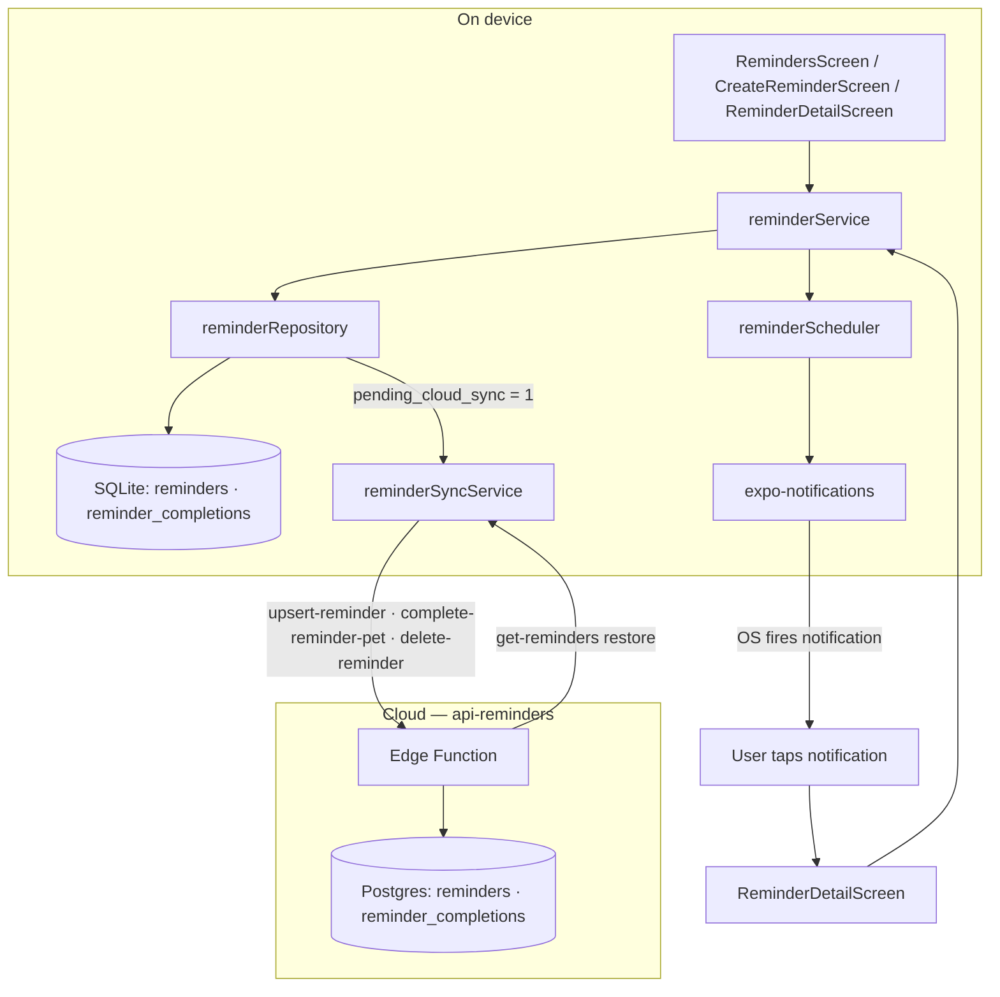
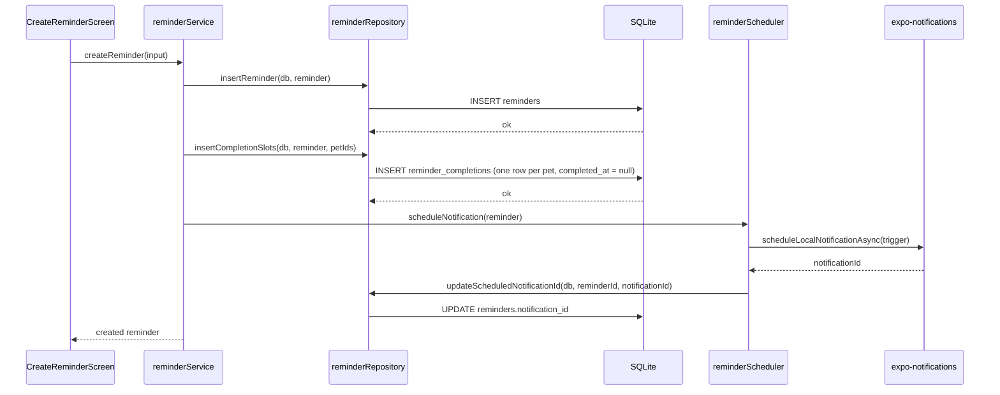
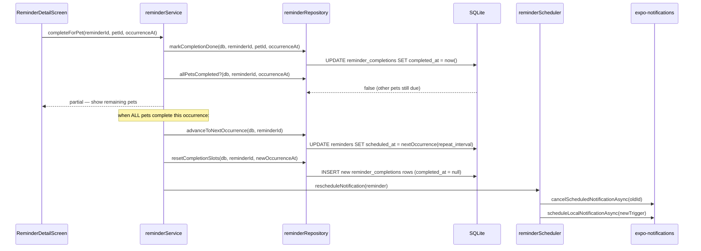
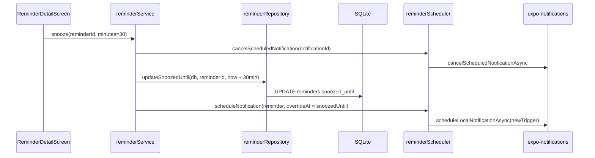
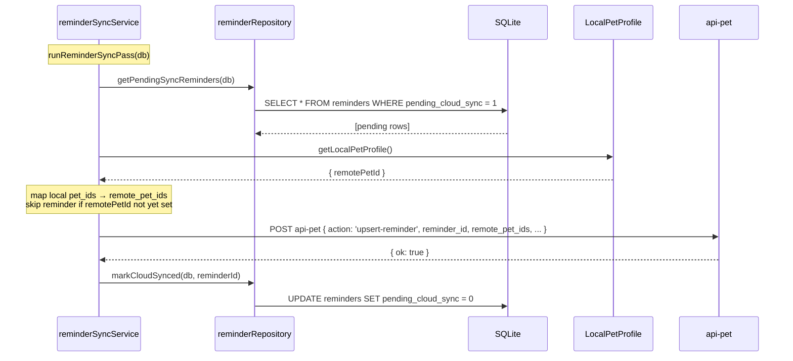
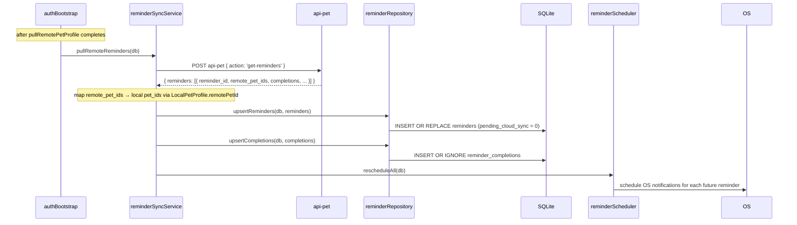

# Reminders

**Status:** Planned  
**Scope:** Pet care reminders — create, complete, snooze, repeat — with per-pet completion tracking and local push notifications  
**Goal:** Let users set recurring care reminders (medicine, grooming, vet visits, flea treatment) for one or more pets, with OS-level push at the right time and independent completion tracking per pet.

Design reference: [Figma — Pet reminders · simplified](https://www.figma.com/design/7yEq5gHBjjwxMrUzsBenVF/Tailo?node-id=658-152)

---

## Product decisions

- **One setup screen.** Name, time, and repeat are configured together. No stepper or category selector.
- **Free-text title.** No forced category (medicine / grooming / vet). User types the name. Empty-state copy suggests common kinds: medicine, meals, grooming, vet visit.
- **Multi-pet.** A single reminder can cover several pets. Completion is tracked independently per pet per occurrence.
- **OS notifications.** Each scheduled occurrence fires an iOS/Android local notification. No cloud push in MVP.
- **Snooze.** 30-minute snooze reschedules the OS notification and updates `snoozed_until`.
- **Recurrence.** None (one-time), daily, weekly, every 2 weeks, every 4 weeks, monthly.
- **Navigation.** Reminders live under Settings (not a fourth top-level tab). Accessed via a row in the Settings screen and pushed as a full-screen route.

---

## High-level design



---

## Low-level design

### Create reminder flow



### Complete for one pet



### Snooze



---

## DB schema (mobile SQLite)

Migration: `apps/mobile/src/db/migrations.ts` `version: 16`

```sql
CREATE TABLE IF NOT EXISTS reminders (
  reminder_id        TEXT PRIMARY KEY NOT NULL,
  title              TEXT NOT NULL,
  pet_ids            TEXT NOT NULL,           -- JSON array of local pet IDs
  scheduled_at       TEXT NOT NULL,           -- ISO 8601 next occurrence datetime
  repeat_interval    TEXT,                    -- NULL | 'daily' | 'weekly' | '2_weeks' | '4_weeks' | 'monthly'
  notification_id    TEXT,                    -- expo-notifications scheduled id
  snoozed_until      TEXT,                    -- ISO 8601 or NULL
  created_at         TEXT NOT NULL,
  updated_at         TEXT NOT NULL
);

CREATE TABLE IF NOT EXISTS reminder_completions (
  completion_id      TEXT PRIMARY KEY NOT NULL,
  reminder_id        TEXT NOT NULL REFERENCES reminders(reminder_id) ON DELETE CASCADE,
  pet_id             TEXT NOT NULL,
  occurrence_at      TEXT NOT NULL,           -- ISO 8601 of the occurrence being tracked
  completed_at       TEXT,                    -- NULL = still due; ISO 8601 when done
  UNIQUE(reminder_id, pet_id, occurrence_at)
);

CREATE INDEX IF NOT EXISTS reminders_scheduled_idx
  ON reminders (scheduled_at);

CREATE INDEX IF NOT EXISTS reminder_completions_reminder_idx
  ON reminder_completions (reminder_id, occurrence_at);
```

### `repeat_interval` values

| Value       | Meaning        |
| ----------- | -------------- |
| `NULL`      | One-time       |
| `'daily'`   | Every day      |
| `'weekly'`  | Every 7 days   |
| `'2_weeks'` | Every 14 days  |
| `'4_weeks'` | Every 28 days  |
| `'monthly'` | Same day +1 mo |

---

## Module layout

```
apps/mobile/src/modules/reminders/
  reminderRepository.ts      — SQLite CRUD (insert, query, update, delete)
  reminderService.ts         — business logic: create, complete, snooze, delete, advance
  reminderScheduler.ts       — expo-notifications: schedule, cancel, reschedule
  reminderRecurrence.ts      — pure next-occurrence calculator (testable)
  reminderTypes.ts           — Reminder, ReminderCompletion local types
  components/
    ReminderListItem.tsx      — row used in RemindersScreen list
    ReminderPetStatus.tsx     — per-pet completion row in ReminderDetailScreen

apps/mobile/src/screens/
  RemindersScreen.tsx         — home list (today + upcoming, pet filter)
  CreateReminderScreen.tsx    — new/edit form (title, pet select, when, repeat)
  ReminderDetailScreen.tsx    — status view (per-pet completion, snooze, edit)
```

---

## Screens

### RemindersScreen

- Header: "Reminders" + "For [pet names]" subtitle.
- Pet filter row: pet avatars → "All pets" (default) or single-pet filter.
- TODAY section: reminders due today, grouped. Each row shows title, pet avatar, time, completion circle.
- UPCOMING section: next occurrence for reminders not due today.
- "Add reminder" primary button at bottom.
- Empty state (no reminders): bell icon + "Nothing scheduled yet" + "Add first reminder" button.

### CreateReminderScreen (modal)

- Free-text title field (e.g. "Flea treatment").
- Pet selector: portrait chips, multi-select, independent completion note when >1 selected.
- When: date + time picker row.
- Repeat: picker row (None / Daily / Weekly / Every 2 weeks / Every 4 weeks / Monthly).
- "Save reminder" primary button.

### ReminderDetailScreen (modal)

- Header: reminder title + next occurrence subtitle.
- PETS section: "N of M completed" count + per-pet row (avatar, name, status, completion toggle).
- OPTIONS: "Snooze 30 minutes" row, "Edit reminder" row.
- Primary button: "Complete for [pet name]" — targets the first incomplete pet; updates as pets complete.

---

## Notification permissions

Reminders require `expo-notifications` permission. The app should:

1. Request permission when the user saves their first reminder (not on app launch).
2. If denied: save the reminder without scheduling; show a calm inline note with a link to Settings.
3. If later granted (via Settings): reschedule all pending reminders on next app open.

Notification permission state is tracked in `reminderScheduler.ts` alongside `getPermissionsAsync` / `requestPermissionsAsync`.

---

## Cloud sync

Reminders are user data that must survive reinstall. Sync runs against `api-pet` alongside existing pet sync.

### Mobile schema additions (migration v17)

Separate from v16 (which creates the local tables):

```sql
ALTER TABLE reminders           ADD COLUMN pending_cloud_sync INTEGER NOT NULL DEFAULT 1;
ALTER TABLE reminder_completions ADD COLUMN pending_cloud_sync INTEGER NOT NULL DEFAULT 1;
```

`DEFAULT 1` means new rows are queued for sync immediately. Set to `0` after a successful sync round.

### API actions (api-pet)

| Action | Purpose |
| --- | --- |
| `upsert-reminder` | Create or update reminder metadata; idempotent by `reminder_id` |
| `delete-reminder` | Soft-delete — sets `deleted_at` on the server |
| `complete-reminder-pet` | Record one pet's completion for a specific occurrence |
| `get-reminders` | Restore path — return all live reminders + completions for the user |

`reminder_id` is a client-generated UUID and serves as the stable cross-device sync key (same pattern as `source_local_event_id` for events). All four actions are registered in `TAILO_API_REMINDERS_ACTIONS` in `packages/shared/src/contracts/tailo-api.ts`.

### Postgres schema (Supabase)

Migration: `supabase/migrations/YYYYMMDD_add_reminders.sql`

```sql
CREATE TABLE IF NOT EXISTS reminders (
  reminder_id      TEXT        PRIMARY KEY,
  app_user_id      TEXT        NOT NULL REFERENCES app_users(app_user_id) ON DELETE CASCADE,
  remote_pet_ids   TEXT[]      NOT NULL,            -- server-side pet IDs (from pets table)
  title            TEXT        NOT NULL,
  scheduled_at     TIMESTAMPTZ NOT NULL,
  repeat_interval  TEXT,                            -- NULL | 'daily' | 'weekly' | '2_weeks' | '4_weeks' | 'monthly'
  created_at       TIMESTAMPTZ NOT NULL DEFAULT now(),
  updated_at       TIMESTAMPTZ NOT NULL DEFAULT now(),
  deleted_at       TIMESTAMPTZ
);

ALTER TABLE reminders ENABLE ROW LEVEL SECURITY;
CREATE POLICY "users see own reminders"
  ON reminders FOR ALL USING (app_user_id = auth.uid()::text);

CREATE TABLE IF NOT EXISTS reminder_completions (
  completion_id    TEXT        PRIMARY KEY,
  reminder_id      TEXT        NOT NULL REFERENCES reminders(reminder_id) ON DELETE CASCADE,
  app_user_id      TEXT        NOT NULL,
  pet_id           TEXT        NOT NULL,            -- remote pet_id from pets table
  occurrence_at    TIMESTAMPTZ NOT NULL,
  completed_at     TIMESTAMPTZ,
  UNIQUE(reminder_id, pet_id, occurrence_at)
);

ALTER TABLE reminder_completions ENABLE ROW LEVEL SECURITY;
CREATE POLICY "users see own reminder completions"
  ON reminder_completions FOR ALL USING (app_user_id = auth.uid()::text);

CREATE INDEX IF NOT EXISTS reminders_user_idx
  ON reminders (app_user_id, deleted_at, scheduled_at);

CREATE INDEX IF NOT EXISTS reminder_completions_reminder_idx
  ON reminder_completions (reminder_id, occurrence_at);
```

### Upload path



Completions follow the same pattern: `pending_cloud_sync = 1` is set when a pet completes an occurrence; the sync pass calls `complete-reminder-pet` for each pending row.

### Restore path (new or reinstalled device)



### Conflict resolution

| Scenario | Rule |
| --- | --- |
| Fresh device restore | Server wins — insert all server rows with `pending_cloud_sync = 0` |
| Normal edit sync | Last-write-wins by `updated_at`; mobile stamps `updated_at` on every change |
| Completion conflict | Server `completed_at IS NOT NULL` wins; never un-complete a server-completed record |
| Deleted on server | `deleted_at IS NOT NULL` → hide locally; cancel OS notification; do not re-sync |

### Pet ID mapping

Local `reminders.pet_ids` are device-scoped identifiers. Before calling `upsert-reminder`, `reminderSyncService` resolves each to `LocalPetProfile.remotePetId`. If `remotePetId` is absent (pet not yet synced), the reminder stays at `pending_cloud_sync = 1` and will be picked up on the next sync pass after pet sync runs.

The restore path reverses this: `remote_pet_ids` from the server are matched against `LocalPetProfile.remotePetId` to populate the local `pet_ids` array. If no match is found yet, the reminder is stored with an empty pet list and re-mapped after `pullRemotePetProfile` completes.

### Module

`apps/mobile/src/modules/reminders/reminderSyncService.ts`

| Export | Description |
| --- | --- |
| `runReminderSyncPass(db)` | Upload pending reminders and completions to cloud |
| `pullRemoteReminders(db)` | Restore path — fetch from server, upsert locally, reschedule OS notifications |

---

## Change log

| Date       | Change                   |
| ---------- | ------------------------ |
| 2026-06-29 | Cloud sync section: Postgres schema, upload + restore sequence diagrams, conflict rules, pet ID mapping; `upsert-reminder`, `delete-reminder`, `complete-reminder-pet`, `get-reminders` added to `TAILO_API_PET_ACTIONS`; migration v17 for `pending_cloud_sync` columns |
| 2026-06-29 | Architecture doc created |
