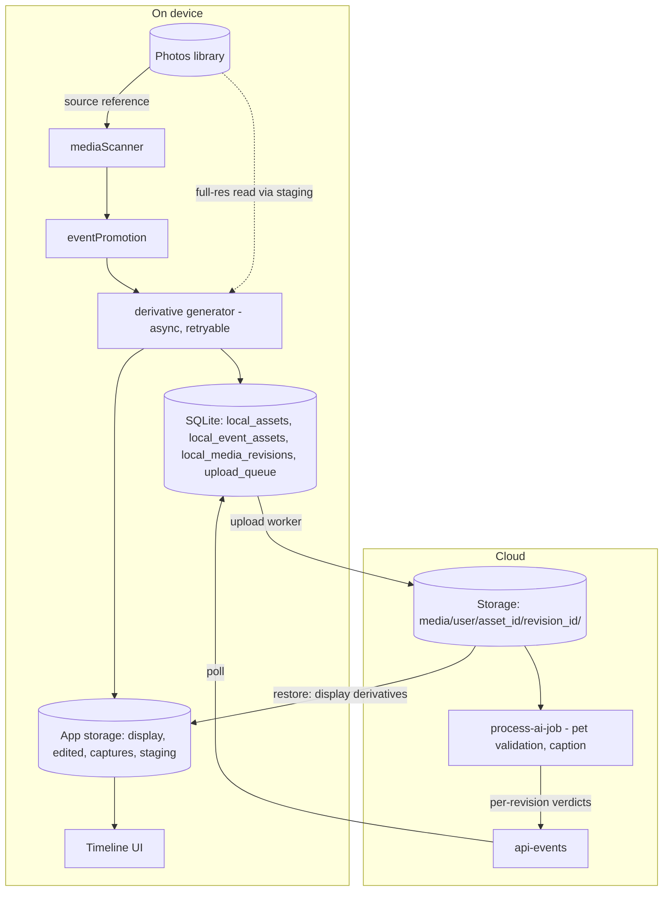
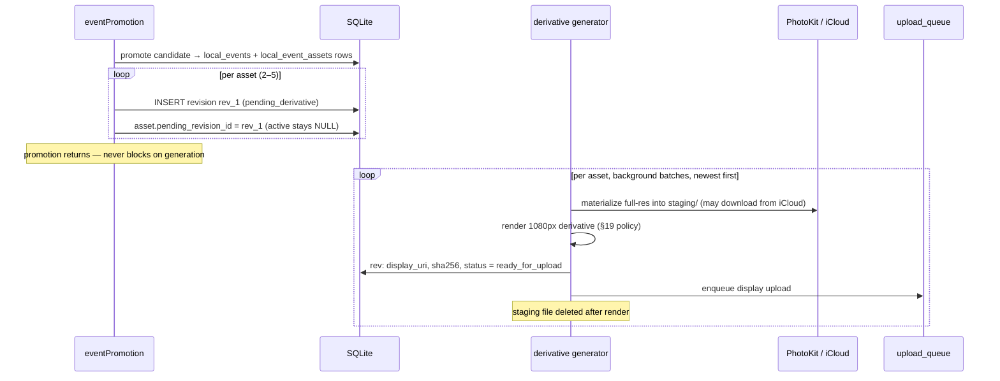
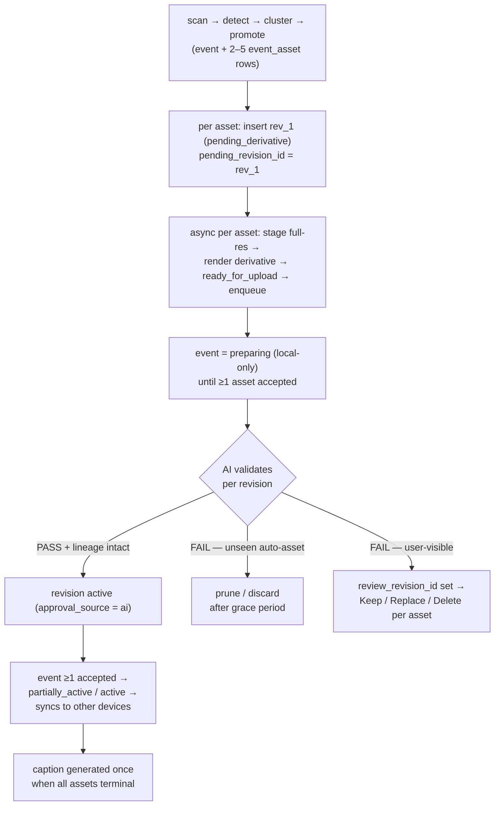
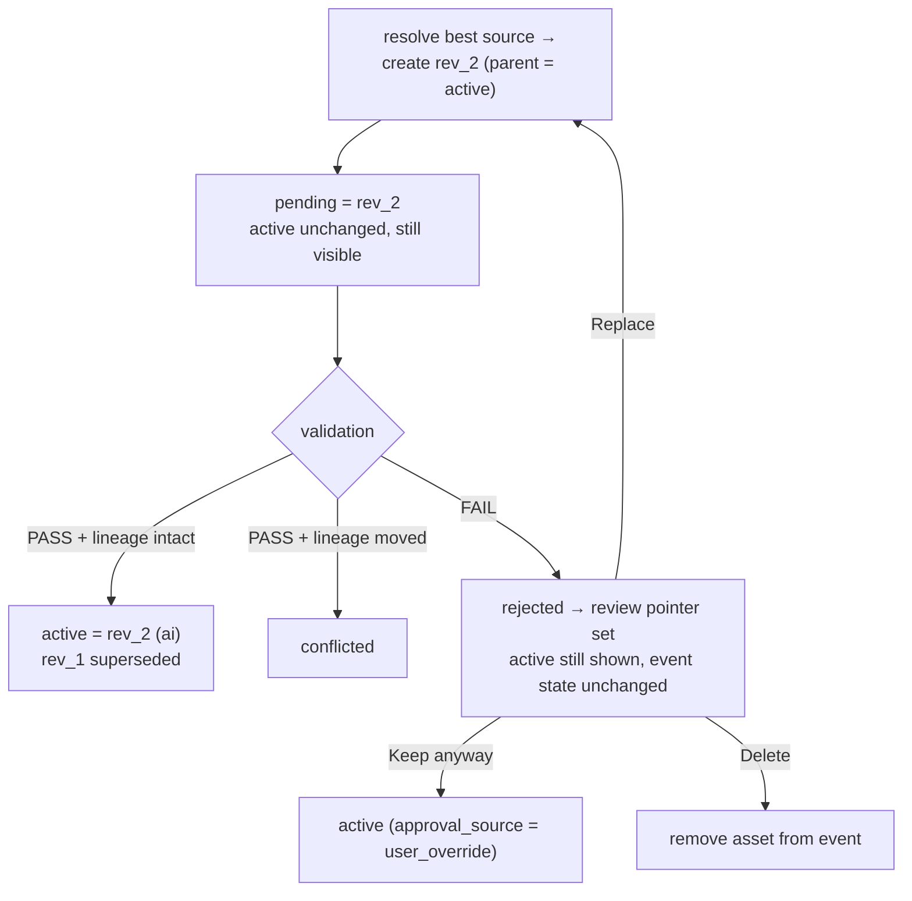
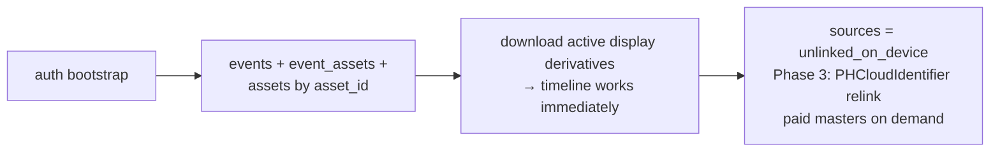
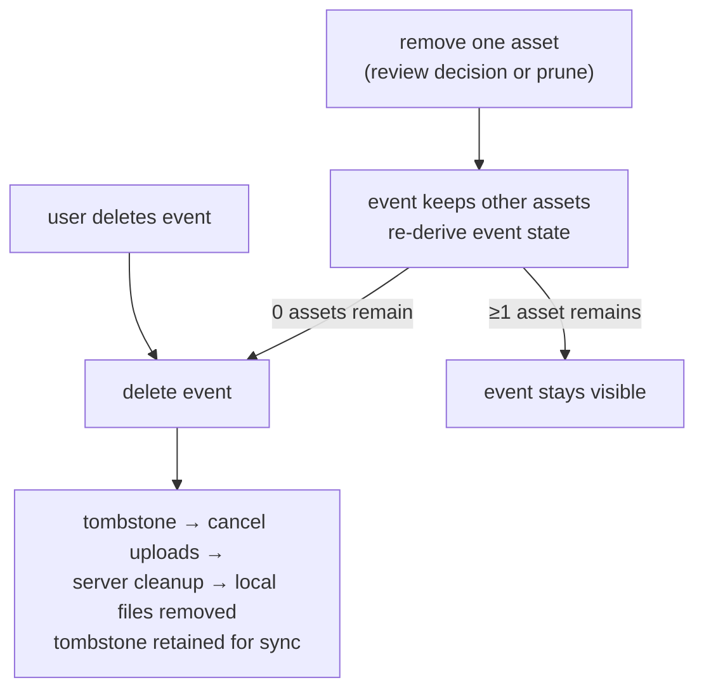

# Tailo — Image Data Process & Storage Plan

Draft for review. Not yet reflected in architecture docs or tasks.

**Revision 6** — final editorial pass from the rev-5 review; the architecture is approved and no longer evolving conceptually. Changes: event state expressed as a normative precedence formula (identical client/server) with server-authoritative persistence; retry-exhaustion policy for `derivative_failed`; replacement semantics for the single review pointer; `quarantined` terminology removed (`event_state` and `deletion_state` are separate enums); zero-asset auto-tombstone is now normative (was open decision); caption trigger written as a precise condition; note on future user-provided storage.

Next steps after sign-off: SQLite migration spec → cloud schema + CAS activation contract → derivative-generator tasks → upload-worker tasks → aggregation/caption trigger tests → restore/deletion integration tests.

---

## 1. Current state (what exists today)

| Source | How stored | Local copy? |
| --- | --- | --- |
| Camera roll scan | `local_asset_id` = MediaLibrary asset id (PHAsset.localIdentifier); `uri` = `ph://` | No — pointer to camera roll original |
| In-app capture | `file://` path in app documents | Yes — copied by `persistCaptureImage` |

Events reference assets through a `selected_asset_ids` JSON array (2–5 per event).

Problems: the `ph://` reference is fragile; the asset primary key is a device-local Photos identifier unusable as cloud identity; the JSON relationship has no referential integrity.

---

## 2. Core principles

**Tailo owns its display derivatives.** A moment must be renderable from Tailo-owned files alone. When a moment is promoted, generate a Tailo-owned 1080px display derivative per asset — stored locally, uploaded to cloud, used as the primary render source.

**Photos identifiers are source references, not identity.** A Photos identifier is never used directly by the upload worker and never appears in a cloud path. Media is first materialized into a Tailo-controlled staging file.

**Validation is per revision; visibility is per event.** Each asset's revisions validate independently; the event derives its timeline state from its assets' results (§12). One failed asset never poisons an event that has other valid images.

---

## 3. Identity model

| Identifier | Generated by | Scope | Used for |
| --- | --- | --- | --- |
| `asset_id` | Tailo (UUID) | Stable, global | Primary key, cloud paths, event relationships, revisions, sync, restore |
| `source_local_identifier` | PhotoKit | This device only | Reading the source photo; scanner dedupe; NULL after restore until relink |
| `source_cloud_identifier` | PhotoKit (PHCloudIdentifier) | User's iCloud Photos library | Optional cross-device relinking (Phase 3) |

`source_uri` (`ph://` or capture `file://`) is a **disposable convenience cache** of the source linkage — non-authoritative, cleared or regenerated whenever the Photos linkage changes. `source_local_identifier` is the canonical device-local linkage.

On a new device, `asset_id` and all cloud paths are unchanged; only the source linkage columns reset.

---

## 4. Media terminology

| Term | Definition |
| --- | --- |
| **Source original** | The unmodified Photos library asset or in-app capture file |
| **Edited master** | Full-resolution result after Tailo edits; owned by Tailo |
| **Display derivative** | 1080px JPEG rendition; Tailo-owned; primary render and upload source |
| **Media revision** | An immutable, versioned snapshot binding one master + one display derivative |

Every display derivative is rendered from the best available master — never from another derivative. In-app captures included: the capture file is a source original.

**Phase 2 scope note:** Phase 2 does not model or upload source-original resources, Live Photo video components, or RAW. A `local_media_resources` table (per-resource type, mime, filename, size, sha256) arrives with paid backup in Phase 3. Until then a revision carries at most one `display_uri` and one `edited_master_uri`.

---

## 5. High-level design



---

## 6. Local data model (SQLite)

### `local_assets` (target shape)

```sql
CREATE TABLE local_assets (
  asset_id                 TEXT PRIMARY KEY NOT NULL,  -- Tailo UUID, stable across devices
  source_type              TEXT NOT NULL,              -- 'photos_library' | 'in_app_capture'
  source_local_identifier  TEXT,                       -- PHAsset.localIdentifier; device-local
  source_cloud_identifier  TEXT,                       -- reserved Phase 2, populated Phase 3
  source_uri               TEXT,                       -- disposable cache (§3)
  source_availability      TEXT NOT NULL DEFAULT 'available_local',
  active_revision_id       TEXT,                       -- accepted revision (AI or user override)
  pending_revision_id      TEXT,                       -- revision in derivative/upload/validation
  review_revision_id       TEXT                        -- rejected revision awaiting user decision
  -- ...existing columns: created_at, width, height, media_type, detection fields...
);

CREATE UNIQUE INDEX local_assets_source_local_idx
  ON local_assets (source_local_identifier)
  WHERE source_local_identifier IS NOT NULL;
```

### `local_event_assets` (new — replaces `selected_asset_ids` JSON)

```sql
CREATE TABLE local_event_assets (
  event_id   TEXT NOT NULL REFERENCES local_events(local_event_id),
  asset_id   TEXT NOT NULL REFERENCES local_assets(asset_id),
  position   INTEGER NOT NULL,
  created_at TEXT NOT NULL,

  PRIMARY KEY (event_id, asset_id),
  UNIQUE (asset_id),              -- enforces: an asset belongs to at most one event
  UNIQUE (event_id, position)     -- preserves gallery order
);
```

This is the canonical relationship. `local_events` may keep a cached JSON array for cheap UI reads, but it is derived, never authoritative. The 2–5 constraint applies at event creation; validation pruning may later reduce an event below 2 (see §12).

### `local_media_revisions` (new)

```sql
CREATE TABLE local_media_revisions (
  revision_id           TEXT PRIMARY KEY NOT NULL,
  asset_id              TEXT NOT NULL REFERENCES local_assets(asset_id),
  parent_revision_id    TEXT,             -- lineage; NULL for revision 1
  created_by_device_id  TEXT,             -- install id, for conflict diagnostics
  display_uri           TEXT,
  edited_master_uri     TEXT,             -- NULL for revision 1 of an unedited photo
  master_format         TEXT,             -- 'jpeg' | 'png' | 'webp' (expo-image-manipulator outputs; HEIC is Phase 3)
  sha256                TEXT,             -- of the display derivative
  status                TEXT NOT NULL,
  approval_source       TEXT,             -- 'ai' | 'user_override' | NULL
  created_at            TEXT NOT NULL,
  validated_at          TEXT
);

CREATE INDEX local_media_revisions_asset_idx
  ON local_media_revisions (asset_id, status);
```

### Revision lifecycle and approval

Status is lifecycle only; approval source is recorded separately:

```
status:  pending_derivative → ready_for_upload → pending_validation → active
              ↘ derivative_failed (retryable)         ↘ rejected | conflicted
         active → superseded

approval_source (set at activation):  'ai' | 'user_override'
```

Upload progress lives in `upload_queue.status`; AI progress in the cloud job record. Revision status duplicates neither.

### Asset pointer semantics

| Pointer | Meaning |
| --- | --- |
| `active_revision_id` | The current **accepted** revision — approved by AI validation or explicit user override. What sync and other devices see. |
| `pending_revision_id` | A newer revision still in derivative → upload → validation. |
| `review_revision_id` | A rejected revision awaiting a user decision (Keep / Replace / Delete). Keeps an initial rejected revision addressable when `active` is NULL. |

Timeline render rule per asset:

```
if active exists            → render active derivative
else if pending is ready    → render pending derivative (local preview)
else if review exists       → render review derivative (in review UI context)
else                        → render Photos source via source_uri
```

---

## 7. Source availability states

| State | Meaning | User message |
| --- | --- | --- |
| `available_local` | Readable from device Photos library | — |
| `available_icloud` | In iCloud Photos, not downloaded locally | "This photo needs to be downloaded from iCloud." |
| `permission_required` | Photos permission revoked | "Tailo no longer has access to this photo." |
| `permission_limited` | No longer in limited-library selection | "This photo is no longer shared with Tailo." |
| `temporarily_unavailable` | Transient PhotoKit error | Show cached derivative silently |
| `unlinked_on_device` | No Photos linkage on this device (post-restore or relink failed) | — (derivative renders) |
| `missing` | Confirmed deleted after deliberate PhotoKit lookup in the same library | "This photo is no longer in your Photos library." |

Only set `missing` after a deliberate lookup confirms deletion. The display derivative renders in every state.

---

## 8. Promotion flow



- Generation failure sets `derivative_failed` on **that asset's revision only**; unrelated assets are unaffected. Failure handling by class (classified in application logic using `attempt_count` — no new DB fields in Phase 2):
  - **Transient** (network, iCloud timeout, PhotoKit hiccup) → retry on a later worker pass.
  - **Permission / confirmed source failure** → stop automatic retries; a `source_availability` transition re-arms the generator.
  - **Retry limit reached** (e.g. 5 attempts) → user-visible asset resolves to `needs_review`; unseen auto-asset is pruned after the grace period. An event can therefore never sit in `preparing` forever. The exhaustion transition is explicit (implementation acceptance criteria):

    ```
    revision.status            = derivative_failed   (terminal)
    asset.pending_revision_id  = NULL
    asset.review_revision_id   = revision_id
    ```

    Since this review revision has no derivative, the review UI renders the Photos source when available, or a placeholder, with **Retry / Replace / Remove** options (Retry re-arms the generator with a fresh attempt count).
- Until a derivative exists, that asset renders from the Photos source (fragility window).
- In-app captures skip the PhotoKit read; the capture file is the source original.
- Event visibility while assets are at different stages: §12.

---

## 9. Immutable media revisions (cloud)

### Storage paths

Phase 2 uploads display derivatives only:

```
media/{app_user_id}/{asset_id}/{revision_id}/display.jpg
```

Phase 3 adds masters/originals — likely separating source resources from revision outputs:

```
media/{app_user_id}/{asset_id}/source/{resource_id}.{ext}          (Phase 3)
media/{app_user_id}/{asset_id}/revisions/{revision_id}/edited-master.{ext}   (Phase 3)
```

`asset_id` is the Tailo UUID — never a Photos identifier. Objects are write-once; a new edit is a new `revision_id`, never an overwrite.

### Activation: first lineage-valid activation wins

```
server activates rev_N only if:
  asset.active_revision_id == rev_N.parent_revision_id

else → rev_N.status = conflicted
```

This is compare-and-swap, not last-write-wins: if device A's rev_2 (parent rev_1) activates first, device B's rev_3 (parent rev_1) fails the check and becomes `conflicted` regardless of arrival order. `rejected` = validation failed; `conflicted` = lineage moved. Different states, different user handling.

Phase 2 ships the state model; the conflict-resolution UI (*"This moment was edited on another device — Use this version / Keep current version"*) is Phase 3.

---

## 10. Edit flow

1. **Resolve best available source** (priority): local edited master of active revision → Photos full-res via `source_local_identifier` → paid cloud master → display derivative (last resort, warn).
2. **Apply edits** with `expo-image-manipulator` (output: jpeg/png/webp).
3. **Create new revision:** `parent_revision_id` = current active; master to `edited/{revision_id}.{format}`; derivative to `display/{revision_id}.jpg`; set `pending_revision_id`. Active pointer does not move.
4. **Enqueue upload.**
5. Outcomes:
   - **PASS, lineage intact** → active ← new, old → `superseded`, pending → NULL, `approval_source = 'ai'`.
   - **PASS, lineage moved** → `conflicted` (§9).
   - **FAIL** → `rejected`; `review_revision_id` ← revision; pending → NULL; **active unchanged and still visible**. Contextual message: *"Your latest edit could not be confirmed. The previous version is still being shown."* The event state does not change.

---

## 11. Validation outcomes and user review (revision-level)

Validation verdicts apply to revisions, not events.

### Rejected initial revision (asset has no active revision)

```
rev_1 rejected → review_revision_id = rev_1, pending = NULL
```

The revision stays addressable so the user can decide. Options:

- **Keep anyway** → verify lineage, then: `status = active`, `approval_source = 'user_override'`, `active_revision_id = revision_id`, clear `review_revision_id`, supersede any previous active. User override is real activation — queries never need to treat a separate "user_accepted" status as active.
- **Replace photo** → edit flow (§10) from the review revision's source.
- **Delete** → remove the asset from the event (§13).

### Rejected replacement edit (asset has an active revision)

Handled in §10 — review pointer set, event state unchanged.

### Single review pointer — replacement semantics

An asset holds at most one unresolved review revision. When the user starts **Replace** from a review revision:

```
old review revision is kept until the replacement resolves

replacement PASSES → activate it; clear review_revision_id;
                     old rejected revision cleaned up per retention
replacement FAILS  → review_revision_id moves to the new rejected revision;
                     the old one becomes abandoned → 30-day cleanup
```

Where an older active revision exists, it remains untouched and visible throughout.

### Retention

| Media | Cleanup rule |
| --- | --- |
| Unseen auto-candidate, rejected | Delete after short grace period |
| Rejected edit while a previous revision remains active | Delete rejected revision's media after 30 days if unresolved |
| User-confirmed moment under review | Retain until the user decides — no timer |
| Paid backed-up media | Never deleted because pet detection failed |

---

## 12. Event state aggregation (2–5 assets)

Each asset independently resolves to one of: `accepted` (active revision exists), `pending` (derivative/upload/validation in progress, incl. retryable `derivative_failed`), `needs_review` (review revision set, no active), `removed` (user deleted / pruned / retry-exhausted and discarded).

### Derivation formula (normative — implemented identically on client and server)

`removed` assets are excluded from all counts.

```
if event is tombstoned or remaining_asset_count == 0:
    deleted                       # zero-asset events auto-tombstone
else if accepted_count > 0:
    if pending_count == 0 and review_count == 0:  active
    else:                                          partially_active
else:
    if pending_count > 0:         preparing
    else if review_count > 0:     needs_review
    else:                         deleted          # all assets discarded
```

`event_state` (`preparing | active | partially_active | needs_review`) and `deletion_state` (`none | deleted_pending_cleanup | deleted`) are **separate enums** — visibility and deletion are never combined into one.

### Where event state lives

- **Device:** derived immediately after every asset-state change, for responsive UI.
- **Server:** persisted after transactionally recalculating `accepted_asset_count` / `pending_asset_count` / `review_asset_count` on each revision verdict or asset change (with 2–5 assets, a full recount per transition is cheap).
- **Sync:** the server's `event_state` is authoritative; devices reconcile to it.

### Behaviour table (informative — the formula above is normative)

| Asset results | Event state | Timeline behaviour |
| --- | --- | --- |
| ≥1 accepted, rest accepted | `active` | Fully visible |
| ≥1 accepted, some pending | `partially_active` | Visible; show accepted assets; pending assets join the gallery as they land |
| ≥1 accepted, some needs_review | `partially_active` | Visible with accepted assets; per-asset review affordance |
| 0 accepted, ≥1 pending | `preparing` | Visible locally (renders pending/ph:// per §6 rule); not yet synced to other devices |
| 0 accepted, all needs_review (user-visible event) | `needs_review` | Hidden from main timeline; surfaced in review UI with Keep / Replace / Delete per asset |
| 0 accepted, all rejected (unseen auto-candidate) | discard | Event and assets removed after grace period |
| Mixed rejected on unseen auto-candidate | prune | Drop rejected assets silently (never seen); keep event if ≥1 accepted |

Rules this pins down:

- **Sync visibility:** other devices receive an event when it first reaches `active` or `partially_active` (≥1 accepted asset). Later-arriving assets sync incrementally.
- **One failed asset never blocks the event.** Event-level `needs_review` occurs only when *no* asset is accepted.
- **Per-asset user decisions are independent** — the user can keep one rejected image without approving others.
- **Derivative failure is per-asset** — retry/exhaustion policy in §8; exhaustion resolves the asset to `needs_review` or `removed`, so no event sits in `preparing` forever.
- **Pruning below 2 assets:** the 2–5 constraint is a creation-time rule. A 1-asset event after pruning/review remains valid. **At 0 remaining assets the event auto-tombstones** — normative, per the derivation formula.

### Caption timing (Phase 2 policy)

**Wait until every asset is `accepted` or `removed`, then generate one caption from accepted/user-overridden assets only.**

Precise trigger (evaluated server-side after each event-state recalculation):

```
accepted_count > 0
AND pending_count == 0
AND review_count == 0
AND caption_status == not_started
```

A `needs_review` asset is deliberately non-terminal — an ignored review item delays the caption indefinitely, which is acceptable for Phase 2 provided the UI clearly surfaces unresolved media. Chosen over caption-on-first-accepted-then-regenerate: deterministic, one AI call per event, no caption churn across devices, never references later-removed images. If caption latency becomes a product problem, switch to first-accepted + one regeneration — the pipeline shape supports both.

---

## 13. Deletion flows

### Removing one asset (user decision in review, or prune)

```
1. DELETE local_event_assets row (event keeps its other assets)
2. Cancel upload_queue entries for the asset's revisions
3. Tombstone asset; server cleanup deletes its revisions from Storage
4. Delete local display/edited files (subject to §15 guard)
5. Re-derive event state (§12); if 0 assets remain → event delete below
```

### User deletes an event

```
1. local_events.deleted_at set (optimistic hide)
2. deletion_state = pending_cleanup
3. Cancel upload_queue entries for all its assets' revisions
4. Server tombstones event + assets; cleanup worker deletes all revisions from Storage
5. cleanup_completed_at recorded; tombstones retained for sync
6. Local files deleted (subject to §15 guard)
```

The `UNIQUE(asset_id)` constraint guarantees cascade safety: an asset has exactly one owning event, so event deletion can never destroy media another event depends on.

Never delete `ph://` camera roll photos.

`deletion_state` (separate from `event_state` — §12): `none` · `deleted_pending_cleanup` · `deleted` (tombstone retained).

---

## 14. Restore path (new device or reinstall)

```
1. Auth bootstrap → bootstrap-timeline / get-event-updates
     → events, event_assets, assets (keyed by asset_id), active revisions
2. Download active display derivatives → timeline immediately functional
3. source_local_identifier = NULL, source_availability = unlinked_on_device
4. (Phase 3) Optional Photos relink via source_cloud_identifier
     → requires photo permission; skip silently if absent
     → match: fill source_local_identifier + availability; no match: stays unlinked_on_device
5. Paid masters download on demand
```

`asset_id` and cloud paths never change. Failure to relink never breaks a moment.

---

## 15. Local storage layout and disk lifecycle

### Locations and backup policy

Phase 2 uses `expo-file-system` directories (Application Support and iOS backup-exclusion flags need a native module/config plugin — Phase 3):

| Content | Location | Backup intent |
| --- | --- | --- |
| Capture source originals (`captures/`) | documentDirectory | Back up — user data not yet in cloud |
| Edited masters (`edited/`) | documentDirectory | Back up — user data |
| Display derivatives (`display/`) | documentDirectory | Ideally excluded once uploaded (recreatable); accepted Phase 2 trade-off: potentially hundreds of MB in device backups. Phase 3: exclusion flag or move uploaded derivatives to a recreatable cache location |
| Staging (PhotoKit extraction) | cacheDirectory (`staging/`) | Excluded; deleted after render |

### Cleanup rules

| File | Keep while | Delete when |
| --- | --- | --- |
| Active revision's derivative + master | Always | Asset removed/deleted |
| Superseded revision's files | Until replacement `active` in cloud | Replacement confirmed — delete files, keep DB row |
| Review (rejected) revision's files | Until user resolves | Keep / Replace / Delete chosen, or 30-day rule (§11) |
| Staging files | During generation | Immediately after render |

**Guard:** never delete a local file while a non-terminal `upload_queue` entry references it via `source_uri_snapshot`. Cleanup runs opportunistically after sync passes, error-wrapped, retried next pass on failure.

---

## 16. Upload queue

One item per rendition per revision. Phase 2 fields:

| Field | Description |
| --- | --- |
| `id`, `revision_id`, `rendition_type` | Identity; `'display' \| 'source_original' \| 'edited_master'` |
| `source_uri_snapshot` | `file://` path at enqueue (immutable) |
| `destination_path`, `content_type` | Target object |
| `expected_sha256`, `expected_byte_size` | Client-side integrity + idempotency material |
| `status` | `pending \| preparing \| uploading \| uploaded \| failed \| cancelled` |
| `priority`, `attempt_count`, `idempotency_key` | Scheduling and retry safety |
| `created_at` / `completed_at` / `cancelled_at` | Timestamps |

`validating` deliberately absent — validation belongs to the revision/AI job. `uploaded` is the queue's terminal success.

**Checksum note:** `expected_sha256` gives client-side integrity and idempotency. An upload response does not verify content; Phase 2 stores the hash in object metadata, server-side verification is Phase 3 hardening.

Deferred to Phase 3: `requires_wifi`, `next_attempt_at`, `last_error_code`, TUS resumable uploads (Phase 2 uploads only ≤1 MB derivatives). Dependency rule: `source_original`/`edited_master` enqueue only after the display revision is accepted (AI or user override).

---

## 17. Security and access control

- Private bucket; paths are organization, not authorization
- Storage RLS: `app_user_id` prefix must match `auth.uid()`
- Signed URLs / authenticated requests only; AI uses server-side service credentials
- Server verifies revision ownership before signing
- Immutable paths ⇒ insert-only client permission; no upsert/overwrite grants

---

## 18. Source formats and paid tier

Camera roll assets may be HEIC/HEVC, JPEG, PNG, RAW, Live Photos, depth-effect media. The Phase 3 `local_media_resources` model carries these per-resource (Live Photo still + video as separate resources under one revision). Display derivatives are always JPEG. Edited masters in Phase 2 are jpeg/png/webp (expo-image-manipulator); preserving HEIC or RAW masters requires the Phase 3 native pipeline.

**Paid tier (Phase 3):** free restores 1080px derivatives; paid restores full-resolution masters/originals.

| Moment type | Eligible for paid backup |
| --- | --- |
| Auto-detected, not yet user-confirmed | After confirmation or validation pass |
| User-created or user-confirmed | Yes — regardless of AI result |

Costs (directional, per user, after Supabase Pro quotas): 2,000 moments ≈ 600 MB derivatives / 8–16 GB originals → $0.17–$0.34/mo storage; full restore $0.72–$1.44 uncached. Gate behind a `backup_originals` entitlement.

**User-provided cloud storage (future option):** nothing in Phase 2 blocks it. If ever scoped, the Phase 3 resource model separates the logical file (`media_resource`) from its copies (`media_replica`: Tailo Storage / local / external Drive-Dropbox-iCloud archive), and the upload queue gains a `storage_destination_id`. Not planned unless external storage joins the roadmap.

---

## 19. Display derivative rendition policy

Long edge 1080px · JPEG 0.80–0.85 · max ~1 MB · orientation normalized into pixels · sRGB · metadata stripped (except required orientation/copyright). Always rendered from the best available master. Server-side AI-input rendition (512px) is a Phase 3 option.

---

## 20. Migration (single release migration, internally staged)

Derivative generation and all file I/O happen **outside** the DB migration.

```
 1. BEGIN IMMEDIATE
 2. CREATE TEMP asset_id_map (old_asset_id, new_asset_id)
 3. Generate one UUID per existing asset row
 4. Build local_assets_new keyed by asset_id; old key → source_local_identifier;
    source_type inferred from URI scheme
 5. Populate local_event_assets from selected_asset_ids (position = array index)
 6. Remap every other reference (candidates, media scores, ...) via asset_id_map
 7. CREATE local_media_revisions
 8. CREATE new upload_queue schema (old entries re-derived, not migrated —
    confirm nothing shipped to production storage under old paths)
 9. Integrity checks (below) — abort on any failure
10. Swap tables; drop old structures
11. COMMIT
12. Post-migration, outside the transaction: derivative backfill —
    background batches, newest first, one pending_derivative revision per
    promoted asset through the normal §8 generator
```

### Integrity checks (gate before the swap)

- old asset row count == new asset row count
- every old asset id has exactly one UUID mapping
- every `local_event_assets.asset_id` resolves to a new asset
- every new asset belongs to zero or one event (`UNIQUE(asset_id)` enforces)
- every event's asset count matches its old `selected_asset_ids` length
- no duplicate `source_local_identifier`
- no revision/queue/event reference points to an unknown asset

Keep `asset_id_map` until all checks pass. Timeline renders from `ph://` during backfill — nothing visually changes.

---

## 21. Phasing summary

| Capability | Phase |
| --- | --- |
| Stable `asset_id` + `local_event_assets` + migration/remap | 2 |
| Display derivative at promotion (async generator, staging) | 2 |
| Revisions: three pointers, lineage, `approval_source` | 2 |
| First-lineage-valid-activation-wins (state model) | 2 |
| Event state aggregation (§12) + caption-when-settled | 2 |
| Revision-aware upload queue (core fields) | 2 |
| Immutable cloud paths (display only) + private bucket + RLS | 2 |
| Review flows + retention rules | 2 |
| Restore from cloud derivatives (`unlinked_on_device`) | 2 |
| `source_cloud_identifier` column (reserved, nullable) | 2 |
| Photo editing UI (crop/rotate) | 2 or 3 — product call |
| Conflict-resolution UI | 3 |
| PHCloudIdentifier native lookup + relinking | 3 |
| `local_media_resources`, master storage paths, HEIC/RAW/Live Photo | 3 |
| Paid backup + TUS + server-side hash verification | 3 |
| Backup-exclusion flags / derivative cache relocation | 3 |
| `requires_wifi`, retry backoff fields | 3 |
| Revision history UI | 3+ |

---

## 22. Open decisions

| # | Question | Recommended |
| --- | --- | --- |
| 1 | Derivative generation over cellular for iCloud-only sources? | Yes for single moments; Wi-Fi only for bulk backfill |
| 2 | Grace period before deleting rejected unseen auto-candidates? | 7 days |
| 3 | Revision history visible to free users? | No — active revision only |
| 4 | Re-validation on edit: always, or only on significant crop? | Always |
| 5 | Caption regeneration when a late asset joins an already-captioned event? | No regeneration in Phase 2 (caption waits for all assets, so this only occurs via user edits — revisit with edit UI) |

Closed: zero-asset events auto-tombstone — now normative in the §12 derivation formula.

---

## 23. Summary flows

### Promotion



### Edit



### Restore (new device)



### Delete


